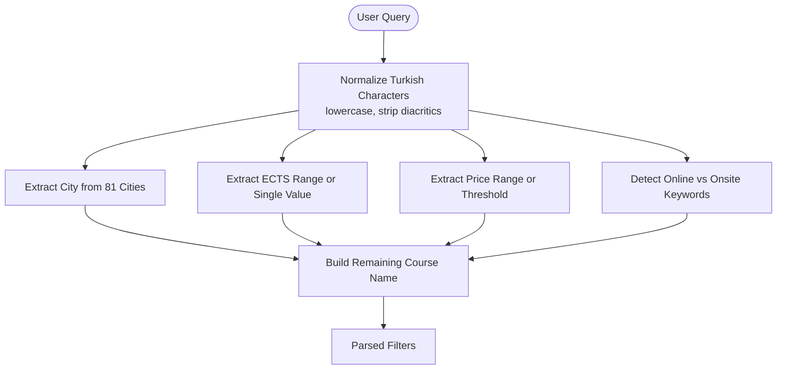

# Project Overview

<cite>
**Referenced Files in This Document**
- [README.md](file://README.md)
- [apps/api/src/main.ts](file://apps/api/src/main.ts)
- [apps/api/src/app.module.ts](file://apps/api/src/app.module.ts)
- [apps/api/src/common/constants/roles.ts](file://apps/api/src/common/constants/roles.ts)
- [apps/api/src/common/guards/roles.guard.ts](file://apps/api/src/common/guards/roles.guard.ts)
- [apps/api/src/common/decorators/roles.decorator.ts](file://apps/api/src/common/decorators/roles.decorator.ts)
- [apps/api/src/modules/course/search-parser.service.ts](file://apps/api/src/modules/course/search-parser.service.ts)
- [apps/api/src/modules/search-log/search-log.service.ts](file://apps/api/src/modules/search-log/search-log.service.ts)
- [apps/api/src/modules/widget/widget.service.ts](file://apps/api/src/modules/widget/widget.service.ts)
- [apps/api/src/modules/student/student.service.ts](file://apps/api/src/modules/student/student.service.ts)
- [apps/api/prisma/schema.prisma](file://apps/api/prisma/schema.prisma)
- [apps/web/middleware.ts](file://apps/web/middleware.ts)
- [apps/web/lib/api.ts](file://apps/web/lib/api.ts)
- [apps/web/contexts/compare-context.tsx](file://apps/web/contexts/compare-context.tsx)
- [apps/web/components/compare/CompareModal.tsx](file://apps/web/components/compare/CompareModal.tsx)
- [apps/web/app/layout.tsx](file://apps/web/app/layout.tsx)
- [apps/web/package.json](file://apps/web/package.json)
</cite>

## Table of Contents
1. [Introduction](#introduction)
2. [Project Structure](#project-structure)
3. [Core Components](#core-components)
4. [Architecture Overview](#architecture-overview)
5. [Detailed Component Analysis](#detailed-component-analysis)
6. [Dependency Analysis](#dependency-analysis)
7. [Performance Considerations](#performance-considerations)
8. [Troubleshooting Guide](#troubleshooting-guide)
9. [Conclusion](#conclusion)

## Introduction
Yaz Okulu Var Mı? is a centralized summer school course discovery platform for Turkish universities and students. It standardizes course information across participating universities, enables university staff to manage their own data, and empowers students with intelligent search, filtering, personal dashboards, and course comparison. The platform is backed by academic research supported by TÜBİTAK and operates as a modern monorepo with a NestJS backend and a Next.js frontend.

Key platform capabilities include:
- Smart filtering and Turkish natural language search parsing
- Student dashboard with favorites, recommendations, search history, and analytics
- Course comparison with analysis cards and PDF export
- Widget API for embedding course tables into external university websites
- Academic logging for statistical analysis and research
- Role-based access control (RBAC) with JWT authentication
- University verification workflow and multitenancy

Target audiences:
- Students: discover, filter, save favorites, compare courses, and track interactions
- University staff: manage courses, profiles, and widget configurations
- Administrators: approve universities, moderate content, and monitor platform statistics

Use cases:
- Students searching for summer courses by location, credits, price, or mode of delivery
- University staff publishing and updating course offerings
- Researchers leveraging academic logs for statistical insights

**Section sources**
- [README.md](file://README.md#L1-L398)

## Project Structure
The project follows a monorepo architecture with two primary applications and shared types:
- Backend API: NestJS application under apps/api, exposing REST endpoints and managing data via Prisma ORM
- Frontend Web: Next.js 14 application under apps/web, implementing routing, UI components, and client-side integrations
- Shared Types: packages/types for cross-package TypeScript definitions
- Database: PostgreSQL with Prisma schema and migrations

**Diagram sources**
- [apps/api/src/main.ts](file://apps/api/src/main.ts#L1-L34)
- [apps/api/src/app.module.ts](file://apps/api/src/app.module.ts#L1-L49)
- [apps/api/prisma/schema.prisma](file://apps/api/prisma/schema.prisma#L1-L183)
- [apps/web/middleware.ts](file://apps/web/middleware.ts#L1-L107)
- [apps/web/app/layout.tsx](file://apps/web/app/layout.tsx#L1-L44)
- [apps/web/lib/api.ts](file://apps/web/lib/api.ts#L1-L378)
- [apps/web/contexts/compare-context.tsx](file://apps/web/contexts/compare-context.tsx#L1-L111)
- [apps/web/components/compare/CompareModal.tsx](file://apps/web/components/compare/CompareModal.tsx#L1-L429)

**Section sources**
- [README.md](file://README.md#L36-L95)
- [apps/api/src/main.ts](file://apps/api/src/main.ts#L1-L34)
- [apps/api/src/app.module.ts](file://apps/api/src/app.module.ts#L1-L49)
- [apps/web/middleware.ts](file://apps/web/middleware.ts#L1-L107)
- [apps/web/app/layout.tsx](file://apps/web/app/layout.tsx#L1-L44)

## Core Components
- Backend API (NestJS)
  - Global configuration: CORS, global prefix, and exception handling
  - Modular feature modules: auth, user, university, course, student, admin, search-log, widget
  - Health check endpoint exposed at the root
- Frontend Web (Next.js)
  - Root layout with providers for favorites and comparison state
  - Middleware enforcing route-level access control and role checks
  - API client module encapsulating all backend requests with token injection
- Database (PostgreSQL via Prisma)
  - Entities: User, University, Course, SearchLog, ActivityLog, UserFavorite, UserInteraction
  - Indexes and enums optimized for filtering, verification, and performance
- Security and Access Control
  - JWT-based authentication with roles and statuses
  - RBAC guard and decorator for controller/method-level permissions
  - Multitenancy enforced per university

Practical examples of platform capabilities:
- Intelligent search parsing converts Turkish queries like “online mathematics in Izmir” into structured filters
- Academic logging records search queries and filters for statistical analysis
- Widget API serves course data for embedding into university websites
- Student dashboard aggregates profile, favorites, recommendations, and interaction analytics
- Course comparison computes price/ECTS/online analyses and supports PDF export

**Section sources**
- [apps/api/src/main.ts](file://apps/api/src/main.ts#L10-L31)
- [apps/api/src/app.module.ts](file://apps/api/src/app.module.ts#L30-L46)
- [apps/api/prisma/schema.prisma](file://apps/api/prisma/schema.prisma#L35-L183)
- [apps/web/middleware.ts](file://apps/web/middleware.ts#L25-L102)
- [apps/web/lib/api.ts](file://apps/web/lib/api.ts#L10-L36)
- [apps/api/src/modules/course/search-parser.service.ts](file://apps/api/src/modules/course/search-parser.service.ts#L116-L144)
- [apps/api/src/modules/search-log/search-log.service.ts](file://apps/api/src/modules/search-log/search-log.service.ts#L25-L35)
- [apps/api/src/modules/widget/widget.service.ts](file://apps/api/src/modules/widget/widget.service.ts#L18-L67)
- [apps/api/src/modules/student/student.service.ts](file://apps/api/src/modules/student/student.service.ts#L22-L45)

## Architecture Overview
The system integrates a frontend Next.js application with a backend NestJS API through a typed API client. Access control is enforced at both the frontend middleware and backend guards. Data persistence is handled by PostgreSQL with Prisma ORM.

**Diagram sources**
- [apps/web/middleware.ts](file://apps/web/middleware.ts#L25-L102)
- [apps/web/lib/api.ts](file://apps/web/lib/api.ts#L10-L36)
- [apps/api/src/common/guards/roles.guard.ts](file://apps/api/src/common/guards/roles.guard.ts#L24-L54)
- [apps/api/src/common/decorators/roles.decorator.ts](file://apps/api/src/common/decorators/roles.decorator.ts#L15-L16)
- [apps/api/src/app.module.ts](file://apps/api/src/app.module.ts#L30-L46)
- [apps/api/prisma/schema.prisma](file://apps/api/prisma/schema.prisma#L1-L183)

**Section sources**
- [README.md](file://README.md#L22-L33)
- [apps/web/middleware.ts](file://apps/web/middleware.ts#L1-L107)
- [apps/web/lib/api.ts](file://apps/web/lib/api.ts#L1-L378)
- [apps/api/src/common/guards/roles.guard.ts](file://apps/api/src/common/guards/roles.guard.ts#L1-L56)
- [apps/api/src/common/decorators/roles.decorator.ts](file://apps/api/src/common/decorators/roles.decorator.ts#L1-L16)
- [apps/api/src/app.module.ts](file://apps/api/src/app.module.ts#L1-L49)

## Detailed Component Analysis

### Smart Filtering and Turkish Natural Language Search Parser
The search parser transforms free-text Turkish queries into structured filters for course search. It extracts city, ECTS range, price range, online/offline preference, and course name, enabling precise filtering.

**Diagram sources**
- [apps/api/src/modules/course/search-parser.service.ts](file://apps/api/src/modules/course/search-parser.service.ts#L116-L144)
- [apps/api/src/modules/course/search-parser.service.ts](file://apps/api/src/modules/course/search-parser.service.ts#L164-L174)
- [apps/api/src/modules/course/search-parser.service.ts](file://apps/api/src/modules/course/search-parser.service.ts#L177-L195)
- [apps/api/src/modules/course/search-parser.service.ts](file://apps/api/src/modules/course/search-parser.service.ts#L198-L222)
- [apps/api/src/modules/course/search-parser.service.ts](file://apps/api/src/modules/course/search-parser.service.ts#L241-L281)

Practical example:
- Query “online mathematics in Izmir” becomes filters for city=Izmir, isOnline=true, and q=mathematics.

**Section sources**
- [apps/api/src/modules/course/search-parser.service.ts](file://apps/api/src/modules/course/search-parser.service.ts#L1-L283)

### Academic Logging and Statistics
Academic logging captures search queries, applied filters, result counts, anonymized IPs, and user agents. Services compute popular searches, daily statistics, and overview metrics for administrative dashboards.

**Diagram sources**
- [apps/api/src/modules/course/search-parser.service.ts](file://apps/api/src/modules/course/search-parser.service.ts#L116-L144)
- [apps/api/src/modules/search-log/search-log.service.ts](file://apps/api/src/modules/search-log/search-log.service.ts#L25-L35)
- [apps/api/prisma/schema.prisma](file://apps/api/prisma/schema.prisma#L125-L138)

Practical example:
- Admin dashboard uses daily stats and popular searches to analyze trends and inform policy decisions.

**Section sources**
- [apps/api/src/modules/search-log/search-log.service.ts](file://apps/api/src/modules/search-log/search-log.service.ts#L1-L116)
- [apps/api/prisma/schema.prisma](file://apps/api/prisma/schema.prisma#L125-L138)

### Widget API for External Embedding
The widget service exposes a headless API for universities to embed course tables on their websites. It validates university verification status and returns structured course data along with generation metadata.

**Diagram sources**
- [apps/api/src/modules/widget/widget.service.ts](file://apps/api/src/modules/widget/widget.service.ts#L18-L67)
- [apps/api/prisma/schema.prisma](file://apps/api/prisma/schema.prisma#L36-L58)

Practical example:
- A university’s page dynamically loads a widget displaying upcoming courses with links to apply.

**Section sources**
- [apps/api/src/modules/widget/widget.service.ts](file://apps/api/src/modules/widget/widget.service.ts#L1-L108)
- [apps/api/prisma/schema.prisma](file://apps/api/prisma/schema.prisma#L36-L58)

### Student Dashboard and Recommendation Engine
The student service manages profile, favorites, search history, interactions, and recommendations. Recommendations are derived from user interactions with weighting by city and ECTS proximity.

**Diagram sources**
- [apps/api/src/modules/student/student.service.ts](file://apps/api/src/modules/student/student.service.ts#L223-L290)
- [apps/api/prisma/schema.prisma](file://apps/api/prisma/schema.prisma#L87-L122)

Practical example:
- A student who frequently views online courses with 4–6 ECTS gets recommendations aligned with those preferences.

**Section sources**
- [apps/api/src/modules/student/student.service.ts](file://apps/api/src/modules/student/student.service.ts#L1-L292)
- [apps/api/prisma/schema.prisma](file://apps/api/prisma/schema.prisma#L87-L122)

### Course Comparison Feature
The frontend provides a comparison context and modal to select up to four courses, compute analysis (cheapest, average ECTS, online/onsite ratio), and export a PDF via browser print.

**Diagram sources**
- [apps/web/contexts/compare-context.tsx](file://apps/web/contexts/compare-context.tsx#L30-L98)
- [apps/web/components/compare/CompareModal.tsx](file://apps/web/components/compare/CompareModal.tsx#L317-L428)
- [apps/web/lib/api.ts](file://apps/web/lib/api.ts#L71-L77)

Practical example:
- Users compare 2–4 courses side-by-side, highlighting the cheapest and highest ECTS, then download a PDF summary.

**Section sources**
- [apps/web/contexts/compare-context.tsx](file://apps/web/contexts/compare-context.tsx#L1-L111)
- [apps/web/components/compare/CompareModal.tsx](file://apps/web/components/compare/CompareModal.tsx#L1-L429)
- [apps/web/lib/api.ts](file://apps/web/lib/api.ts#L63-L96)

### RBAC Security System and Multitenancy
Access control is enforced via JWT authentication, role-based guards, and multitenancy. The frontend middleware redirects unauthorized users and enforces role-specific routes. The backend applies @Roles decorators and RolesGuard for controller/method-level permissions.

**Diagram sources**
- [apps/web/middleware.ts](file://apps/web/middleware.ts#L25-L102)
- [apps/api/src/common/guards/roles.guard.ts](file://apps/api/src/common/guards/roles.guard.ts#L24-L54)
- [apps/api/src/common/decorators/roles.decorator.ts](file://apps/api/src/common/decorators/roles.decorator.ts#L15-L16)
- [apps/api/src/common/constants/roles.ts](file://apps/api/src/common/constants/roles.ts#L5-L6)
- [apps/api/prisma/schema.prisma](file://apps/api/prisma/schema.prisma#L60-L85)

Practical example:
- A UNIVERSITY user with PENDING status is redirected to /pending; ACTIVE status grants access to university dashboards.

**Section sources**
- [apps/web/middleware.ts](file://apps/web/middleware.ts#L1-L107)
- [apps/api/src/common/guards/roles.guard.ts](file://apps/api/src/common/guards/roles.guard.ts#L1-L56)
- [apps/api/src/common/decorators/roles.decorator.ts](file://apps/api/src/common/decorators/roles.decorator.ts#L1-L16)
- [apps/api/src/common/constants/roles.ts](file://apps/api/src/common/constants/roles.ts#L1-L6)
- [apps/api/prisma/schema.prisma](file://apps/api/prisma/schema.prisma#L18-L31)
- [apps/api/prisma/schema.prisma](file://apps/api/prisma/schema.prisma#L60-L85)

## Dependency Analysis
The frontend depends on the backend API client and middleware for access control. The backend composes modular feature modules and relies on Prisma for data access. Shared types are maintained in a dedicated package.

**Diagram sources**
- [apps/web/lib/api.ts](file://apps/web/lib/api.ts#L1-L378)
- [apps/web/middleware.ts](file://apps/web/middleware.ts#L1-L107)
- [apps/api/src/app.module.ts](file://apps/api/src/app.module.ts#L1-L49)
- [apps/api/prisma/schema.prisma](file://apps/api/prisma/schema.prisma#L1-L183)

**Section sources**
- [apps/web/lib/api.ts](file://apps/web/lib/api.ts#L1-L378)
- [apps/web/middleware.ts](file://apps/web/middleware.ts#L1-L107)
- [apps/api/src/app.module.ts](file://apps/api/src/app.module.ts#L1-L49)
- [apps/api/prisma/schema.prisma](file://apps/api/prisma/schema.prisma#L1-L183)

## Performance Considerations
- Database indexes: city, role, status, name/code/universityId composite index for efficient search and filtering
- JSON fields: filters and details support flexible analytics while maintaining query performance
- Pagination and limits: admin endpoints support pagination to reduce payload sizes
- Caching: Redis caching is planned for frequent searches and widget rendering
- Debounce and manual apply: frontend search debounces reduce unnecessary backend calls

[No sources needed since this section provides general guidance]

## Troubleshooting Guide
Common issues and resolutions:
- Authentication failures: Verify JWT token presence and validity; ensure cookies/local storage are accessible
- Role-based access denied: Confirm user role and status; UNIVERSITY users with PENDING status are redirected to /pending
- Widget not loading: Ensure university is verified and widgetConfig is set; confirm API URL and university slug
- Search not returning results: Validate Turkish query normalization and keyword extraction; check city/ECTS/price ranges

**Section sources**
- [apps/web/middleware.ts](file://apps/web/middleware.ts#L25-L102)
- [apps/api/src/common/guards/roles.guard.ts](file://apps/api/src/common/guards/roles.guard.ts#L44-L54)
- [apps/api/src/modules/widget/widget.service.ts](file://apps/api/src/modules/widget/widget.service.ts#L48-L54)
- [apps/api/src/modules/course/search-parser.service.ts](file://apps/api/src/modules/course/search-parser.service.ts#L147-L161)

## Conclusion
Yaz Okulu Var Mı? delivers a robust, research-backed platform that streamlines summer course discovery for Turkish higher education. Its monorepo architecture, strong RBAC, multitenancy, and academic logging enable scalable growth and insightful analytics. The frontend and backend integrate seamlessly through a typed API client and middleware, ensuring secure, efficient, and user-friendly experiences for students, university staff, and administrators alike.

[No sources needed since this section summarizes without analyzing specific files]