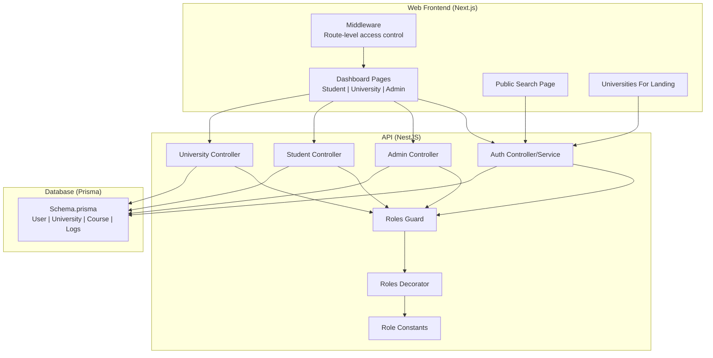
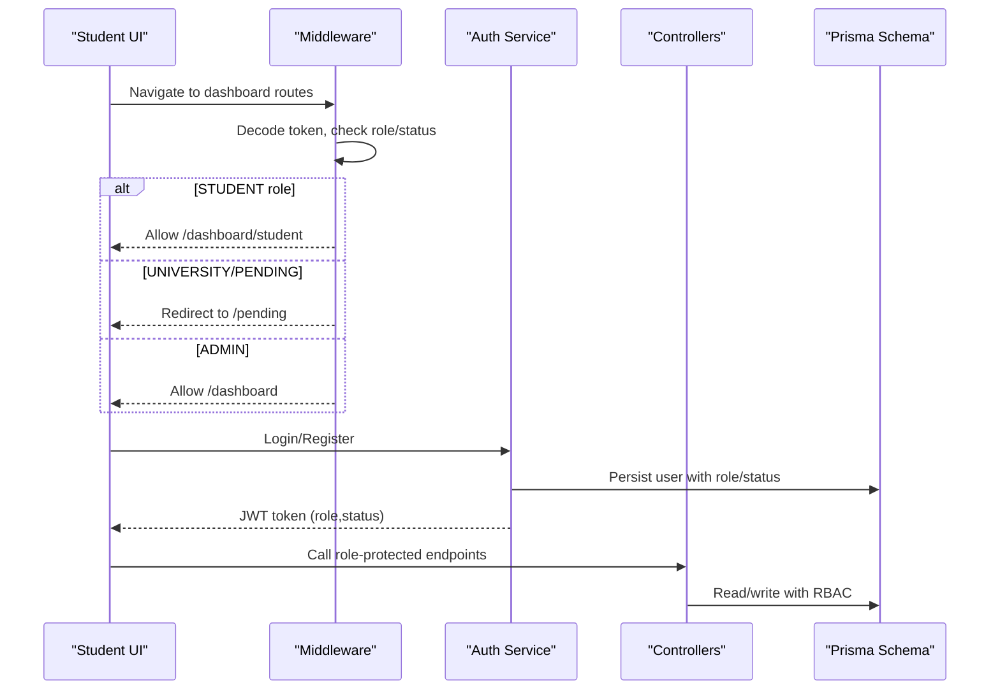
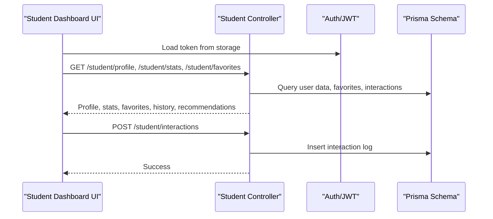
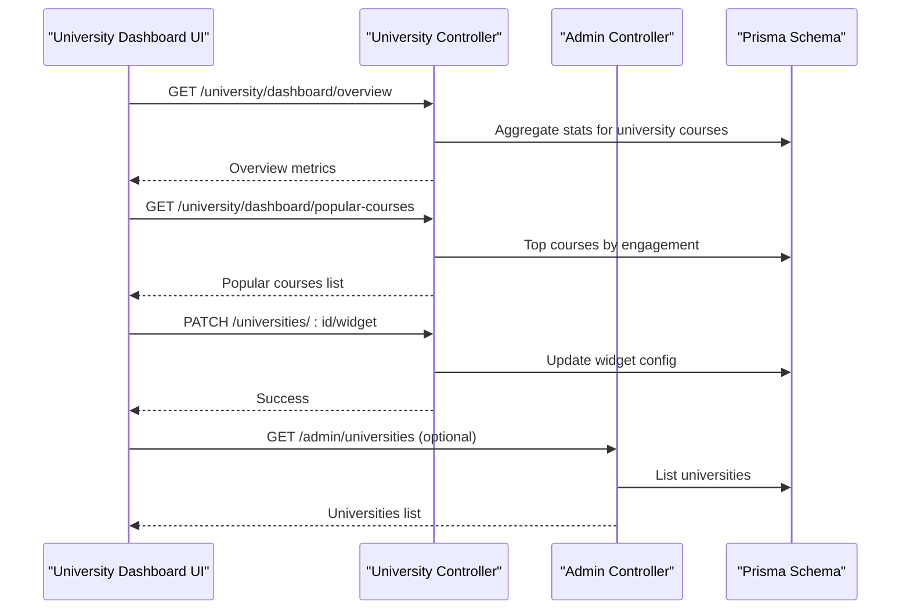
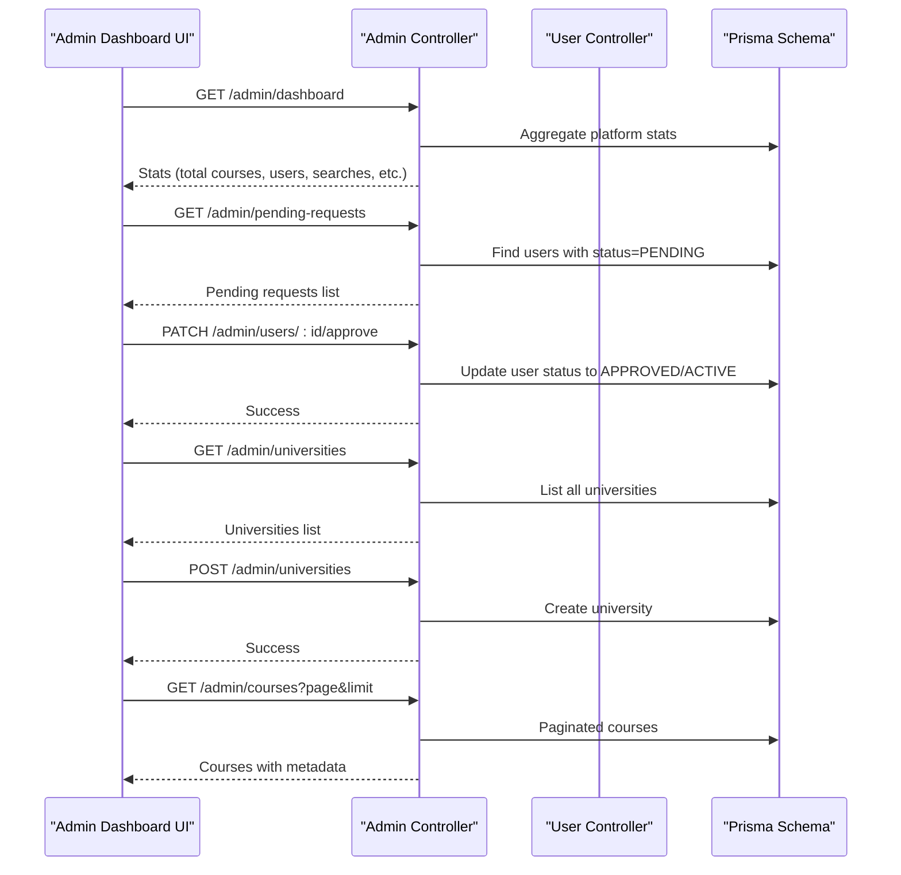
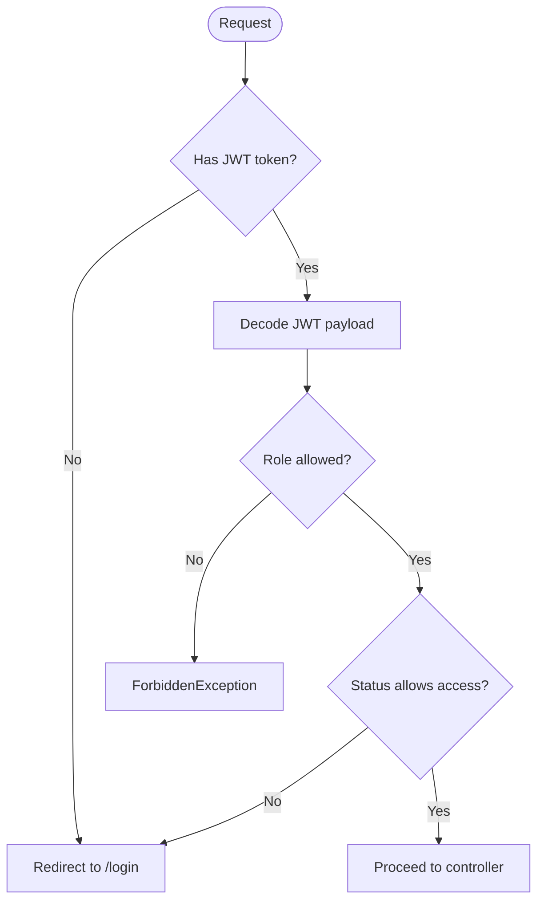
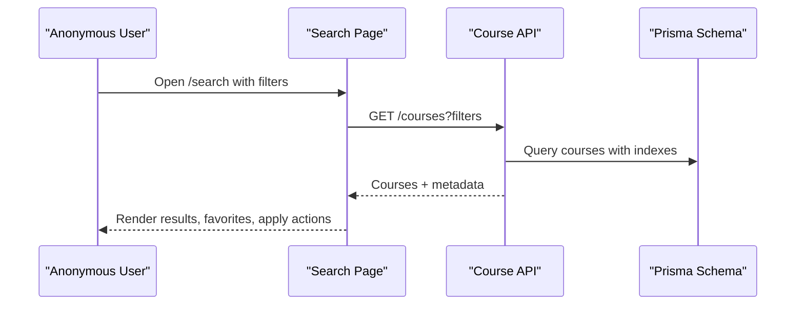
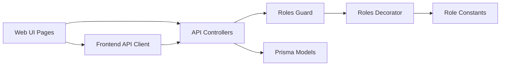

# Target Audience

<cite>
**Referenced Files in This Document**
- [roles.ts](file://apps/api/src/common/constants/roles.ts)
- [roles.guard.ts](file://apps/api/src/common/guards/roles.guard.ts)
- [roles.decorator.ts](file://apps/api/src/common/decorators/roles.decorator.ts)
- [admin.controller.ts](file://apps/api/src/modules/admin/admin.controller.ts)
- [student.controller.ts](file://apps/api/src/modules/student/student.controller.ts)
- [university.controller.ts](file://apps/api/src/modules/university/university.controller.ts)
- [auth.controller.ts](file://apps/api/src/modules/auth/auth.controller.ts)
- [auth.service.ts](file://apps/api/src/modules/auth/auth.service.ts)
- [user.controller.ts](file://apps/api/src/modules/user/user.controller.ts)
- [middleware.ts](file://apps/web/middleware.ts)
- [api.ts](file://apps/web/lib/api.ts)
- [dashboard/page.tsx](file://apps/web/app/dashboard/page.tsx)
- [dashboard/student/page.tsx](file://apps/web/app/dashboard/student/page.tsx)
- [dashboard/university/page.tsx](file://apps/web/app/dashboard/university/page.tsx)
- [dashboard/courses/page.tsx](file://apps/web/app/dashboard/courses/page.tsx)
- [search/page.tsx](file://apps/web/app/(public)/search/page.tsx)
- [universities-for/page.tsx](file://apps/web/app/(public)/universities-for/page.tsx)
- [schema.prisma](file://apps/api/prisma/schema.prisma)
</cite>

## Table of Contents
1. [Introduction](#introduction)
2. [Project Structure](#project-structure)
3. [Core Components](#core-components)
4. [Architecture Overview](#architecture-overview)
5. [Detailed Component Analysis](#detailed-component-analysis)
6. [Dependency Analysis](#dependency-analysis)
7. [Performance Considerations](#performance-considerations)
8. [Troubleshooting Guide](#troubleshooting-guide)
9. [Conclusion](#conclusion)
10. [Appendices](#appendices)

## Introduction
This document describes the target audiences for Yaz Okulu Var Mı? and how the platform serves three primary user groups:
- Students seeking summer school courses
- University staff managing course offerings
- Administrators overseeing the platform

It explains each persona’s needs, typical workflows, capabilities, success metrics, and how role-based access control (RBAC) ensures appropriate functionality and security across the system.

## Project Structure
The application is split into:
- API (NestJS) with modular controllers and guards for RBAC
- Web (Next.js) with route-level middleware and role-aware dashboards
- Database (Prisma) modeling users, universities, courses, and related analytics

**Diagram sources**
- [middleware.ts](file://apps/web/middleware.ts#L25-L102)
- [dashboard/page.tsx](file://apps/web/app/dashboard/page.tsx#L31-L77)
- [dashboard/student/page.tsx](file://apps/web/app/dashboard/student/page.tsx#L21-L59)
- [dashboard/university/page.tsx](file://apps/web/app/dashboard/university/page.tsx#L27-L49)
- [dashboard/courses/page.tsx](file://apps/web/app/dashboard/courses/page.tsx#L44-L96)
- [search/page.tsx](file://apps/web/app/(public)/search/page.tsx#L44-L47)
- [universities-for/page.tsx](file://apps/web/app/(public)/universities-for/page.tsx#L13-L58)
- [auth.controller.ts](file://apps/api/src/modules/auth/auth.controller.ts#L12-L27)
- [auth.service.ts](file://apps/api/src/modules/auth/auth.service.ts#L46-L130)
- [admin.controller.ts](file://apps/api/src/modules/admin/admin.controller.ts#L23-L118)
- [student.controller.ts](file://apps/api/src/modules/student/student.controller.ts#L31-L100)
- [university.controller.ts](file://apps/api/src/modules/university/university.controller.ts#L38-L113)
- [roles.guard.ts](file://apps/api/src/common/guards/roles.guard.ts#L20-L54)
- [roles.decorator.ts](file://apps/api/src/common/decorators/roles.decorator.ts)
- [roles.ts](file://apps/api/src/common/constants/roles.ts#L1-L6)
- [schema.prisma](file://apps/api/prisma/schema.prisma#L18-L31)

**Section sources**
- [middleware.ts](file://apps/web/middleware.ts#L25-L102)
- [api.ts](file://apps/web/lib/api.ts#L11-L36)
- [schema.prisma](file://apps/api/prisma/schema.prisma#L18-L31)

## Core Components
- Role model and statuses: STUDENT, UNIVERSITY, ADMIN and PENDING, APPROVED, REJECTED, ACTIVE.
- JWT-based authentication with role/status embedded in the token payload.
- Route-level middleware enforcing access per role and status.
- Controllers and guards ensuring endpoints are protected by required roles.
- Role-aware dashboards and pages tailored to each persona.

Key RBAC artifacts:
- Role constants and enums
- Roles guard and decorator
- Middleware enforcing redirects and role checks
- Controller-level @Roles(role) decorators

Success metrics per role:
- Students: search volume, favorites, interactions, recommendation relevance
- University staff: course visibility, engagement, application clicks, conversion rate
- Administrators: platform-wide stats, verification throughput, user approvals

**Section sources**
- [roles.ts](file://apps/api/src/common/constants/roles.ts#L1-L6)
- [roles.guard.ts](file://apps/api/src/common/guards/roles.guard.ts#L20-L54)
- [roles.decorator.ts](file://apps/api/src/common/decorators/roles.decorator.ts)
- [middleware.ts](file://apps/web/middleware.ts#L25-L102)
- [auth.service.ts](file://apps/api/src/modules/auth/auth.service.ts#L172-L188)
- [schema.prisma](file://apps/api/prisma/schema.prisma#L18-L31)

## Architecture Overview
The platform separates concerns by role:
- Students: discover, filter, save favorites, receive recommendations, track personal analytics
- University staff: manage courses (CRUD), configure widgets, view analytics
- Administrators: manage universities, courses, approve pending users, view platform stats

**Diagram sources**
- [middleware.ts](file://apps/web/middleware.ts#L25-L102)
- [auth.service.ts](file://apps/api/src/modules/auth/auth.service.ts#L46-L130)
- [auth.controller.ts](file://apps/api/src/modules/auth/auth.controller.ts#L12-L27)
- [student.controller.ts](file://apps/api/src/modules/student/student.controller.ts#L31-L100)
- [university.controller.ts](file://apps/api/src/modules/university/university.controller.ts#L38-L113)
- [admin.controller.ts](file://apps/api/src/modules/admin/admin.controller.ts#L23-L118)
- [schema.prisma](file://apps/api/prisma/schema.prisma#L60-L85)

## Detailed Component Analysis

### Student Persona
- Needs
  - Discover summer courses by location, price, dates, mode (online/on-campus)
  - Save favorites, track viewed courses, see personalized recommendations
  - Understand personal search trends and preferences
- Typical workflows
  - Public search → apply filters → view course cards → save favorites → view recommendations → personal analytics
- Capabilities
  - View profile, stats, favorites, search history, interactions, recommendations
  - Add/remove favorites, record interactions (view/favorite/apply)
- Success metrics
  - Number of searches, favorites, interactions, recommendation click-through
  - Top searched city, average interest by ECTS, last search date

**Diagram sources**
- [dashboard/student/page.tsx](file://apps/web/app/dashboard/student/page.tsx#L33-L59)
- [student.controller.ts](file://apps/api/src/modules/student/student.controller.ts#L37-L100)
- [api.ts](file://apps/web/lib/api.ts#L191-L284)
- [schema.prisma](file://apps/api/prisma/schema.prisma#L60-L85)

**Section sources**
- [dashboard/student/page.tsx](file://apps/web/app/dashboard/student/page.tsx#L21-L190)
- [student.controller.ts](file://apps/api/src/modules/student/student.controller.ts#L31-L100)
- [api.ts](file://apps/web/lib/api.ts#L191-L284)
- [schema.prisma](file://apps/api/prisma/schema.prisma#L156-L182)

### University Staff Persona
- Needs
  - Manage course catalog (add/edit/delete), set pricing/dates, monitor performance
  - Configure widget for embedding and branding
  - Track popularity, views, favorites, application clicks
- Typical workflows
  - Dashboard overview → manage courses → configure widget → view analytics
- Capabilities
  - CRUD courses under own university
  - Update widget configuration
  - View popular courses, time series analytics, course health metrics
- Success metrics
  - Total courses, views, favorites, application clicks, conversion rate, course health score

**Diagram sources**
- [dashboard/university/page.tsx](file://apps/web/app/dashboard/university/page.tsx#L27-L92)
- [university.controller.ts](file://apps/api/src/modules/university/university.controller.ts#L38-L113)
- [admin.controller.ts](file://apps/api/src/modules/admin/admin.controller.ts#L60-L83)
- [api.ts](file://apps/web/lib/api.ts#L114-L165)
- [schema.prisma](file://apps/api/prisma/schema.prisma#L35-L58)

**Section sources**
- [dashboard/university/page.tsx](file://apps/web/app/dashboard/university/page.tsx#L27-L94)
- [university.controller.ts](file://apps/api/src/modules/university/university.controller.ts#L38-L113)
- [api.ts](file://apps/web/lib/api.ts#L98-L165)
- [schema.prisma](file://apps/api/prisma/schema.prisma#L35-L58)

### Administrator Persona
- Needs
  - Oversee platform health, approve university accounts, manage courses and universities
  - Monitor popular searches, platform usage, and pending requests
- Typical workflows
  - Dashboard overview → review pending users → manage universities → manage courses
- Capabilities
  - Approve/reject users, verify universities, create/update/delete universities and courses
  - View platform statistics and popular searches
- Success metrics
  - Total courses, universities, verified/unverified counts, pending approvals, online courses, today’s searches

**Diagram sources**
- [dashboard/page.tsx](file://apps/web/app/dashboard/page.tsx#L31-L77)
- [admin.controller.ts](file://apps/api/src/modules/admin/admin.controller.ts#L23-L118)
- [user.controller.ts](file://apps/api/src/modules/user/user.controller.ts#L14-L39)
- [api.ts](file://apps/web/lib/api.ts#L294-L377)
- [schema.prisma](file://apps/api/prisma/schema.prisma#L35-L58)

**Section sources**
- [dashboard/page.tsx](file://apps/web/app/dashboard/page.tsx#L31-L175)
- [admin.controller.ts](file://apps/api/src/modules/admin/admin.controller.ts#L23-L118)
- [user.controller.ts](file://apps/api/src/modules/user/user.controller.ts#L14-L39)
- [api.ts](file://apps/web/lib/api.ts#L294-L377)
- [schema.prisma](file://apps/api/prisma/schema.prisma#L18-L31)

### Role-Based Access Control (RBAC)
- Guards and decorators
  - RolesGuard validates JWT role against controller-declared required roles
  - Roles decorator marks endpoints requiring ADMIN, UNIVERSITY, or STUDENT
- Middleware enforcement
  - Route-level protection for /dashboard and special pages (/pending)
  - Redirects based on role and status (e.g., UNIVERSITY with non-ACTIVE status to /pending)
- Authentication and token payload
  - Auth service generates JWT with role, status, and optional universityId
  - Middleware decodes token to enforce access rules

**Diagram sources**
- [roles.guard.ts](file://apps/api/src/common/guards/roles.guard.ts#L24-L54)
- [roles.decorator.ts](file://apps/api/src/common/decorators/roles.decorator.ts)
- [middleware.ts](file://apps/web/middleware.ts#L25-L102)
- [auth.service.ts](file://apps/api/src/modules/auth/auth.service.ts#L172-L188)

**Section sources**
- [roles.guard.ts](file://apps/api/src/common/guards/roles.guard.ts#L20-L54)
- [roles.decorator.ts](file://apps/api/src/common/decorators/roles.decorator.ts)
- [middleware.ts](file://apps/web/middleware.ts#L25-L102)
- [auth.service.ts](file://apps/api/src/modules/auth/auth.service.ts#L172-L188)

### Public Experience and Discovery
- Public search page enables anonymous discovery with filters and pagination
- Universities-for landing targets university partners with benefits and CTA

**Diagram sources**
- [search/page.tsx](file://apps/web/app/(public)/search/page.tsx#L44-L47)
- [api.ts](file://apps/web/lib/api.ts#L63-L96)
- [schema.prisma](file://apps/api/prisma/schema.prisma#L87-L122)

**Section sources**
- [search/page.tsx](file://apps/web/app/(public)/search/page.tsx#L44-L237)
- [api.ts](file://apps/web/lib/api.ts#L63-L96)
- [schema.prisma](file://apps/api/prisma/schema.prisma#L87-L122)

## Dependency Analysis
- Controllers depend on Guards and Decorators for RBAC
- Middleware depends on token decoding to enforce route-level access
- Services depend on Prisma models for data operations
- Frontend API clients encapsulate HTTP calls and token injection

**Diagram sources**
- [roles.guard.ts](file://apps/api/src/common/guards/roles.guard.ts#L20-L54)
- [roles.decorator.ts](file://apps/api/src/common/decorators/roles.decorator.ts)
- [roles.ts](file://apps/api/src/common/constants/roles.ts#L1-L6)
- [admin.controller.ts](file://apps/api/src/modules/admin/admin.controller.ts#L23-L118)
- [student.controller.ts](file://apps/api/src/modules/student/student.controller.ts#L31-L100)
- [university.controller.ts](file://apps/api/src/modules/university/university.controller.ts#L38-L113)
- [api.ts](file://apps/web/lib/api.ts#L11-L36)
- [schema.prisma](file://apps/api/prisma/schema.prisma#L35-L58)

**Section sources**
- [roles.guard.ts](file://apps/api/src/common/guards/roles.guard.ts#L20-L54)
- [roles.decorator.ts](file://apps/api/src/common/decorators/roles.decorator.ts)
- [roles.ts](file://apps/api/src/common/constants/roles.ts#L1-L6)
- [admin.controller.ts](file://apps/api/src/modules/admin/admin.controller.ts#L23-L118)
- [student.controller.ts](file://apps/api/src/modules/student/student.controller.ts#L31-L100)
- [university.controller.ts](file://apps/api/src/modules/university/university.controller.ts#L38-L113)
- [api.ts](file://apps/web/lib/api.ts#L11-L36)
- [schema.prisma](file://apps/api/prisma/schema.prisma#L35-L58)

## Performance Considerations
- Database indexes support frequent queries (course name/code, universityId, online flag, user favorites/interactions)
- Pagination for admin course listings reduces payload sizes
- Client-side caching and minimal re-renders in dashboards improve responsiveness
- Middleware avoids redundant token decoding by checking route matchers

[No sources needed since this section provides general guidance]

## Troubleshooting Guide
- Authentication failures
  - Invalid credentials or rejected account status block login
  - Middleware redirects unauthorized users to login or pending page
- Authorization errors
  - RolesGuard throws forbidden when user role does not match endpoint requirement
- Dashboard routing issues
  - Middleware enforces role-specific dashboards and prevents cross-access

**Section sources**
- [auth.service.ts](file://apps/api/src/modules/auth/auth.service.ts#L136-L170)
- [middleware.ts](file://apps/web/middleware.ts#L25-L102)
- [roles.guard.ts](file://apps/api/src/common/guards/roles.guard.ts#L40-L51)

## Conclusion
Yaz Okulu Var Mı? provides a clear, role-aware platform:
- Students can efficiently discover, save, and engage with courses
- University staff can manage offerings and analyze performance
- Administrators can oversee growth and quality across the ecosystem

RBAC, middleware enforcement, and role-specific dashboards ensure each persona receives the right tools and boundaries to succeed.

## Appendices

### User Personas and Success Metrics

- Student
  - Goals: Find suitable courses quickly, personalize experience, track interests
  - Metrics: Searches, favorites, interactions, recommendation effectiveness, top city/ECTS insights

- University Staff
  - Goals: Publish and maintain course info, drive visibility, optimize engagement
  - Metrics: Views, favorites, application clicks, conversion rate, course health score

- Administrator
  - Goals: Grow platform, verify quality, streamline operations
  - Metrics: Platform totals, verification throughput, pending approvals, popular searches

[No sources needed since this section summarizes without analyzing specific files]