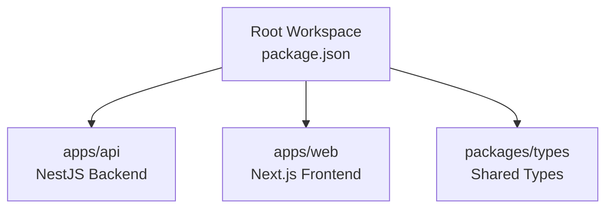
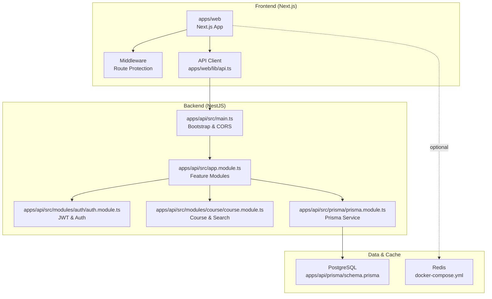
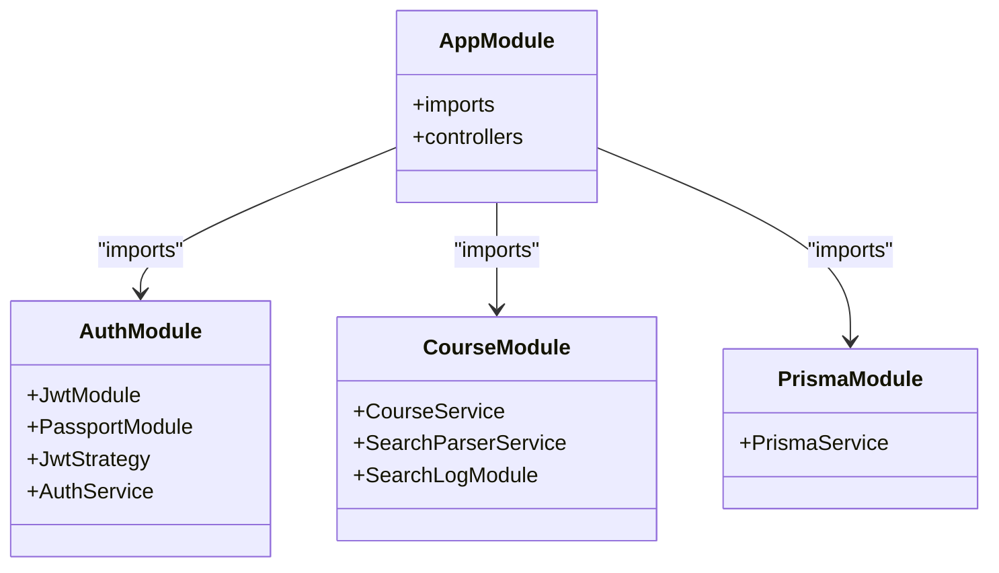
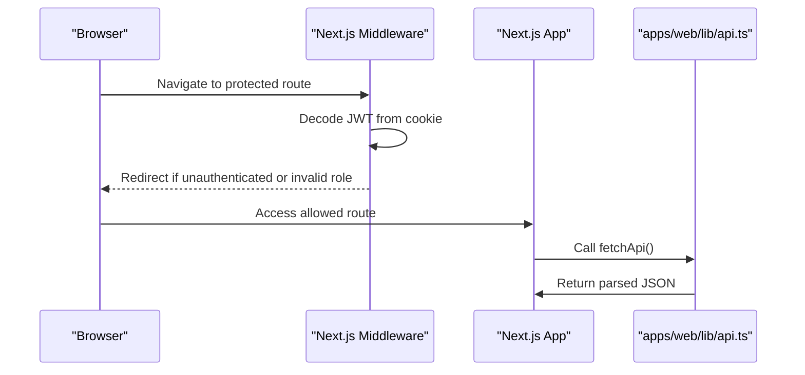
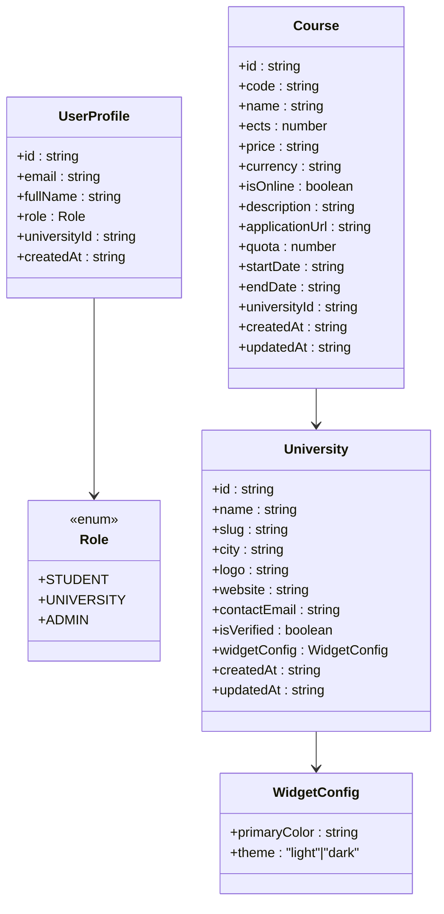
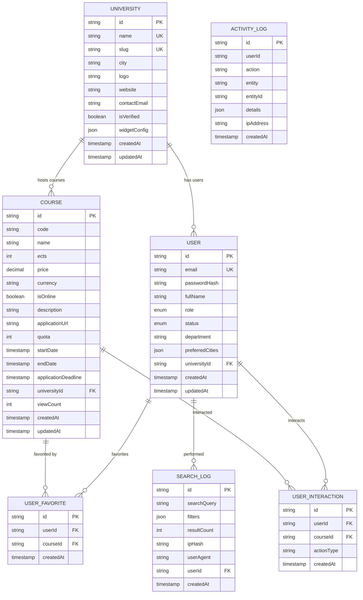
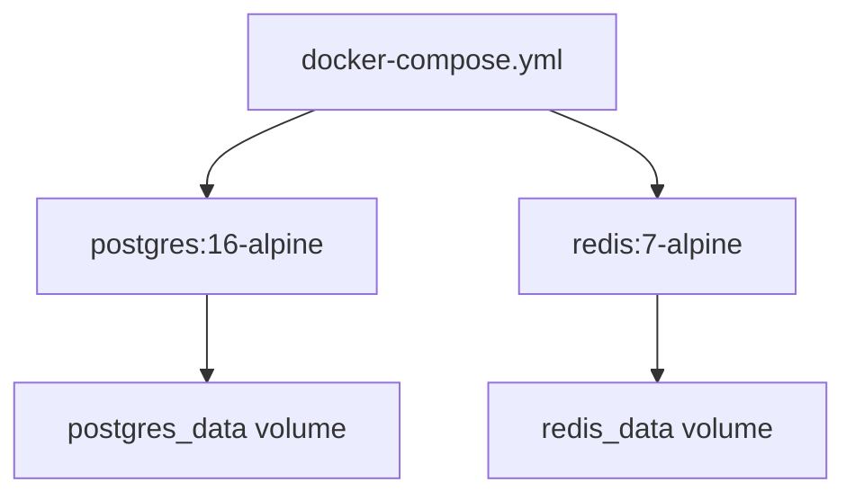
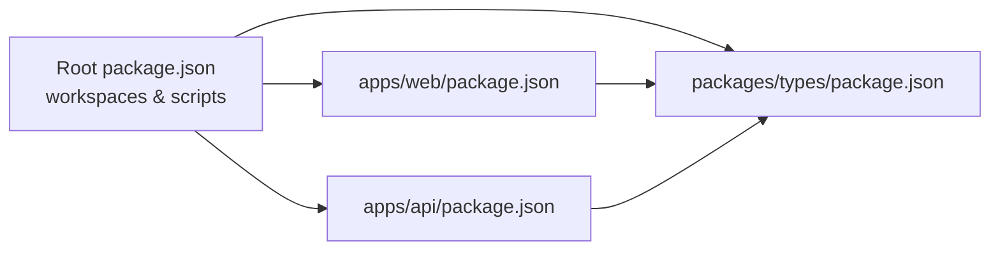

# Technology Stack

<cite>
**Referenced Files in This Document**
- [package.json](file://package.json)
- [docker-compose.yml](file://docker-compose.yml)
- [tsconfig.base.json](file://tsconfig.base.json)
- [apps/api/package.json](file://apps/api/package.json)
- [apps/api/src/main.ts](file://apps/api/src/main.ts)
- [apps/api/src/app.module.ts](file://apps/api/src/app.module.ts)
- [apps/api/src/modules/auth/auth.module.ts](file://apps/api/src/modules/auth/auth.module.ts)
- [apps/api/src/modules/course/course.module.ts](file://apps/api/src/modules/course/course.module.ts)
- [apps/api/src/prisma/prisma.module.ts](file://apps/api/src/prisma/prisma.module.ts)
- [apps/api/prisma/schema.prisma](file://apps/api/prisma/schema.prisma)
- [apps/web/package.json](file://apps/web/package.json)
- [apps/web/next.config.js](file://apps/web/next.config.js)
- [apps/web/tailwind.config.ts](file://apps/web/tailwind.config.ts)
- [apps/web/middleware.ts](file://apps/web/middleware.ts)
- [apps/web/lib/api.ts](file://apps/web/lib/api.ts)
- [packages/types/package.json](file://packages/types/package.json)
- [packages/types/src/index.ts](file://packages/types/src/index.ts)
</cite>

## Table of Contents
1. [Introduction](#introduction)
2. [Project Structure](#project-structure)
3. [Core Components](#core-components)
4. [Architecture Overview](#architecture-overview)
5. [Detailed Component Analysis](#detailed-component-analysis)
6. [Dependency Analysis](#dependency-analysis)
7. [Performance Considerations](#performance-considerations)
8. [Troubleshooting Guide](#troubleshooting-guide)
9. [Conclusion](#conclusion)
10. [Appendices](#appendices)

## Introduction
This document describes the complete technology stack powering Yaz Okulu Var Mı?, a full-stack platform for searching Turkish summer course offerings. It covers the backend built with NestJS, the frontend with Next.js, shared TypeScript types, Prisma ORM with PostgreSQL, Redis caching, and Docker-based containerization. It also explains the monorepo structure using npm workspaces, the rationale behind each technology choice, version requirements, integration patterns, and how these pieces collaborate to deliver a scalable and maintainable system.

## Project Structure
The project follows a monorepo layout using npm workspaces:
- Root workspace configuration defines two apps (backend and frontend) and a shared types package.
- Backend (NestJS) lives under apps/api.
- Frontend (Next.js) lives under apps/web.
- Shared types live under packages/types.

**Diagram sources**
- [package.json](file://package.json#L6-L9)

**Section sources**
- [package.json](file://package.json#L1-L24)

## Core Components
- Backend (NestJS): Application entrypoint initializes the framework, sets global prefix, enables CORS, registers global exception filtering, and listens on a configurable port.
- Frontend (Next.js): Provides a modern React application with route-based protection via middleware, image optimization, and API proxying to the backend.
- Shared Types: A dedicated package exporting common TypeScript interfaces and enums used by both backend and frontend.
- Database (PostgreSQL): Managed via Prisma with a comprehensive schema supporting multitenancy, user roles, courses, favorites, and analytics.
- Caching (Redis): Defined in Docker Compose for development; can be integrated for caching hot queries and session storage.
- Containerization: Docker Compose provisions PostgreSQL and Redis for local development.

**Section sources**
- [apps/api/src/main.ts](file://apps/api/src/main.ts#L10-L31)
- [apps/web/next.config.js](file://apps/web/next.config.js#L14-L22)
- [packages/types/src/index.ts](file://packages/types/src/index.ts#L1-L171)
- [apps/api/prisma/schema.prisma](file://apps/api/prisma/schema.prisma#L1-L183)
- [docker-compose.yml](file://docker-compose.yml#L6-L34)

## Architecture Overview
The system separates concerns across a backend API and a frontend application, communicating over HTTP with a shared type contract. The backend exposes REST-like endpoints under a global prefix, while the frontend proxies API requests and enforces route-level access control.

**Diagram sources**
- [apps/api/src/main.ts](file://apps/api/src/main.ts#L10-L31)
- [apps/api/src/app.module.ts](file://apps/api/src/app.module.ts#L30-L48)
- [apps/api/src/modules/auth/auth.module.ts](file://apps/api/src/modules/auth/auth.module.ts#L13-L28)
- [apps/api/src/modules/course/course.module.ts](file://apps/api/src/modules/course/course.module.ts#L11-L16)
- [apps/api/src/prisma/prisma.module.ts](file://apps/api/src/prisma/prisma.module.ts#L8-L13)
- [apps/api/prisma/schema.prisma](file://apps/api/prisma/schema.prisma#L7-L14)
- [apps/web/lib/api.ts](file://apps/web/lib/api.ts#L7-L36)
- [apps/web/middleware.ts](file://apps/web/middleware.ts#L25-L102)
- [docker-compose.yml](file://docker-compose.yml#L6-L34)

## Detailed Component Analysis

### Backend (NestJS)
- Entry and bootstrap: Initializes Nest application, sets global prefix, enables CORS, registers global exception filter, and starts the server.
- Modular architecture: Central AppModule aggregates feature modules (auth, user, university, course, search-log, widget, admin, student).
- Authentication: JWT module configured with secret from environment and a passport strategy; exported for use across modules.
- Persistence: Prisma module provides a globally available PrismaService for database operations.

**Diagram sources**
- [apps/api/src/app.module.ts](file://apps/api/src/app.module.ts#L30-L48)
- [apps/api/src/modules/auth/auth.module.ts](file://apps/api/src/modules/auth/auth.module.ts#L13-L28)
- [apps/api/src/modules/course/course.module.ts](file://apps/api/src/modules/course/course.module.ts#L11-L16)
- [apps/api/src/prisma/prisma.module.ts](file://apps/api/src/prisma/prisma.module.ts#L8-L13)

**Section sources**
- [apps/api/src/main.ts](file://apps/api/src/main.ts#L10-L31)
- [apps/api/src/app.module.ts](file://apps/api/src/app.module.ts#L30-L48)
- [apps/api/src/modules/auth/auth.module.ts](file://apps/api/src/modules/auth/auth.module.ts#L13-L28)
- [apps/api/src/modules/course/course.module.ts](file://apps/api/src/modules/course/course.module.ts#L11-L16)
- [apps/api/src/prisma/prisma.module.ts](file://apps/api/src/prisma/prisma.module.ts#L8-L13)

### Frontend (Next.js)
- API proxy: Rewrites /api/* routes to the backend base URL, simplifying cross-origin handling during development.
- Route protection: Middleware decodes JWT cookies, enforces role-specific routing, and redirects unauthorized or pending users appropriately.
- UI and styling: Tailwind CSS configured with design tokens and dark mode support; components use Radix UI primitives and Recharts for visualizations.

**Diagram sources**
- [apps/web/middleware.ts](file://apps/web/middleware.ts#L25-L102)
- [apps/web/lib/api.ts](file://apps/web/lib/api.ts#L11-L36)

**Section sources**
- [apps/web/next.config.js](file://apps/web/next.config.js#L14-L22)
- [apps/web/middleware.ts](file://apps/web/middleware.ts#L25-L102)
- [apps/web/tailwind.config.ts](file://apps/web/tailwind.config.ts#L1-L60)
- [apps/web/lib/api.ts](file://apps/web/lib/api.ts#L7-L36)

### Shared Types Package
- Purpose: Defines common TypeScript interfaces and enums used by both backend and frontend to ensure type consistency across the stack.
- Exports: Roles, user profiles, university and course entities, pagination metadata, search filters, statistics, widget data, and API error shape.

**Diagram sources**
- [packages/types/src/index.ts](file://packages/types/src/index.ts#L9-L171)

**Section sources**
- [packages/types/package.json](file://packages/types/package.json#L1-L9)
- [packages/types/src/index.ts](file://packages/types/src/index.ts#L1-L171)

### Database Schema (Prisma + PostgreSQL)
- Data source: PostgreSQL configured via DATABASE_URL environment variable.
- Entities: University, User, Course, SearchLog, ActivityLog, UserFavorite, UserInteraction.
- Indexes: Optimized composite and single-column indexes for frequent queries (name/code, universityId, role, status, filters).
- Multitenancy: Users linked to a university via universityId; course relations enforce tenant isolation.
- JSON fields: Native PostgreSQL JSON used for flexible configurations and analytics.

**Diagram sources**
- [apps/api/prisma/schema.prisma](file://apps/api/prisma/schema.prisma#L36-L183)

**Section sources**
- [apps/api/prisma/schema.prisma](file://apps/api/prisma/schema.prisma#L7-L14)
- [apps/api/prisma/schema.prisma](file://apps/api/prisma/schema.prisma#L36-L183)

### Containerization (Docker)
- Services: PostgreSQL 16 (Alpine) and Redis 7 (Alpine) with persistent volumes.
- Ports: PostgreSQL exposed on 5432; Redis on 6379.
- Volumes: Named volumes for data persistence.

**Diagram sources**
- [docker-compose.yml](file://docker-compose.yml#L6-L34)

**Section sources**
- [docker-compose.yml](file://docker-compose.yml#L1-L34)

## Dependency Analysis
- Monorepo workspaces: Root package.json declares workspaces for apps and packages; npm scripts orchestrate per-app builds and DB tasks.
- Backend dependencies: NestJS core, Prisma client, Passport/JWT, RxJS, Zod, and testing libraries.
- Frontend dependencies: Next.js, React, Radix UI, Tailwind, Recharts, Sonner, and Zod.
- Shared types: Consumed by both backend and frontend to align DTOs and response shapes.

**Diagram sources**
- [package.json](file://package.json#L6-L19)
- [apps/api/package.json](file://apps/api/package.json#L20-L54)
- [apps/web/package.json](file://apps/web/package.json#L12-L36)
- [packages/types/package.json](file://packages/types/package.json#L1-L9)

**Section sources**
- [package.json](file://package.json#L6-L19)
- [apps/api/package.json](file://apps/api/package.json#L20-L54)
- [apps/web/package.json](file://apps/web/package.json#L12-L36)
- [packages/types/package.json](file://packages/types/package.json#L1-L9)

## Performance Considerations
- Database indexing: Composite and selective indexes on frequently queried columns (name, code, universityId, filters) improve search performance.
- JSON fields: Native PostgreSQL JSON supports flexible analytics and widget configurations without normalization overhead.
- Caching strategy: Redis can cache hot search results and reduce load on PostgreSQL; configure connection and policies in backend services.
- Frontend optimization: Next.js image optimization and API rewrites minimize latency; middleware avoids unnecessary client-side redirects.
- Type safety: Shared types reduce runtime errors and enable efficient client-side rendering.

[No sources needed since this section provides general guidance]

## Troubleshooting Guide
- Backend health check: A root GET endpoint returns service status and timestamp for quick verification.
- CORS configuration: Origin and credentials are set from environment variables; ensure frontend URL matches to avoid preflight issues.
- Environment variables: DATABASE_URL and JWT_SECRET must be present; missing values cause startup failures.
- Database migrations: Use per-app scripts to generate Prisma client, apply migrations, and seed data.
- Frontend proxy: Verify NEXT_PUBLIC_API_URL and API_URL alignment; mismatch leads to 404s or CORS errors.
- Middleware redirects: Incorrect JWT payload or expired tokens trigger redirects to login or pending pages.

**Section sources**
- [apps/api/src/app.module.ts](file://apps/api/src/app.module.ts#L17-L28)
- [apps/api/src/main.ts](file://apps/api/src/main.ts#L14-L23)
- [apps/api/package.json](file://apps/api/package.json#L11-L16)
- [apps/web/next.config.js](file://apps/web/next.config.js#L14-L22)
- [apps/web/middleware.ts](file://apps/web/middleware.ts#L25-L102)

## Conclusion
Yaz Okulu Var Mı? leverages a modern, type-safe, and modular stack. NestJS provides a robust backend foundation with clear separation of concerns; Next.js delivers a responsive frontend with strong routing and middleware protections; Prisma and PostgreSQL offer a scalable data layer with multitenancy and analytics-friendly JSON fields; Redis can accelerate hot paths; and Docker streamlines local development. The shared types package ensures consistency across the stack, while npm workspaces simplify monorepo management.

[No sources needed since this section summarizes without analyzing specific files]

## Appendices

### Version Requirements
- Node.js: Engine requirement >= 18.0.0 at the root level.
- NestJS: Backend dependencies specify v10.x for core packages.
- Next.js: Frontend depends on Next.js 14.x.
- TypeScript: Both apps and shared types use TypeScript 5.3.x.
- Prisma: Backend depends on Prisma 5.x with Prisma Client.
- PostgreSQL: Docker Compose uses postgres:16-alpine.
- Redis: Docker Compose uses redis:7-alpine.

**Section sources**
- [package.json](file://package.json#L20-L22)
- [apps/api/package.json](file://apps/api/package.json#L21-L39)
- [apps/web/package.json](file://apps/web/package.json#L20)
- [apps/api/package.json](file://apps/api/package.json#L53)
- [docker-compose.yml](file://docker-compose.yml#L9)
- [docker-compose.yml](file://docker-compose.yml#L23)

### Integration Patterns
- Backend initialization: Global prefix (/api), CORS, and global exception filter ensure consistent behavior.
- Frontend API client: Centralized fetch wrapper handles auth headers and error responses.
- Middleware enforcement: JWT decoding and role checks protect routes before rendering pages.
- Shared types: Interfaces and enums imported by both backend DTOs/services and frontend components.

**Section sources**
- [apps/api/src/main.ts](file://apps/api/src/main.ts#L14-L26)
- [apps/web/lib/api.ts](file://apps/web/lib/api.ts#L11-L36)
- [apps/web/middleware.ts](file://apps/web/middleware.ts#L11-L23)
- [packages/types/src/index.ts](file://packages/types/src/index.ts#L1-L171)