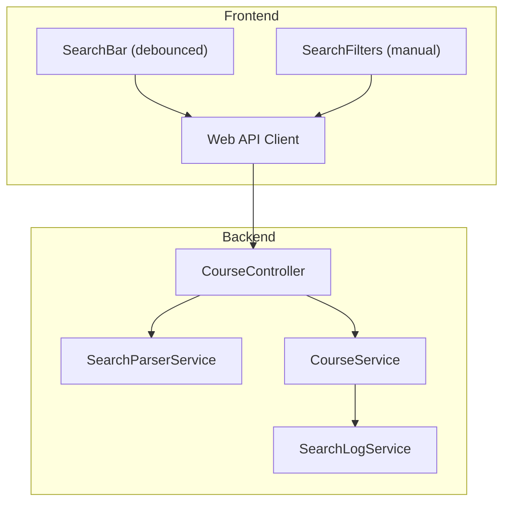
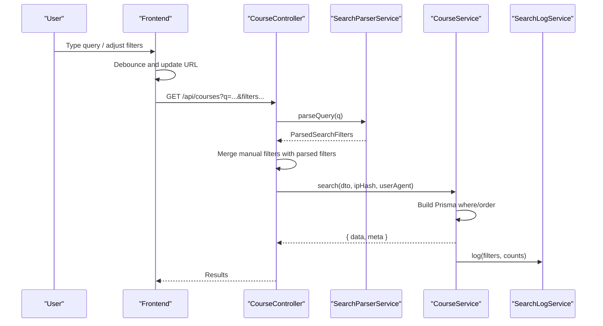
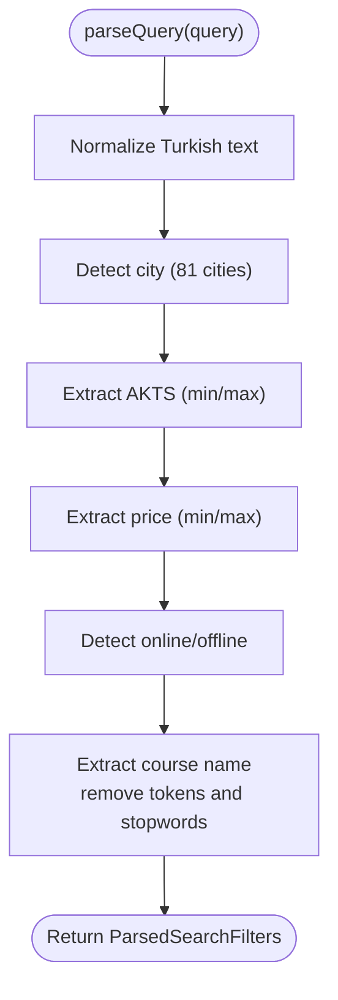
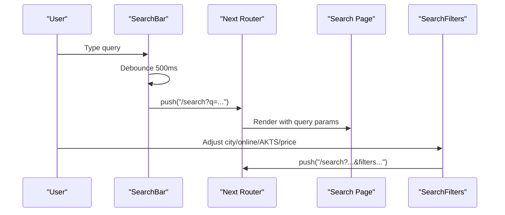
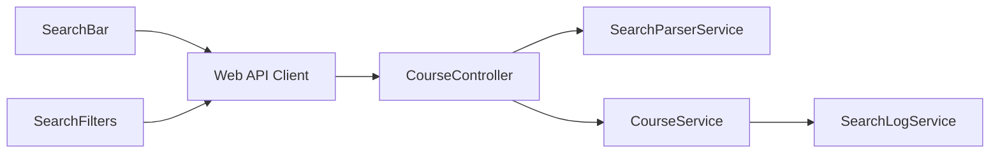

# Search and Natural Language Processing

<cite>
**Referenced Files in This Document**
- [search-parser.service.ts](file://apps/api/src/modules/course/search-parser.service.ts)
- [search-parser.service.spec.ts](file://apps/api/src/modules/course/search-parser.service.spec.ts)
- [course.controller.ts](file://apps/api/src/modules/course/course.controller.ts)
- [course.service.ts](file://apps/api/src/modules/course/course.service.ts)
- [course.dto.ts](file://apps/api/src/modules/course/course.dto.ts)
- [search-log.service.ts](file://apps/api/src/modules/search-log/search-log.service.ts)
- [search-bar.tsx](file://apps/web/components/layout/search-bar.tsx)
- [search-filters.tsx](file://apps/web/components/layout/search-filters.tsx)
- [api.ts](file://apps/web/lib/api.ts)
</cite>

## Table of Contents
1. [Introduction](#introduction)
2. [Project Structure](#project-structure)
3. [Core Components](#core-components)
4. [Architecture Overview](#architecture-overview)
5. [Detailed Component Analysis](#detailed-component-analysis)
6. [Dependency Analysis](#dependency-analysis)
7. [Performance Considerations](#performance-considerations)
8. [Troubleshooting Guide](#troubleshooting-guide)
9. [Conclusion](#conclusion)
10. [Appendices](#appendices)

## Introduction
This document explains the Turkish natural language search parsing system used to convert free-form Turkish queries into structured filters for course discovery. It covers the search algorithm, normalization, city detection across 81 Turkish cities, credit (AKTS) filtering, price range processing, and online/offline course detection. It also documents the parser service implementation, test coverage, performance optimization strategies, and the integration with the frontend search interface and real-time search capabilities.

## Project Structure
The search pipeline spans the backend NestJS API and the Next.js frontend:
- Backend: A dedicated parser service extracts filters from natural language queries, which are merged with manual query parameters in the course controller and applied by the course service to database queries.
- Frontend: A debounced search bar triggers live navigation to the search page, while sidebar filters manage explicit parameters.

**Diagram sources**
- [search-bar.tsx](file://apps/web/components/layout/search-bar.tsx#L31-L41)
- [search-filters.tsx](file://apps/web/components/layout/search-filters.tsx#L53-L59)
- [api.ts](file://apps/web/lib/api.ts#L64-L67)
- [course.controller.ts](file://apps/api/src/modules/course/course.controller.ts#L49-L75)
- [search-parser.service.ts](file://apps/api/src/modules/course/search-parser.service.ts#L116-L144)
- [course.service.ts](file://apps/api/src/modules/course/course.service.ts#L31-L133)
- [search-log.service.ts](file://apps/api/src/modules/search-log/search-log.service.ts#L25-L35)

**Section sources**
- [search-bar.tsx](file://apps/web/components/layout/search-bar.tsx#L1-L94)
- [search-filters.tsx](file://apps/web/components/layout/search-filters.tsx#L1-L248)
- [api.ts](file://apps/web/lib/api.ts#L1-L378)
- [course.controller.ts](file://apps/api/src/modules/course/course.controller.ts#L1-L148)
- [search-parser.service.ts](file://apps/api/src/modules/course/search-parser.service.ts#L1-L283)
- [course.service.ts](file://apps/api/src/modules/course/course.service.ts#L1-L310)
- [search-log.service.ts](file://apps/api/src/modules/search-log/search-log.service.ts#L1-L116)

## Core Components
- SearchParserService: Extracts city, AKTS range, price range, online/offline status, and course name from Turkish queries using normalization and regex.
- CourseController: Merges natural language filters with explicit query parameters, ensuring manual filters take precedence.
- CourseService: Applies filters to database queries, handles pagination, and records search logs.
- SearchLogService: Persists search events for analytics.
- Frontend SearchBar: Debounces user input and navigates to the search route with query parameters.
- Frontend SearchFilters: Manages explicit city, online/offline, AKTS, and price filters.

**Section sources**
- [search-parser.service.ts](file://apps/api/src/modules/course/search-parser.service.ts#L8-L17)
- [course.controller.ts](file://apps/api/src/modules/course/course.controller.ts#L49-L75)
- [course.service.ts](file://apps/api/src/modules/course/course.service.ts#L31-L133)
- [search-log.service.ts](file://apps/api/src/modules/search-log/search-log.service.ts#L9-L16)
- [search-bar.tsx](file://apps/web/components/layout/search-bar.tsx#L31-L41)
- [search-filters.tsx](file://apps/web/components/layout/search-filters.tsx#L53-L59)

## Architecture Overview
The system follows a layered approach:
- Input: Natural language query via SearchBar or explicit filters via SearchFilters.
- Parsing: SearchParserService normalizes Turkish text and applies keyword/regex rules to extract structured filters.
- Merging: CourseController merges parser results with explicit query parameters, prioritizing manual inputs.
- Execution: CourseService builds Prisma queries, executes them, and records logs.
- Output: Results returned with pagination metadata.

**Diagram sources**
- [search-bar.tsx](file://apps/web/components/layout/search-bar.tsx#L31-L41)
- [course.controller.ts](file://apps/api/src/modules/course/course.controller.ts#L49-L75)
- [search-parser.service.ts](file://apps/api/src/modules/course/search-parser.service.ts#L116-L144)
- [course.service.ts](file://apps/api/src/modules/course/course.service.ts#L31-L133)
- [search-log.service.ts](file://apps/api/src/modules/search-log/search-log.service.ts#L25-L35)

## Detailed Component Analysis

### SearchParserService
Responsibilities:
- Normalize Turkish text (lowercase, ASCII mapping, locale-independent I/i handling).
- Detect city from 81 Turkish cities using word-boundary-aware regex.
- Extract AKTS credits as single value or range.
- Extract price as "under X", "over X", or range, supporting TL/lira/₺ variants.
- Determine online/offline preference from keywords.
- Remove extracted tokens from remaining text to derive course name.

Key implementation patterns:
- Normalization: Maps Turkish characters to ASCII equivalents and normalizes case.
- City detection: Iterates predefined city keys with regex word boundaries.
- Numeric ranges: Uses regex captures to parse inclusive ranges and single values.
- Stopword removal: Strips extracted tokens and common Turkish words to isolate course name.

**Diagram sources**
- [search-parser.service.ts](file://apps/api/src/modules/course/search-parser.service.ts#L116-L144)
- [search-parser.service.ts](file://apps/api/src/modules/course/search-parser.service.ts#L147-L161)
- [search-parser.service.ts](file://apps/api/src/modules/course/search-parser.service.ts#L164-L174)
- [search-parser.service.ts](file://apps/api/src/modules/course/search-parser.service.ts#L177-L195)
- [search-parser.service.ts](file://apps/api/src/modules/course/search-parser.service.ts#L198-L222)
- [search-parser.service.ts](file://apps/api/src/modules/course/search-parser.service.ts#L225-L236)
- [search-parser.service.ts](file://apps/api/src/modules/course/search-parser.service.ts#L241-L281)

**Section sources**
- [search-parser.service.ts](file://apps/api/src/modules/course/search-parser.service.ts#L1-L283)

### CourseController
Responsibilities:
- Accepts query parameters for search.
- If a natural language query is present, invokes SearchParserService to enrich filters.
- Merges parsed filters with explicit parameters, giving precedence to manual inputs.
- Calls CourseService.search and returns paginated results.

Behavior highlights:
- Manual filters override parsed values.
- Converts boolean online preference to string for downstream processing.
- Records IP hash and user agent for analytics.

**Section sources**
- [course.controller.ts](file://apps/api/src/modules/course/course.controller.ts#L49-L75)

### CourseService
Responsibilities:
- Builds dynamic Prisma queries from filters.
- Supports text search on course name/code, city, university, online status, AKTS range, and price range.
- Applies sorting and pagination.
- Logs search events via SearchLogService.

Processing logic:
- Validates page and limit bounds (max 100 per page).
- Constructs where conditions for each filter.
- Sorts by requested field and order.
- Executes findMany and count concurrently.
- Logs search metadata asynchronously (non-blocking).

**Section sources**
- [course.service.ts](file://apps/api/src/modules/course/course.service.ts#L31-L133)

### SearchLogService
Responsibilities:
- Persists search events with query, filters, result count, IP hash, and user agent.
- Provides administrative analytics: popular searches, daily statistics, and overview metrics.

**Section sources**
- [search-log.service.ts](file://apps/api/src/modules/search-log/search-log.service.ts#L9-L16)
- [search-log.service.ts](file://apps/api/src/modules/search-log/search-log.service.ts#L25-L35)
- [search-log.service.ts](file://apps/api/src/modules/search-log/search-log.service.ts#L46-L59)
- [search-log.service.ts](file://apps/api/src/modules/search-log/search-log.service.ts#L65-L90)
- [search-log.service.ts](file://apps/api/src/modules/search-log/search-log.service.ts#L93-L114)

### Frontend Integration
- SearchBar: Debounces input for 500 ms and navigates to /search?q=...; supports focus sync to prevent overwriting.
- SearchFilters: Manages city, online/offline, AKTS, and price filters; updates URL parameters and clears pagination.

**Diagram sources**
- [search-bar.tsx](file://apps/web/components/layout/search-bar.tsx#L31-L41)
- [search-filters.tsx](file://apps/web/components/layout/search-filters.tsx#L53-L59)

**Section sources**
- [search-bar.tsx](file://apps/web/components/layout/search-bar.tsx#L1-L94)
- [search-filters.tsx](file://apps/web/components/layout/search-filters.tsx#L1-L248)
- [api.ts](file://apps/web/lib/api.ts#L64-L67)

## Dependency Analysis
- CourseController depends on SearchParserService and CourseService.
- CourseService depends on PrismaService and SearchLogService.
- Frontend components depend on Next.js routing and the Web API client.

**Diagram sources**
- [course.controller.ts](file://apps/api/src/modules/course/course.controller.ts#L36-L41)
- [course.service.ts](file://apps/api/src/modules/course/course.service.ts#L22-L25)
- [search-log.service.ts](file://apps/api/src/modules/search-log/search-log.service.ts#L22)
- [search-bar.tsx](file://apps/web/components/layout/search-bar.tsx#L18-L41)
- [search-filters.tsx](file://apps/web/components/layout/search-filters.tsx#L12-L59)
- [api.ts](file://apps/web/lib/api.ts#L64-L67)

**Section sources**
- [course.controller.ts](file://apps/api/src/modules/course/course.controller.ts#L36-L41)
- [course.service.ts](file://apps/api/src/modules/course/course.service.ts#L22-L25)
- [search-log.service.ts](file://apps/api/src/modules/search-log/search-log.service.ts#L22)
- [search-bar.tsx](file://apps/web/components/layout/search-bar.tsx#L18-L41)
- [search-filters.tsx](file://apps/web/components/layout/search-filters.tsx#L12-L59)
- [api.ts](file://apps/web/lib/api.ts#L64-L67)

## Performance Considerations
- Frontend
  - Debounce input to reduce network requests during typing.
  - Keep URL parameters minimal to avoid excessive re-renders.
- Backend
  - Limit page size (max 100) to control query cost.
  - Use concurrent count and findMany to minimize latency.
  - Index database columns frequently used in filters (city, price, ects).
  - Normalize text once per query to avoid repeated transformations.
- Logging
  - Log asynchronously to avoid blocking response time.

[No sources needed since this section provides general guidance]

## Troubleshooting Guide
Common issues and resolutions:
- Empty or whitespace-only queries return empty filters; ensure non-empty input.
- Manual filters override parsed values; if parsing conflicts with explicit filters, check precedence logic.
- City detection requires word boundaries; ensure city names are not embedded inside other words.
- Price parsing supports multiple forms ("under X", "over X", "X-Y"); verify units and separators.
- Online/offline detection relies on keyword presence; ensure query contains recognized terms.

**Section sources**
- [search-parser.service.spec.ts](file://apps/api/src/modules/course/search-parser.service.spec.ts#L65-L69)
- [course.controller.ts](file://apps/api/src/modules/course/course.controller.ts#L54-L68)
- [course.service.ts](file://apps/api/src/modules/course/course.service.ts#L32-L34)

## Conclusion
The Turkish natural language search system combines a robust parser with explicit frontend controls to deliver precise, real-time course discovery. The parser normalizes Turkish text, detects cities, credits, prices, and delivery modes, and the backend merges these signals with manual filters to produce efficient database queries and meaningful analytics.

[No sources needed since this section summarizes without analyzing specific files]

## Appendices

### Supported Query Patterns and Filter Mappings
- City detection: "İzmir'de online matematik" → city: "İzmir", isOnline: true, q: "matematik"
- AKTS range: "3-6 kredi", "6 AKTS", "4 ects" → minEcts, maxEcts
- Price range: "2000 TL altı", "1500 TL üstü", "1000-2000 TL" → minPrice, maxPrice
- Online/offline: "online", "uzaktan", "yüz yüze", "kampüs" → isOnline: true/false
- Course name extraction: Removes detected tokens and common stop words to derive q

**Section sources**
- [search-parser.service.spec.ts](file://apps/api/src/modules/course/search-parser.service.spec.ts#L18-L57)
- [search-parser.service.ts](file://apps/api/src/modules/course/search-parser.service.ts#L177-L222)
- [search-parser.service.ts](file://apps/api/src/modules/course/search-parser.service.ts#L241-L281)

### API Contracts and Validation
- Search endpoint: /api/courses with query parameters validated by SearchCoursesSchema.
- Sorting: sortBy supports name, price, ects, createdAt; sortOrder supports asc/desc.
- Pagination: page defaults to 1; limit defaults to 20 with max 100.

**Section sources**
- [course.dto.ts](file://apps/api/src/modules/course/course.dto.ts#L68-L84)
- [course.service.ts](file://apps/api/src/modules/course/course.service.ts#L31-L85)