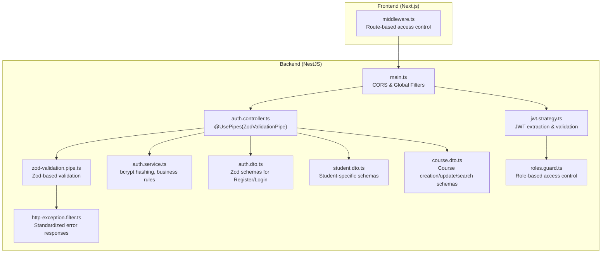
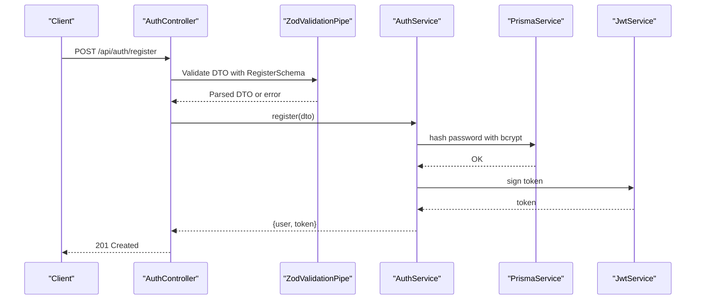
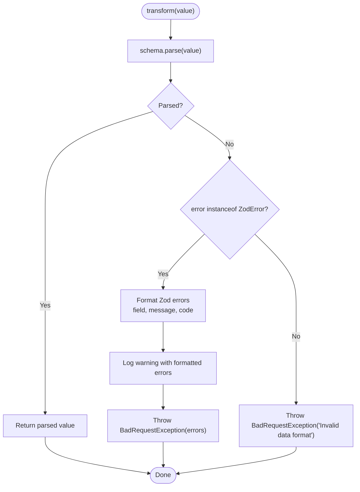
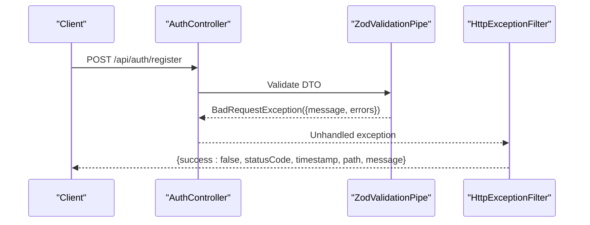
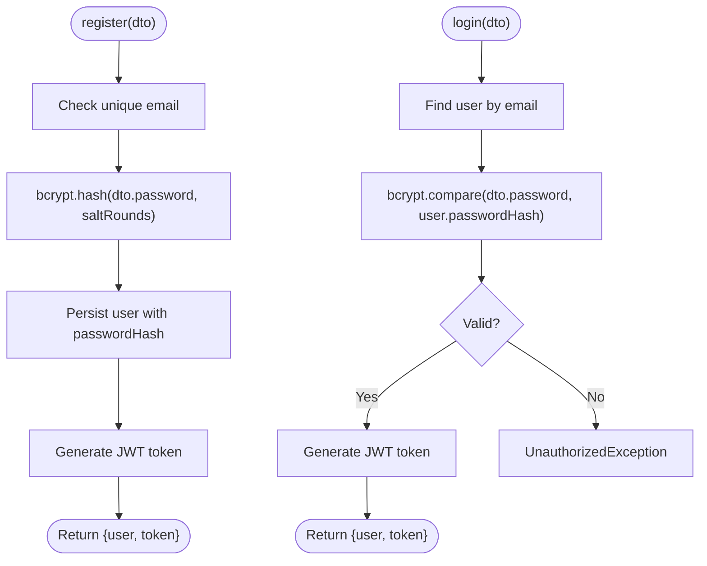
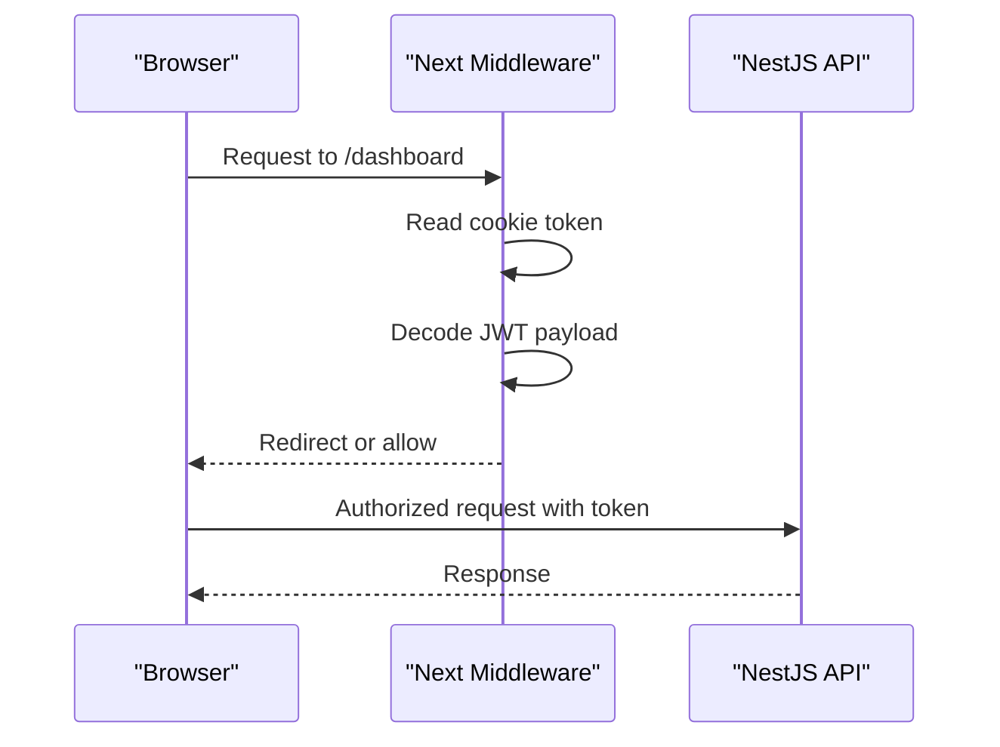
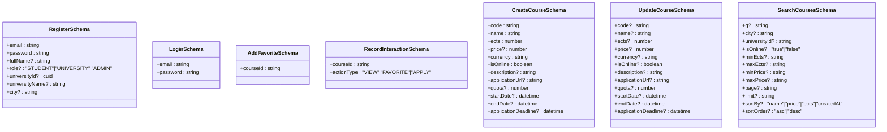
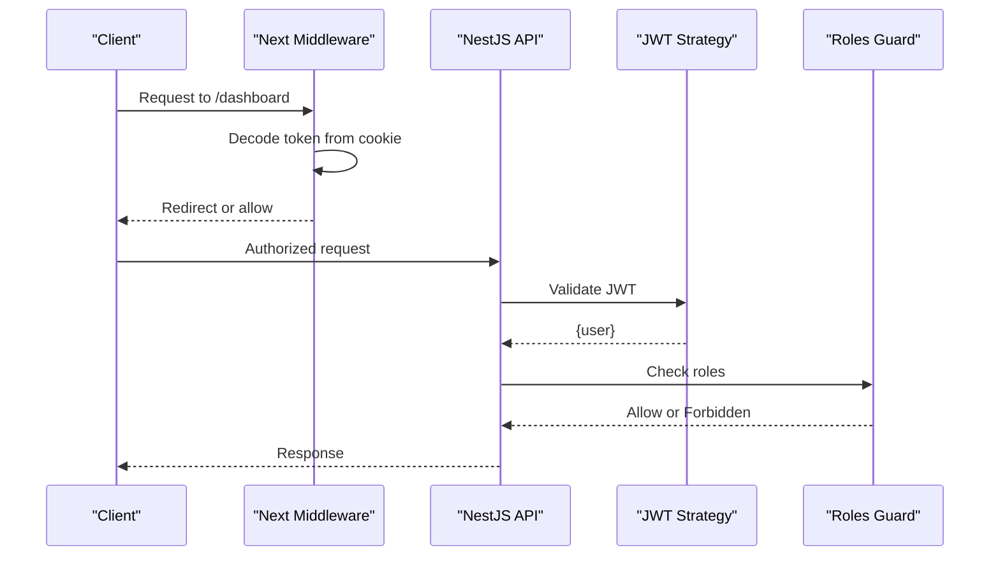
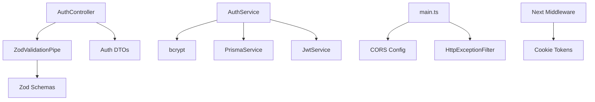

# Input Validation and Security

<cite>
**Referenced Files in This Document**
- [zod-validation.pipe.ts](file://apps/api/src/common/pipes/zod-validation.pipe.ts)
- [http-exception.filter.ts](file://apps/api/src/common/filters/http-exception.filter.ts)
- [auth.controller.ts](file://apps/api/src/modules/auth/auth.controller.ts)
- [auth.dto.ts](file://apps/api/src/modules/auth/auth.dto.ts)
- [auth.service.ts](file://apps/api/src/modules/auth/auth.service.ts)
- [student.dto.ts](file://apps/api/src/modules/student/student.dto.ts)
- [course.dto.ts](file://apps/api/src/modules/course/course.dto.ts)
- [main.ts](file://apps/api/src/main.ts)
- [middleware.ts](file://apps/web/middleware.ts)
- [jwt.strategy.ts](file://apps/api/src/modules/auth/jwt.strategy.ts)
- [roles.guard.ts](file://apps/api/src/common/guards/roles.guard.ts)
</cite>

## Table of Contents
1. [Introduction](#introduction)
2. [Project Structure](#project-structure)
3. [Core Components](#core-components)
4. [Architecture Overview](#architecture-overview)
5. [Detailed Component Analysis](#detailed-component-analysis)
6. [Dependency Analysis](#dependency-analysis)
7. [Performance Considerations](#performance-considerations)
8. [Troubleshooting Guide](#troubleshooting-guide)
9. [Conclusion](#conclusion)

## Introduction
This document explains the input validation and security measures implemented in the backend API and frontend middleware. It focuses on:
- Automatic DTO validation using Zod schemas via a custom ZodValidationPipe
- Validation error handling and standardized error responses
- Password hashing with bcrypt
- Input sanitization and XSS prevention techniques
- CORS configuration for secure cross-origin requests
- CSRF protection strategies
- Examples of validation schemas for user registration, login, and course-related operations
- Rate limiting, input length restrictions, and special character filtering
- Common input validation vulnerabilities and secure coding practices for form processing

## Project Structure
The validation and security features span the backend NestJS application and the frontend Next.js middleware:
- Backend: Zod-based DTOs, ZodValidationPipe, global exception filter, CORS configuration, JWT strategy, and role guard
- Frontend: Route-based middleware enforcing access control and token validation

**Diagram sources**
- [main.ts](file://apps/api/src/main.ts#L10-L31)
- [auth.controller.ts](file://apps/api/src/modules/auth/auth.controller.ts#L12-L27)
- [zod-validation.pipe.ts](file://apps/api/src/common/pipes/zod-validation.pipe.ts#L14-L44)
- [http-exception.filter.ts](file://apps/api/src/common/filters/http-exception.filter.ts#L16-L49)
- [auth.service.ts](file://apps/api/src/modules/auth/auth.service.ts#L32-L130)
- [jwt.strategy.ts](file://apps/api/src/modules/auth/jwt.strategy.ts#L21-L57)
- [roles.guard.ts](file://apps/api/src/common/guards/roles.guard.ts#L20-L42)
- [auth.dto.ts](file://apps/api/src/modules/auth/auth.dto.ts#L9-L32)
- [student.dto.ts](file://apps/api/src/modules/student/student.dto.ts#L6-L17)
- [course.dto.ts](file://apps/api/src/modules/course/course.dto.ts#L9-L43)
- [middleware.ts](file://apps/web/middleware.ts#L25-L102)

**Section sources**
- [main.ts](file://apps/api/src/main.ts#L10-L31)
- [auth.controller.ts](file://apps/api/src/modules/auth/auth.controller.ts#L12-L27)
- [zod-validation.pipe.ts](file://apps/api/src/common/pipes/zod-validation.pipe.ts#L14-L44)
- [http-exception.filter.ts](file://apps/api/src/common/filters/http-exception.filter.ts#L16-L49)
- [auth.service.ts](file://apps/api/src/modules/auth/auth.service.ts#L32-L130)
- [jwt.strategy.ts](file://apps/api/src/modules/auth/jwt.strategy.ts#L21-L57)
- [roles.guard.ts](file://apps/api/src/common/guards/roles.guard.ts#L20-L42)
- [auth.dto.ts](file://apps/api/src/modules/auth/auth.dto.ts#L9-L32)
- [student.dto.ts](file://apps/api/src/modules/student/student.dto.ts#L6-L17)
- [course.dto.ts](file://apps/api/src/modules/course/course.dto.ts#L9-L43)
- [middleware.ts](file://apps/web/middleware.ts#L25-L102)

## Core Components
- ZodValidationPipe: Validates incoming request bodies against Zod schemas and throws structured errors on failure.
- Global Exception Filter: Standardizes error responses across the API.
- Auth Controller: Applies ZodValidationPipe to registration and login endpoints.
- Auth DTOs: Strongly-typed Zod schemas for Register and Login.
- Student DTOs: Zod schemas for student-specific operations.
- Course DTOs: Zod schemas for course creation, updates, and search filters.
- Auth Service: Implements password hashing with bcrypt and business rules.
- CORS Configuration: Enables controlled cross-origin access from the frontend.
- Frontend Middleware: Enforces route-level access control and redirects unauthorized users.
- JWT Strategy and Roles Guard: Secure authentication and role-based authorization.

**Section sources**
- [zod-validation.pipe.ts](file://apps/api/src/common/pipes/zod-validation.pipe.ts#L14-L44)
- [http-exception.filter.ts](file://apps/api/src/common/filters/http-exception.filter.ts#L16-L49)
- [auth.controller.ts](file://apps/api/src/modules/auth/auth.controller.ts#L12-L27)
- [auth.dto.ts](file://apps/api/src/modules/auth/auth.dto.ts#L9-L32)
- [student.dto.ts](file://apps/api/src/modules/student/student.dto.ts#L6-L17)
- [course.dto.ts](file://apps/api/src/modules/course/course.dto.ts#L9-L43)
- [auth.service.ts](file://apps/api/src/modules/auth/auth.service.ts#L69-L70)
- [main.ts](file://apps/api/src/main.ts#L19-L23)
- [middleware.ts](file://apps/web/middleware.ts#L25-L102)
- [jwt.strategy.ts](file://apps/api/src/modules/auth/jwt.strategy.ts#L21-L57)
- [roles.guard.ts](file://apps/api/src/common/guards/roles.guard.ts#L20-L42)

## Architecture Overview
The validation and security pipeline ensures that all incoming requests are validated early, standardized errors are returned, and access is controlled both at the backend and frontend.

**Diagram sources**
- [auth.controller.ts](file://apps/api/src/modules/auth/auth.controller.ts#L16-L20)
- [zod-validation.pipe.ts](file://apps/api/src/common/pipes/zod-validation.pipe.ts#L20-L43)
- [auth.service.ts](file://apps/api/src/modules/auth/auth.service.ts#L69-L130)
- [auth.dto.ts](file://apps/api/src/modules/auth/auth.dto.ts#L9-L32)

## Detailed Component Analysis

### ZodValidationPipe Implementation
- Purpose: Replace generic validation with Zod for strong typing and localized error reporting.
- Behavior:
  - Parses the incoming value with the provided Zod schema.
  - On validation errors, formats field paths, messages, and error codes.
  - Logs warnings with raw request data for debugging.
  - Throws a structured BadRequestException with a machine-readable error array.
- Integration: Applied per endpoint via @UsePipes(new ZodValidationPipe(Schema)).

**Diagram sources**
- [zod-validation.pipe.ts](file://apps/api/src/common/pipes/zod-validation.pipe.ts#L20-L43)

**Section sources**
- [zod-validation.pipe.ts](file://apps/api/src/common/pipes/zod-validation.pipe.ts#L14-L44)

### Validation Error Handling and Custom Messages
- Global Exception Filter:
  - Catches all exceptions and returns a consistent JSON response.
  - Logs request method, URL, and status code.
  - Ensures non-HTTP errors are mapped to internal server error with a friendly message.
- ZodValidationPipe:
  - Produces an array of validation errors with field paths and messages.
  - Provides machine-readable codes for client-side handling.

**Diagram sources**
- [auth.controller.ts](file://apps/api/src/modules/auth/auth.controller.ts#L16-L20)
- [zod-validation.pipe.ts](file://apps/api/src/common/pipes/zod-validation.pipe.ts#L35-L38)
- [http-exception.filter.ts](file://apps/api/src/common/filters/http-exception.filter.ts#L20-L47)

**Section sources**
- [http-exception.filter.ts](file://apps/api/src/common/filters/http-exception.filter.ts#L16-L49)
- [zod-validation.pipe.ts](file://apps/api/src/common/pipes/zod-validation.pipe.ts#L24-L41)

### Password Hashing with bcrypt
- Implemented in AuthService during registration.
- Uses a cost factor suitable for server environments.
- Password comparison occurs during login using bcrypt.compare.

**Diagram sources**
- [auth.service.ts](file://apps/api/src/modules/auth/auth.service.ts#L46-L130)

**Section sources**
- [auth.service.ts](file://apps/api/src/modules/auth/auth.service.ts#L69-L70)
- [auth.service.ts](file://apps/api/src/modules/auth/auth.service.ts#L145-L148)

### Input Sanitization and XSS Prevention
- Backend:
  - Zod schemas enforce data types and lengths, reducing risk of malformed payloads.
  - Global exception filter avoids leaking stack traces to clients.
- Frontend:
  - Next.js middleware decodes JWT tokens from cookies and enforces route-level access control.
  - Redirects unauthorized users and prevents role-based bypass attempts.

**Diagram sources**
- [middleware.ts](file://apps/web/middleware.ts#L25-L102)

**Section sources**
- [middleware.ts](file://apps/web/middleware.ts#L25-L102)

### CORS Configuration for Secure Cross-Origin Requests
- Enabled in main.ts with:
  - origin: Controlled by FRONTEND_URL environment variable
  - credentials: true to support cookie-based authentication
- Ensures frontend can send cookies and credentials securely.

**Section sources**
- [main.ts](file://apps/api/src/main.ts#L19-L23)

### CSRF Protection Strategies
- Cookies are HTTP-only and sent with credentials (CORS credentials enabled).
- Next.js middleware validates presence and validity of JWT tokens for protected routes.
- No explicit CSRF tokens are implemented in the backend; reliance is on token-based authentication and middleware checks.

**Section sources**
- [main.ts](file://apps/api/src/main.ts#L20-L23)
- [middleware.ts](file://apps/web/middleware.ts#L25-L102)

### Validation Schemas: Registration, Login, and Profile Operations
- Registration (RegisterSchema):
  - Email validation with custom message
  - Password minimum/maximum length constraints
  - Optional fullName, role defaults, optional university fields
- Login (LoginSchema):
  - Email validation
  - Non-empty password requirement
- Student DTOs:
  - AddFavoriteSchema: courseId required
  - RecordInteractionSchema: courseId required and actionType enum
- Course DTOs:
  - CreateCourseSchema: code/name length limits, integer ects bounds, price non-negative, currency default, optional URLs and dates
  - UpdateCourseSchema: optional fields with similar constraints
  - SearchCoursesSchema: pagination defaults, enum filters, numeric string conversions

**Diagram sources**
- [auth.dto.ts](file://apps/api/src/modules/auth/auth.dto.ts#L9-L32)
- [auth.dto.ts](file://apps/api/src/modules/auth/auth.dto.ts#L36-L43)
- [student.dto.ts](file://apps/api/src/modules/student/student.dto.ts#L6-L17)
- [course.dto.ts](file://apps/api/src/modules/course/course.dto.ts#L9-L43)
- [course.dto.ts](file://apps/api/src/modules/course/course.dto.ts#L49-L62)
- [course.dto.ts](file://apps/api/src/modules/course/course.dto.ts#L68-L81)

**Section sources**
- [auth.dto.ts](file://apps/api/src/modules/auth/auth.dto.ts#L9-L32)
- [auth.dto.ts](file://apps/api/src/modules/auth/auth.dto.ts#L36-L43)
- [student.dto.ts](file://apps/api/src/modules/student/student.dto.ts#L6-L17)
- [course.dto.ts](file://apps/api/src/modules/course/course.dto.ts#L9-L43)
- [course.dto.ts](file://apps/api/src/modules/course/course.dto.ts#L49-L62)
- [course.dto.ts](file://apps/api/src/modules/course/course.dto.ts#L68-L81)

### Rate Limiting Implementation
- Not implemented in the current codebase.
- Recommended approaches:
  - Use a rate-limiting library (e.g., Express rate limiters) behind a reverse proxy or middleware.
  - Apply per-endpoint or per-IP limits with Redis-backed tracking.
  - Combine with circuit breakers for resilience.

[No sources needed since this section provides general guidance]

### Input Length Restrictions and Special Character Filtering
- Enforced via Zod schemas:
  - String min/max lengths for emails, passwords, names, course codes/names, descriptions
  - Numeric bounds for ects and price
  - Enum constraints for roles and action types
- Additional client-side constraints observed in frontend pages:
  - Number inputs with min/max attributes for ects and quota
  - URL inputs for application URLs and websites
- Recommendation: Apply server-side validation as the single source of truth; treat client-side constraints as UX enhancements.

**Section sources**
- [auth.dto.ts](file://apps/api/src/modules/auth/auth.dto.ts#L10-L21)
- [course.dto.ts](file://apps/api/src/modules/course/course.dto.ts#L10-L22)
- [course.dto.ts](file://apps/api/src/modules/course/course.dto.ts#L30-L33)
- [course.dto.ts](file://apps/api/src/modules/course/course.dto.ts#L34-L42)
- [course.dto.ts](file://apps/api/src/modules/course/course.dto.ts#L14-L16)
- [course.dto.ts](file://apps/api/src/modules/course/course.dto.ts#L50-L56)

### Authentication and Authorization Flow
- JWT Strategy extracts and verifies tokens; populates request.user.
- Roles Guard enforces role-based access using @Roles() metadata.
- Frontend middleware decodes tokens from cookies and redirects unauthorized users.

**Diagram sources**
- [middleware.ts](file://apps/web/middleware.ts#L25-L102)
- [jwt.strategy.ts](file://apps/api/src/modules/auth/jwt.strategy.ts#L21-L57)
- [roles.guard.ts](file://apps/api/src/common/guards/roles.guard.ts#L20-L42)

**Section sources**
- [jwt.strategy.ts](file://apps/api/src/modules/auth/jwt.strategy.ts#L21-L57)
- [roles.guard.ts](file://apps/api/src/common/guards/roles.guard.ts#L20-L42)
- [middleware.ts](file://apps/web/middleware.ts#L25-L102)

## Dependency Analysis
- ZodValidationPipe depends on ZodSchema and NestJS pipes infrastructure.
- Auth Controller depends on ZodValidationPipe and DTO schemas.
- Auth Service depends on bcrypt, PrismaService, and JwtService.
- Global Exception Filter centralizes error handling.
- CORS configuration depends on environment variables.
- Frontend middleware depends on JWT decoding and cookie parsing.

**Diagram sources**
- [zod-validation.pipe.ts](file://apps/api/src/common/pipes/zod-validation.pipe.ts#L12-L18)
- [auth.controller.ts](file://apps/api/src/modules/auth/auth.controller.ts#L8-L10)
- [auth.service.ts](file://apps/api/src/modules/auth/auth.service.ts#L14-L16)
- [main.ts](file://apps/api/src/main.ts#L19-L23)
- [http-exception.filter.ts](file://apps/api/src/common/filters/http-exception.filter.ts#L16-L28)
- [middleware.ts](file://apps/web/middleware.ts#L25-L29)

**Section sources**
- [zod-validation.pipe.ts](file://apps/api/src/common/pipes/zod-validation.pipe.ts#L12-L18)
- [auth.controller.ts](file://apps/api/src/modules/auth/auth.controller.ts#L8-L10)
- [auth.service.ts](file://apps/api/src/modules/auth/auth.service.ts#L14-L16)
- [main.ts](file://apps/api/src/main.ts#L19-L23)
- [http-exception.filter.ts](file://apps/api/src/common/filters/http-exception.filter.ts#L16-L28)
- [middleware.ts](file://apps/web/middleware.ts#L25-L29)

## Performance Considerations
- Zod parsing overhead is minimal compared to database operations; keep schemas concise and avoid overly complex nested validations.
- bcrypt hashing cost should be tuned for deployment environment; ensure asynchronous hashing does not block request threads.
- Centralized exception filtering reduces repeated error-handling logic and improves consistency.

[No sources needed since this section provides general guidance]

## Troubleshooting Guide
- Validation failures:
  - Inspect the structured error array returned by ZodValidationPipe for field paths and messages.
  - Review logs for warnings containing formatted errors and raw request payloads.
- Authentication issues:
  - Verify JWT secret configuration and ensure tokens are present in Authorization header or cookies.
  - Check Roles Guard for role mismatches and missing @Roles() decorators.
- CORS problems:
  - Confirm FRONTEND_URL matches the origin sending requests and credentials are enabled.
- Frontend access control:
  - Ensure cookies are set with proper SameSite and Secure attributes when deployed over HTTPS.

**Section sources**
- [zod-validation.pipe.ts](file://apps/api/src/common/pipes/zod-validation.pipe.ts#L31-L33)
- [http-exception.filter.ts](file://apps/api/src/common/filters/http-exception.filter.ts#L35-L39)
- [jwt.strategy.ts](file://apps/api/src/modules/auth/jwt.strategy.ts#L27-L31)
- [roles.guard.ts](file://apps/api/src/common/guards/roles.guard.ts#L40-L42)
- [main.ts](file://apps/api/src/main.ts#L20-L23)
- [middleware.ts](file://apps/web/middleware.ts#L28-L29)

## Conclusion
The system employs robust input validation using Zod, centralized error handling, secure password hashing, and layered access control across backend and frontend. While CSRF protection is not explicitly implemented, the combination of token-based authentication, CORS configuration, and middleware route enforcement provides strong security posture. Extending the implementation with rate limiting and additional input sanitization would further harden the platform against common vulnerabilities.