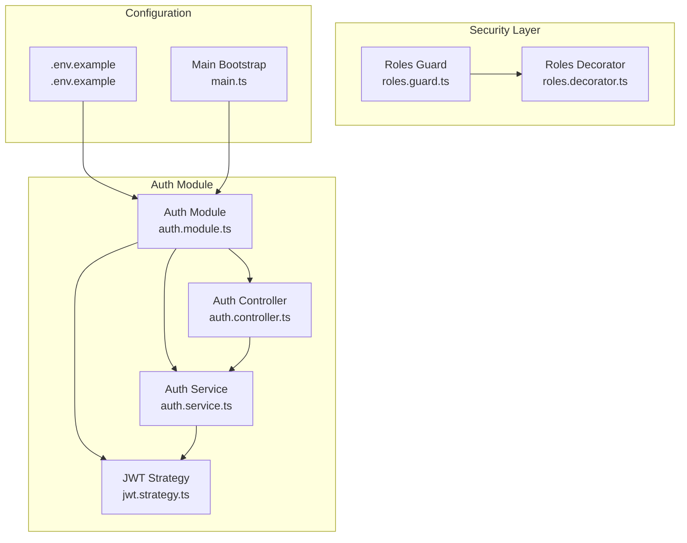
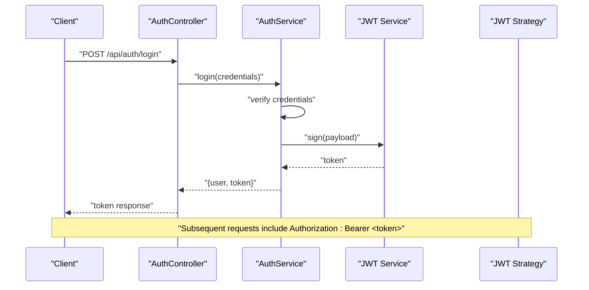
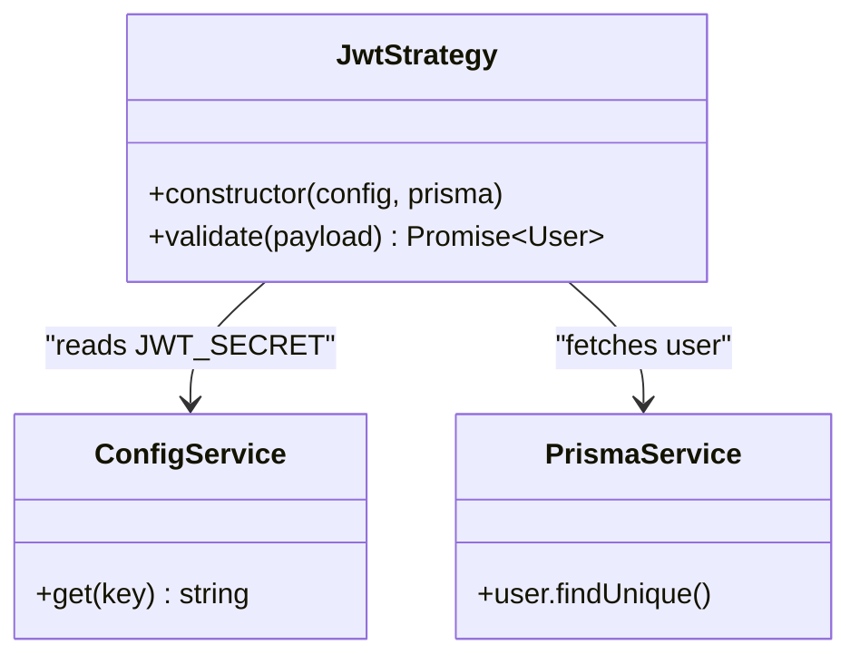
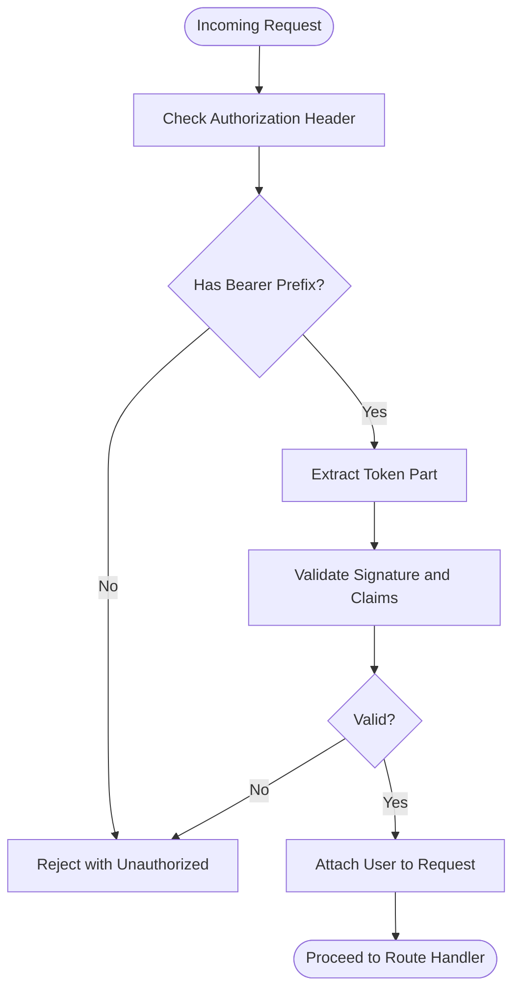
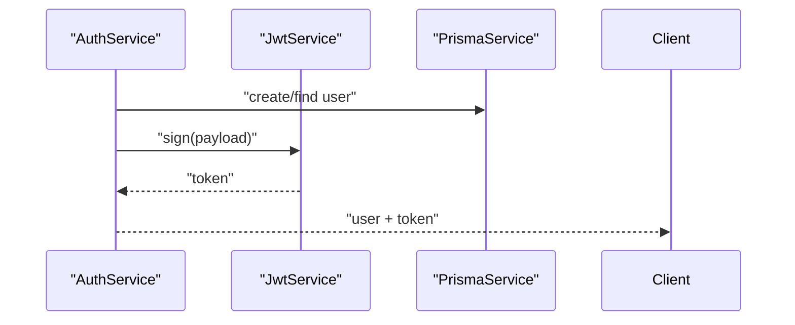
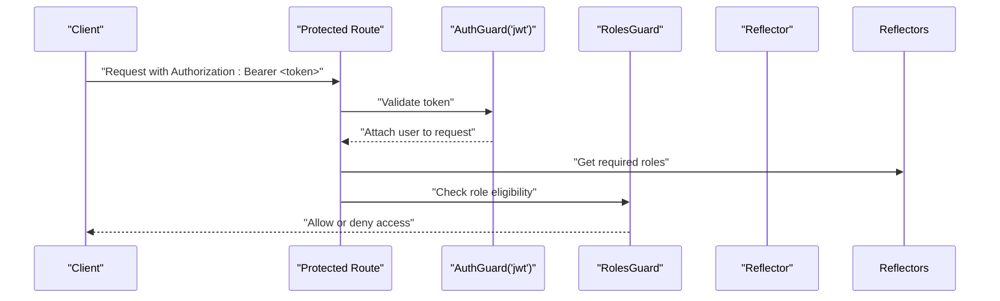
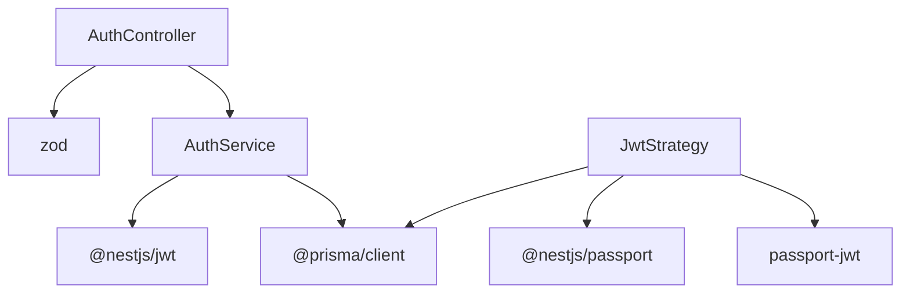

# JWT Implementation

<cite>
**Referenced Files in This Document**
- [jwt.strategy.ts](file://apps/api/src/modules/auth/jwt.strategy.ts)
- [auth.service.ts](file://apps/api/src/modules/auth/auth.service.ts)
- [auth.controller.ts](file://apps/api/src/modules/auth/auth.controller.ts)
- [auth.module.ts](file://apps/api/src/modules/auth/auth.module.ts)
- [roles.guard.ts](file://apps/api/src/common/guards/roles.guard.ts)
- [roles.decorator.ts](file://apps/api/src/common/decorators/roles.decorator.ts)
- [roles.ts](file://apps/api/src/common/constants/roles.ts)
- [.env.example](file://apps/api/.env.example)
- [main.ts](file://apps/api/src/main.ts)
- [auth.dto.ts](file://apps/api/src/modules/auth/auth.dto.ts)
</cite>

## Table of Contents
1. [Introduction](#introduction)
2. [Project Structure](#project-structure)
3. [Core Components](#core-components)
4. [Architecture Overview](#architecture-overview)
5. [Detailed Component Analysis](#detailed-component-analysis)
6. [Dependency Analysis](#dependency-analysis)
7. [Performance Considerations](#performance-considerations)
8. [Troubleshooting Guide](#troubleshooting-guide)
9. [Conclusion](#conclusion)

## Introduction
This document provides comprehensive documentation for the JWT authentication implementation in the backend API. It covers JWT strategy configuration with passport-jwt, token extraction from Authorization headers, payload structure, validation and expiration handling, secret key management, token generation during authentication, role-based access control, and security considerations. Practical examples of protected routes and debugging techniques are included to help developers integrate and troubleshoot JWT-based authentication effectively.

## Project Structure
The JWT authentication implementation spans several modules and files:
- Authentication module: registration, login, and token generation
- JWT strategy: token extraction and validation
- Guards and decorators: role-based access control
- Environment configuration: JWT secret and server settings
- DTOs: request validation schemas



**Diagram sources**
- [auth.module.ts](file://apps/api/src/modules/auth/auth.module.ts#L1-L30)
- [auth.controller.ts](file://apps/api/src/modules/auth/auth.controller.ts#L1-L28)
- [auth.service.ts](file://apps/api/src/modules/auth/auth.service.ts#L1-L205)
- [jwt.strategy.ts](file://apps/api/src/modules/auth/jwt.strategy.ts#L1-L58)
- [roles.guard.ts](file://apps/api/src/common/guards/roles.guard.ts#L1-L56)
- [roles.decorator.ts](file://apps/api/src/common/decorators/roles.decorator.ts#L1-L16)
- [.env.example](file://apps/api/.env.example#L1-L20)
- [main.ts](file://apps/api/src/main.ts#L1-L34)

**Section sources**
- [auth.module.ts](file://apps/api/src/modules/auth/auth.module.ts#L1-L30)
- [auth.controller.ts](file://apps/api/src/modules/auth/auth.controller.ts#L1-L28)
- [auth.service.ts](file://apps/api/src/modules/auth/auth.service.ts#L1-L205)
- [jwt.strategy.ts](file://apps/api/src/modules/auth/jwt.strategy.ts#L1-L58)
- [roles.guard.ts](file://apps/api/src/common/guards/roles.guard.ts#L1-L56)
- [roles.decorator.ts](file://apps/api/src/common/decorators/roles.decorator.ts#L1-L16)
- [.env.example](file://apps/api/.env.example#L1-L20)
- [main.ts](file://apps/api/src/main.ts#L1-L34)

## Core Components
- JWT Strategy: Extracts tokens from Authorization headers and validates them against the configured secret. It enriches the request with user data upon successful validation.
- Auth Service: Handles user registration and login, including password hashing and token generation with a structured payload.
- Auth Controller: Exposes registration and login endpoints with Zod-based request validation.
- Roles Guard and Decorator: Enforce role-based access control on protected routes.
- Environment Configuration: Provides the JWT secret and server settings.

Key JWT payload fields:
- sub: User identifier
- email: User email address
- role: User role (STUDENT, UNIVERSITY, ADMIN)
- status: User status (ACTIVE, PENDING, REJECTED)
- universityId: Associated university identifier or null

**Section sources**
- [jwt.strategy.ts](file://apps/api/src/modules/auth/jwt.strategy.ts#L12-L19)
- [auth.service.ts](file://apps/api/src/modules/auth/auth.service.ts#L20-L27)
- [auth.controller.ts](file://apps/api/src/modules/auth/auth.controller.ts#L1-L28)
- [roles.guard.ts](file://apps/api/src/common/guards/roles.guard.ts#L1-L56)
- [roles.decorator.ts](file://apps/api/src/common/decorators/roles.decorator.ts#L1-L16)
- [.env.example](file://apps/api/.env.example#L9-L10)

## Architecture Overview
The JWT authentication flow integrates NestJS Passport and NestJS JWT modules. The AuthModule registers the default JWT strategy and JWT signing options. The AuthController delegates authentication tasks to the AuthService, which generates tokens containing a predefined payload. Protected routes apply both the JWT guard and the RolesGuard to enforce access control.



**Diagram sources**
- [auth.controller.ts](file://apps/api/src/modules/auth/auth.controller.ts#L16-L26)
- [auth.service.ts](file://apps/api/src/modules/auth/auth.service.ts#L136-L170)
- [auth.module.ts](file://apps/api/src/modules/auth/auth.module.ts#L15-L23)
- [jwt.strategy.ts](file://apps/api/src/modules/auth/jwt.strategy.ts#L27-L31)

## Detailed Component Analysis

### JWT Strategy Configuration
The JWT strategy is configured to extract tokens from the Authorization header as a Bearer token, reject expired tokens, and use the secret from environment configuration. On successful validation, it fetches the user record from the database and attaches it to the request object.



**Diagram sources**
- [jwt.strategy.ts](file://apps/api/src/modules/auth/jwt.strategy.ts#L21-L32)
- [jwt.strategy.ts](file://apps/api/src/modules/auth/jwt.strategy.ts#L38-L56)

**Section sources**
- [jwt.strategy.ts](file://apps/api/src/modules/auth/jwt.strategy.ts#L27-L31)
- [jwt.strategy.ts](file://apps/api/src/modules/auth/jwt.strategy.ts#L38-L56)

### Token Extraction from Authorization Headers
Tokens are extracted from the Authorization header using the Bearer scheme. The strategy expects headers formatted as "Authorization: Bearer YOUR_TOKEN_HERE".



**Diagram sources**
- [jwt.strategy.ts](file://apps/api/src/modules/auth/jwt.strategy.ts#L28-L31)

**Section sources**
- [jwt.strategy.ts](file://apps/api/src/modules/auth/jwt.strategy.ts#L28-L31)

### Payload Structure
The JWT payload includes the following fields:
- sub: Unique user identifier
- email: User email
- role: User role enumeration
- status: User status enumeration
- universityId: Associated university identifier or null

These fields are used to authorize access and tailor responses to the authenticated user.

**Section sources**
- [jwt.strategy.ts](file://apps/api/src/modules/auth/jwt.strategy.ts#L13-L19)
- [auth.service.ts](file://apps/api/src/modules/auth/auth.service.ts#L21-L27)

### Token Validation Process and Expiration Handling
- Signature verification: Uses the configured JWT secret to validate the token signature.
- Expiration check: Expired tokens are rejected automatically due to ignoreExpiration being set to false.
- User lookup: On successful signature verification, the strategy retrieves the user from the database using the sub claim to ensure the user still exists and is eligible.

```mermaid
sequenceDiagram
participant Strategy as "JWT Strategy"
participant Config as "ConfigService"
participant DB as "PrismaService"
Strategy->>Config : "get('JWT_SECRET')"
Strategy->>Strategy : "verify signature"
Strategy->>Strategy : "check expiration"
Strategy->>DB : "findUnique({ id : payload.sub })"
DB-->>Strategy : "User or null"
alt User not found
Strategy-->>Unauthorized["Throw UnauthorizedException"]
else User found
Strategy-->>Authorized["Return user"]
end
```

**Diagram sources**
- [jwt.strategy.ts](file://apps/api/src/modules/auth/jwt.strategy.ts#L27-L31)
- [jwt.strategy.ts](file://apps/api/src/modules/auth/jwt.strategy.ts#L38-L56)

**Section sources**
- [jwt.strategy.ts](file://apps/api/src/modules/auth/jwt.strategy.ts#L29-L31)
- [jwt.strategy.ts](file://apps/api/src/modules/auth/jwt.strategy.ts#L51-L53)

### Secret Key Management
- The JWT secret is loaded from the environment variable JWT_SECRET.
- A fallback value is provided in the strategy configuration for development scenarios.
- The AuthModule configures the JWT service with the secret and sets token expiration to seven days.

Recommendations:
- Use a strong, random secret in production.
- Store the secret in a secure secrets manager or environment configuration.
- Rotate the secret periodically and invalidate existing tokens as part of the rotation process.

**Section sources**
- [.env.example](file://apps/api/.env.example#L9-L10)
- [auth.module.ts](file://apps/api/src/modules/auth/auth.module.ts#L20-L21)
- [jwt.strategy.ts](file://apps/api/src/modules/auth/jwt.strategy.ts#L30)

### Token Generation in Authentication Flow
- Registration: After validating uniqueness and optional university domain rules, the service hashes the password and creates a user record. It then generates a JWT token using the payload structure described above.
- Login: On successful credential verification and status validation, the service generates a JWT token for the user.



**Diagram sources**
- [auth.service.ts](file://apps/api/src/modules/auth/auth.service.ts#L99-L117)
- [auth.service.ts](file://apps/api/src/modules/auth/auth.service.ts#L173-L188)

**Section sources**
- [auth.service.ts](file://apps/api/src/modules/auth/auth.service.ts#L121-L129)
- [auth.service.ts](file://apps/api/src/modules/auth/auth.service.ts#L157-L169)
- [auth.service.ts](file://apps/api/src/modules/auth/auth.service.ts#L173-L188)

### Refresh Token Strategies
- Current implementation does not include refresh tokens. Access tokens are valid for seven days as configured in the AuthModule.
- If refresh tokens are introduced, implement a dedicated endpoint, securely store token pairs, and add revocation mechanisms to mitigate token theft risks.

[No sources needed since this section provides general guidance]

### Security Considerations
- Transport security: Use HTTPS to prevent token interception.
- Secure storage: Store tokens in httpOnly cookies or secure storage mechanisms on the client to reduce XSS risks.
- CSRF protection: Apply anti-CSRF measures for cookie-based tokens.
- Token scope: Limit token claims to the minimum necessary data.
- Rotation and revocation: Implement token rotation and centralized revocation lists for compromised tokens.
- Logging and monitoring: Log authentication events and monitor for suspicious activity.

[No sources needed since this section provides general guidance]

### Practical Examples of JWT Usage in Protected Routes
Protected routes combine the JWT guard with the RolesGuard to enforce both authentication and authorization. The RolesGuard checks the user's role against the required roles defined via the Roles decorator.



**Diagram sources**
- [roles.guard.ts](file://apps/api/src/common/guards/roles.guard.ts#L24-L54)
- [roles.decorator.ts](file://apps/api/src/common/decorators/roles.decorator.ts#L26-L29)

**Section sources**
- [roles.guard.ts](file://apps/api/src/common/guards/roles.guard.ts#L5-L8)
- [roles.guard.ts](file://apps/api/src/common/guards/roles.guard.ts#L24-L54)
- [roles.decorator.ts](file://apps/api/src/common/decorators/roles.decorator.ts#L11-L15)

### Token Storage Recommendations
- Prefer httpOnly cookies for browser applications to mitigate XSS.
- For SPA or mobile apps, use secure, same-site storage with encryption.
- Avoid storing tokens in localStorage or sessionStorage without additional protections.

[No sources needed since this section provides general guidance]

### Debugging Techniques
- Enable logging in the AuthService to track registration and login events.
- Verify Authorization header format and presence in requests.
- Confirm JWT_SECRET is correctly set in the environment.
- Monitor token expiration and adjust signOptions as needed.

**Section sources**
- [auth.service.ts](file://apps/api/src/modules/auth/auth.service.ts#L34-L35)
- [auth.service.ts](file://apps/api/src/modules/auth/auth.service.ts#L119-L120)
- [auth.service.ts](file://apps/api/src/modules/auth/auth.service.ts#L155-L156)
- [.env.example](file://apps/api/.env.example#L9-L10)

## Dependency Analysis
The JWT implementation relies on NestJS modules and external libraries:
- Passport and passport-jwt for strategy-based authentication
- NestJS JWT for signing tokens
- Zod for request validation
- Prisma for user and university data access



**Diagram sources**
- [auth.module.ts](file://apps/api/src/modules/auth/auth.module.ts#L6-L23)
- [jwt.strategy.ts](file://apps/api/src/modules/auth/jwt.strategy.ts#L5-L10)
- [auth.service.ts](file://apps/api/src/modules/auth/auth.service.ts#L14-L18)
- [auth.controller.ts](file://apps/api/src/modules/auth/auth.controller.ts#L8-L10)

**Section sources**
- [auth.module.ts](file://apps/api/src/modules/auth/auth.module.ts#L6-L23)
- [jwt.strategy.ts](file://apps/api/src/modules/auth/jwt.strategy.ts#L5-L10)
- [auth.service.ts](file://apps/api/src/modules/auth/auth.service.ts#L14-L18)
- [auth.controller.ts](file://apps/api/src/modules/auth/auth.controller.ts#L8-L10)

## Performance Considerations
- Token lifetime: Seven-day expiration balances usability and security; consider shorter lifetimes for higher-risk endpoints.
- Database lookups: The strategy performs a single user lookup per validated token; ensure database indexing on user identifiers.
- Caching: Consider caching non-sensitive user metadata to reduce database load.

[No sources needed since this section provides general guidance]

## Troubleshooting Guide
Common issues and resolutions:
- UnauthorizedException on protected routes: Verify the Authorization header format and token validity.
- Missing user in strategy: Ensure the sub claim corresponds to an existing user ID.
- Invalid JWT_SECRET: Confirm the environment variable is set and matches the configured secret.
- Role-based access denials: Check the Roles decorator and RolesGuard configuration.

**Section sources**
- [jwt.strategy.ts](file://apps/api/src/modules/auth/jwt.strategy.ts#L51-L53)
- [roles.guard.ts](file://apps/api/src/common/guards/roles.guard.ts#L40-L41)
- [.env.example](file://apps/api/.env.example#L9-L10)

## Conclusion
The JWT authentication implementation provides a robust foundation for securing API endpoints. It leverages NestJS Passport and JWT modules, enforces role-based access control, and uses a structured payload to support flexible authorization logic. By following the security recommendations and troubleshooting steps outlined above, teams can maintain a secure and reliable authentication system.