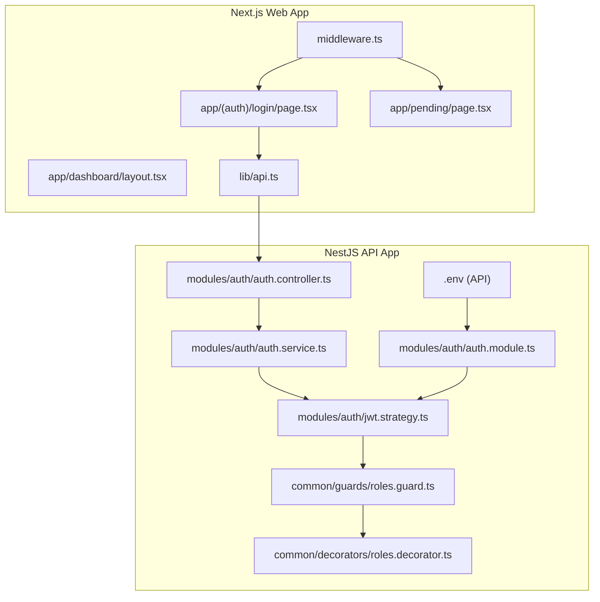
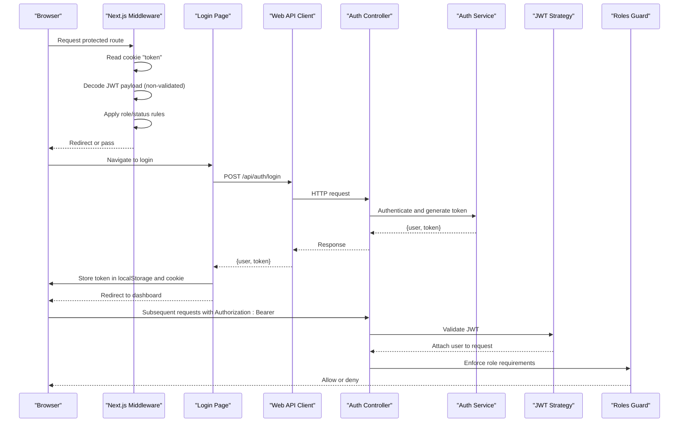
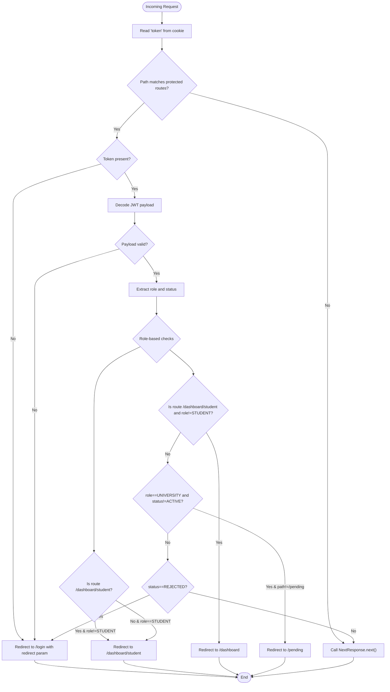
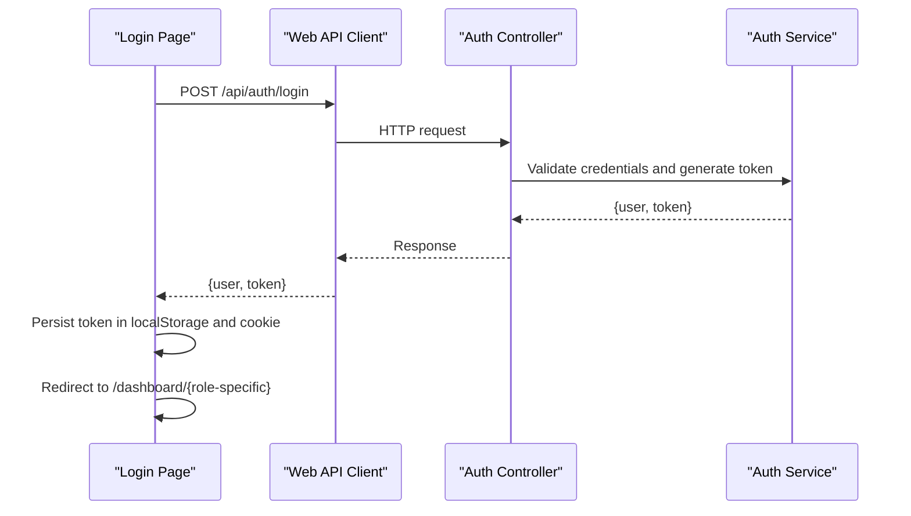
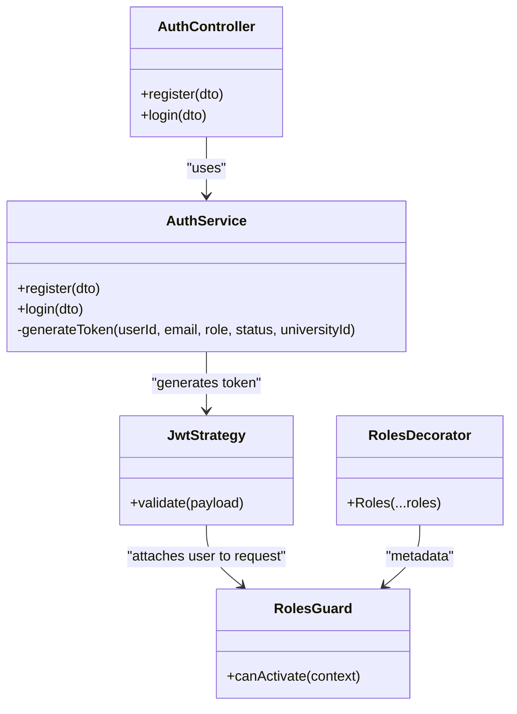
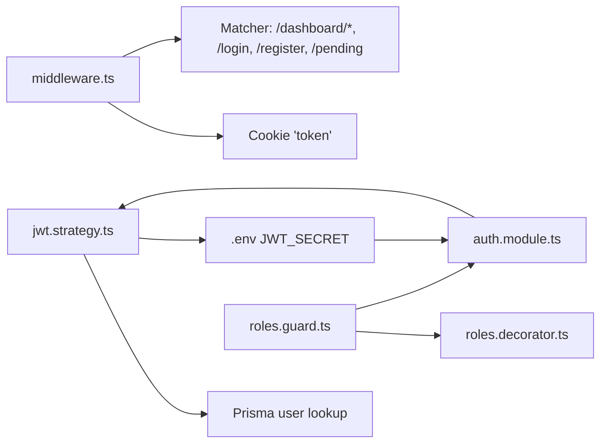

# Middleware and Route Protection

<cite>
**Referenced Files in This Document**
- [middleware.ts](file://apps/web/middleware.ts)
- [api.ts](file://apps/web/lib/api.ts)
- [login/page.tsx](file://apps/web/app/(auth)/login/page.tsx)
- [pending/page.tsx](file://apps/web/app/pending/page.tsx)
- [layout.tsx](file://apps/web/app/dashboard/layout.tsx)
- [auth.controller.ts](file://apps/api/src/modules/auth/auth.controller.ts)
- [auth.service.ts](file://apps/api/src/modules/auth/auth.service.ts)
- [jwt.strategy.ts](file://apps/api/src/modules/auth/jwt.strategy.ts)
- [roles.guard.ts](file://apps/api/src/common/guards/roles.guard.ts)
- [roles.decorator.ts](file://apps/api/src/common/decorators/roles.decorator.ts)
- [roles.ts](file://apps/api/src/common/constants/roles.ts)
- [auth.module.ts](file://apps/api/src/modules/auth/auth.module.ts)
- [.env (API)](file://apps/api/.env)
- [.env.local (Web)](file://apps/web/.env.local)
</cite>

## Table of Contents
1. [Introduction](#introduction)
2. [Project Structure](#project-structure)
3. [Core Components](#core-components)
4. [Architecture Overview](#architecture-overview)
5. [Detailed Component Analysis](#detailed-component-analysis)
6. [Dependency Analysis](#dependency-analysis)
7. [Performance Considerations](#performance-considerations)
8. [Troubleshooting Guide](#troubleshooting-guide)
9. [Conclusion](#conclusion)

## Introduction
This document explains the middleware pipeline and route protection mechanisms across the Next.js frontend and NestJS backend. It covers:
- Next.js middleware for client-side route protection and authentication state management
- NestJS Guards for server-side route protection with JWT validation
- Middleware execution order, authentication flow, and redirect handling for unauthenticated users
- Session management, cookie handling, and state persistence across requests
- Examples of protecting different route types (public, authenticated, role-specific)
- Error handling, fallback redirects, and graceful degradation
- Performance considerations, caching strategies, and debugging middleware issues

## Project Structure
The authentication and protection system spans two applications:
- Next.js Web App: client-side middleware and pages manage cookies, redirects, and UI state
- NestJS API App: server-side authentication, JWT validation, and role-based access control

**Diagram sources**
- [middleware.ts](file://apps/web/middleware.ts#L1-L107)
- [login/page.tsx](file://apps/web/app/(auth)/login/page.tsx#L1-L135)
- [pending/page.tsx](file://apps/web/app/pending/page.tsx#L1-L64)
- [layout.tsx](file://apps/web/app/dashboard/layout.tsx#L1-L71)
- [api.ts](file://apps/web/lib/api.ts#L1-L378)
- [auth.controller.ts](file://apps/api/src/modules/auth/auth.controller.ts#L1-L28)
- [auth.service.ts](file://apps/api/src/modules/auth/auth.service.ts#L1-L205)
- [jwt.strategy.ts](file://apps/api/src/modules/auth/jwt.strategy.ts#L1-L58)
- [roles.guard.ts](file://apps/api/src/common/guards/roles.guard.ts#L1-L56)
- [roles.decorator.ts](file://apps/api/src/common/decorators/roles.decorator.ts#L1-L16)
- [auth.module.ts](file://apps/api/src/modules/auth/auth.module.ts#L1-L30)
- [.env (API)](file://apps/api/.env#L1-L6)

**Section sources**
- [middleware.ts](file://apps/web/middleware.ts#L1-L107)
- [auth.controller.ts](file://apps/api/src/modules/auth/auth.controller.ts#L1-L28)

## Core Components
- Next.js Middleware: Decodes JWT from cookie, enforces role and status-based access, and redirects accordingly
- Frontend Pages: Login page persists token in localStorage and cookie; Pending page clears tokens on logout
- API Authentication Controller: Exposes registration and login endpoints
- API Auth Service: Creates users, validates credentials, generates JWT tokens with role and status
- JWT Strategy: Validates JWT and attaches user profile to request
- Roles Guard: Enforces role-based access control on protected endpoints
- API Auth Module: Registers Passport JWT strategy and JWT module
- API Environment: Defines JWT secret and other runtime configuration

**Section sources**
- [middleware.ts](file://apps/web/middleware.ts#L1-L107)
- [login/page.tsx](file://apps/web/app/(auth)/login/page.tsx#L1-L135)
- [pending/page.tsx](file://apps/web/app/pending/page.tsx#L1-L64)
- [auth.controller.ts](file://apps/api/src/modules/auth/auth.controller.ts#L1-L28)
- [auth.service.ts](file://apps/api/src/modules/auth/auth.service.ts#L1-L205)
- [jwt.strategy.ts](file://apps/api/src/modules/auth/jwt.strategy.ts#L1-L58)
- [roles.guard.ts](file://apps/api/src/common/guards/roles.guard.ts#L1-L56)
- [auth.module.ts](file://apps/api/src/modules/auth/auth.module.ts#L1-L30)
- [.env (API)](file://apps/api/.env#L1-L6)

## Architecture Overview
The system enforces protection at two layers:
- Client-side via Next.js middleware that inspects the cookie token and enforces route access rules
- Server-side via NestJS Passport JWT strategy and Roles Guard that validate tokens and enforce role-based permissions

**Diagram sources**
- [middleware.ts](file://apps/web/middleware.ts#L25-L102)
- [login/page.tsx](file://apps/web/app/(auth)/login/page.tsx#L21-L45)
- [api.ts](file://apps/web/lib/api.ts#L11-L36)
- [auth.controller.ts](file://apps/api/src/modules/auth/auth.controller.ts#L16-L26)
- [auth.service.ts](file://apps/api/src/modules/auth/auth.service.ts#L136-L170)
- [jwt.strategy.ts](file://apps/api/src/modules/auth/jwt.strategy.ts#L38-L56)
- [roles.guard.ts](file://apps/api/src/common/guards/roles.guard.ts#L24-L54)

## Detailed Component Analysis

### Next.js Middleware Pipeline
The middleware runs on incoming requests and applies route protection rules:
- Reads the token from the cookie
- Decodes the token to extract role and status
- Applies rules for:
  - Protected dashboard routes
  - Pending page access
  - Login/register redirection for authenticated users
- Uses explicit matcher configuration to limit middleware invocation

**Diagram sources**
- [middleware.ts](file://apps/web/middleware.ts#L25-L102)

**Section sources**
- [middleware.ts](file://apps/web/middleware.ts#L1-L107)
- [middleware.ts](file://apps/web/middleware.ts#L104-L107)

### Client-Side Authentication State Management
- Login page:
  - Submits credentials to the backend
  - Stores token in localStorage and sets a cookie
  - Redirects based on role
- Pending page:
  - Clears token from localStorage and cookie on logout
- API client:
  - Automatically attaches Authorization header when a token exists
  - Centralizes error handling for HTTP responses

**Diagram sources**
- [login/page.tsx](file://apps/web/app/(auth)/login/page.tsx#L21-L45)
- [api.ts](file://apps/web/lib/api.ts#L11-L36)
- [auth.controller.ts](file://apps/api/src/modules/auth/auth.controller.ts#L22-L26)
- [auth.service.ts](file://apps/api/src/modules/auth/auth.service.ts#L136-L170)

**Section sources**
- [login/page.tsx](file://apps/web/app/(auth)/login/page.tsx#L1-L135)
- [pending/page.tsx](file://apps/web/app/pending/page.tsx#L1-L64)
- [api.ts](file://apps/web/lib/api.ts#L1-L378)

### Server-Side Authentication and Authorization (NestJS)
- Auth Controller exposes registration and login endpoints
- Auth Service:
  - Validates uniqueness and domain rules
  - Hashes passwords
  - Generates JWT with role and status claims
- JWT Strategy:
  - Validates JWT and loads user from database
  - Attaches user to request for downstream guards
- Roles Guard:
  - Enforces role-based access using metadata
  - Throws forbidden errors when unauthorized
- Auth Module:
  - Registers Passport JWT strategy and JWT module with secret and expiration

**Diagram sources**
- [auth.controller.ts](file://apps/api/src/modules/auth/auth.controller.ts#L1-L28)
- [auth.service.ts](file://apps/api/src/modules/auth/auth.service.ts#L1-L205)
- [jwt.strategy.ts](file://apps/api/src/modules/auth/jwt.strategy.ts#L1-L58)
- [roles.guard.ts](file://apps/api/src/common/guards/roles.guard.ts#L1-L56)
- [roles.decorator.ts](file://apps/api/src/common/decorators/roles.decorator.ts#L1-L16)

**Section sources**
- [auth.controller.ts](file://apps/api/src/modules/auth/auth.controller.ts#L1-L28)
- [auth.service.ts](file://apps/api/src/modules/auth/auth.service.ts#L1-L205)
- [jwt.strategy.ts](file://apps/api/src/modules/auth/jwt.strategy.ts#L1-L58)
- [roles.guard.ts](file://apps/api/src/common/guards/roles.guard.ts#L1-L56)
- [roles.decorator.ts](file://apps/api/src/common/decorators/roles.decorator.ts#L1-L16)
- [auth.module.ts](file://apps/api/src/modules/auth/auth.module.ts#L1-L30)
- [roles.ts](file://apps/api/src/common/constants/roles.ts#L1-L6)
- [.env (API)](file://apps/api/.env#L1-L6)

### Route Protection Examples
- Public routes:
  - Accessible without authentication
  - Example: marketing pages under public groups
- Authenticated routes:
  - Require a valid token
  - Example: dashboard area protected by middleware
- Role-specific routes:
  - STUDENT can access /dashboard/student
  - UNIVERSITY/ADMIN cannot access /dashboard/student
  - UNIVERSITY with non-ACTIVE status redirected to /pending
  - REJECTED users redirected to login

**Section sources**
- [middleware.ts](file://apps/web/middleware.ts#L32-L72)
- [middleware.ts](file://apps/web/middleware.ts#L48-L66)
- [layout.tsx](file://apps/web/app/dashboard/layout.tsx#L1-L71)

## Dependency Analysis
The middleware depends on:
- Cookie parsing and URL manipulation
- JWT decoding (non-validated) for role/status checks
- Matcher configuration to limit invocation

The NestJS stack depends on:
- Passport JWT strategy for token validation
- Roles Guard for role enforcement
- Auth Service for token generation
- Auth Module wiring and environment configuration

**Diagram sources**
- [middleware.ts](file://apps/web/middleware.ts#L104-L107)
- [jwt.strategy.ts](file://apps/api/src/modules/auth/jwt.strategy.ts#L23-L32)
- [roles.guard.ts](file://apps/api/src/common/guards/roles.guard.ts#L26-L29)
- [roles.decorator.ts](file://apps/api/src/common/decorators/roles.decorator.ts#L9-L15)
- [auth.module.ts](file://apps/api/src/modules/auth/auth.module.ts#L13-L27)
- [.env (API)](file://apps/api/.env#L2-L2)

**Section sources**
- [middleware.ts](file://apps/web/middleware.ts#L104-L107)
- [jwt.strategy.ts](file://apps/api/src/modules/auth/jwt.strategy.ts#L1-L58)
- [roles.guard.ts](file://apps/api/src/common/guards/roles.guard.ts#L1-L56)
- [roles.decorator.ts](file://apps/api/src/common/decorators/roles.decorator.ts#L1-L16)
- [auth.module.ts](file://apps/api/src/modules/auth/auth.module.ts#L1-L30)
- [.env (API)](file://apps/api/.env#L1-L6)

## Performance Considerations
- Middleware execution scope:
  - Narrow matcher reduces unnecessary invocations
- Token decoding:
  - Lightweight base64url decode avoids heavy crypto in middleware
- Server-side validation:
  - Use short-lived tokens and rely on guard checks for fine-grained permissions
- Caching:
  - Consider caching non-sensitive user metadata per session if needed
- Network:
  - API client centralizes headers and error handling to reduce duplication

[No sources needed since this section provides general guidance]

## Troubleshooting Guide
Common issues and remedies:
- Unauthenticated access to protected routes:
  - Verify cookie presence and correctness
  - Confirm middleware matcher and redirect logic
- Role mismatch errors:
  - Ensure token payload includes correct role and status
  - Check Roles decorator usage on protected endpoints
- JWT validation failures:
  - Confirm JWT secret matches environment
  - Validate token expiration and signature
- Frontend token persistence:
  - Ensure localStorage and cookie are set after login
  - Clear both on logout to avoid stale sessions

**Section sources**
- [middleware.ts](file://apps/web/middleware.ts#L29-L43)
- [login/page.tsx](file://apps/web/app/(auth)/login/page.tsx#L28-L39)
- [pending/page.tsx](file://apps/web/app/pending/page.tsx#L13-L17)
- [jwt.strategy.ts](file://apps/api/src/modules/auth/jwt.strategy.ts#L23-L32)
- [roles.guard.ts](file://apps/api/src/common/guards/roles.guard.ts#L36-L51)
- [.env (API)](file://apps/api/.env#L2-L2)

## Conclusion
The system combines client-side middleware and server-side guards to provide robust route protection:
- Next.js middleware enforces broad access rules and redirects unauthenticated users
- NestJS JWT strategy and Roles Guard provide strong server-side validation and role enforcement
- Frontend pages manage tokens and state consistently
- The design balances security, performance, and developer experience