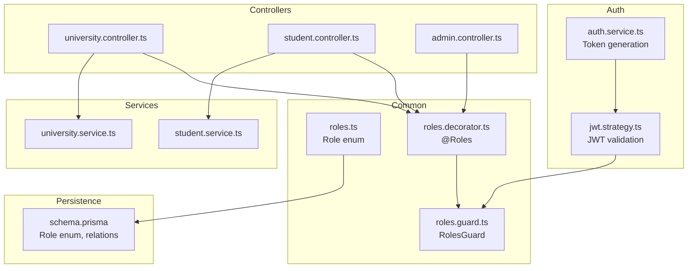
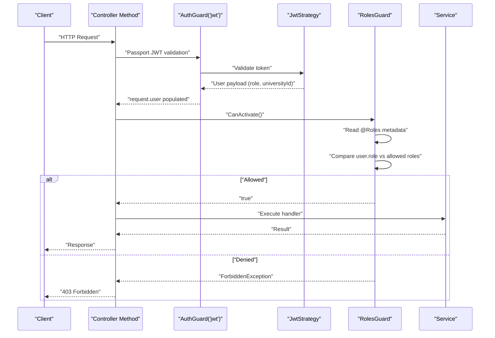
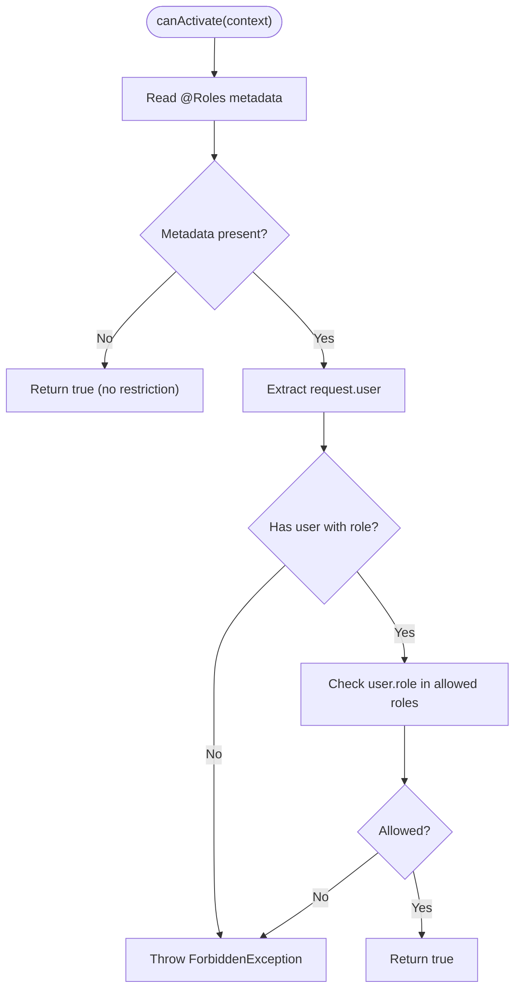
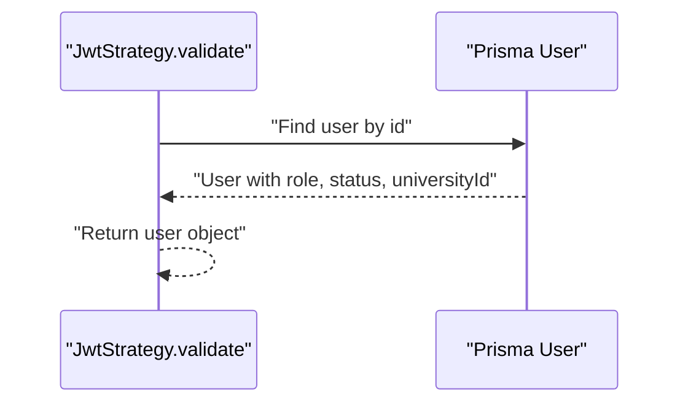
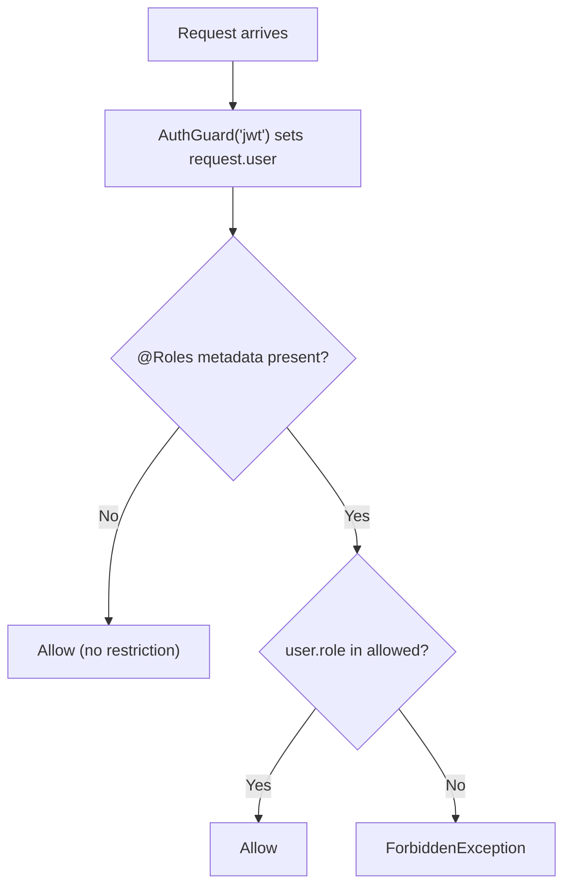
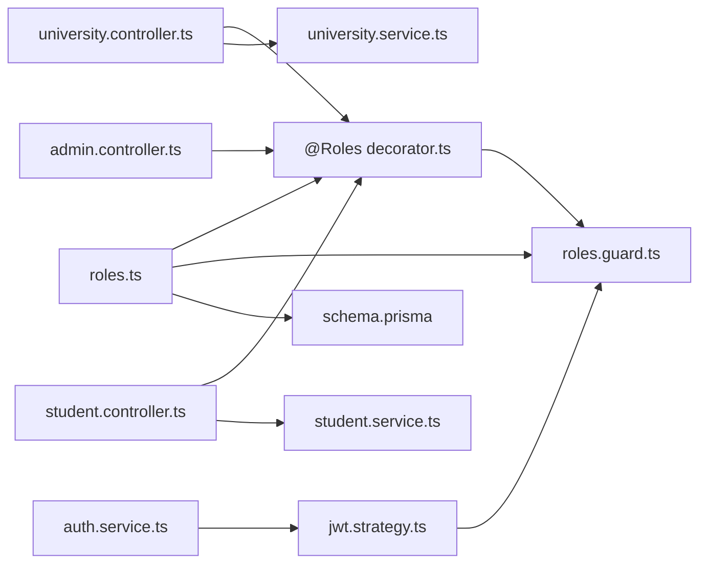

# Role-Based Access Control

<cite>
**Referenced Files in This Document**
- [roles.ts](file://apps/api/src/common/constants/roles.ts)
- [roles.decorator.ts](file://apps/api/src/common/decorators/roles.decorator.ts)
- [roles.guard.ts](file://apps/api/src/common/guards/roles.guard.ts)
- [jwt.strategy.ts](file://apps/api/src/modules/auth/jwt.strategy.ts)
- [auth.service.ts](file://apps/api/src/modules/auth/auth.service.ts)
- [admin.controller.ts](file://apps/api/src/modules/admin/admin.controller.ts)
- [university.controller.ts](file://apps/api/src/modules/university/university.controller.ts)
- [student.controller.ts](file://apps/api/src/modules/student/student.controller.ts)
- [university.service.ts](file://apps/api/src/modules/university/university.service.ts)
- [student.service.ts](file://apps/api/src/modules/student/student.service.ts)
- [schema.prisma](file://apps/api/prisma/schema.prisma)
- [main.ts](file://apps/api/src/main.ts)
</cite>

## Table of Contents
1. [Introduction](#introduction)
2. [Project Structure](#project-structure)
3. [Core Components](#core-components)
4. [Architecture Overview](#architecture-overview)
5. [Detailed Component Analysis](#detailed-component-analysis)
6. [Dependency Analysis](#dependency-analysis)
7. [Performance Considerations](#performance-considerations)
8. [Troubleshooting Guide](#troubleshooting-guide)
9. [Conclusion](#conclusion)

## Introduction
This document explains the role-based access control (RBAC) system used to protect endpoints and enforce tenant-aware permissions. It covers:
- The @Roles decorator for declaring role requirements
- The RolesGuard implementation for validating roles against the authenticated user
- The Role enum values and their access semantics
- Multitenant isolation ensuring users access only their own data
- Practical examples of applying @Roles to controllers and methods
- Role inheritance patterns, edge cases, and debugging unauthorized access attempts
- Security implications and best practices for role assignment

## Project Structure
The RBAC system spans several modules:
- Constants define the Role enum sourced from the database schema
- Decorators declare role requirements per controller/method
- Guards enforce role checks using metadata
- Authentication extracts user identity and roles from JWT
- Services implement multitenant logic to restrict data access
- Controllers apply @Roles and combine with AuthGuard for layered protection

**Diagram sources**
- [roles.ts](file://apps/api/src/common/constants/roles.ts#L1-L6)
- [roles.decorator.ts](file://apps/api/src/common/decorators/roles.decorator.ts#L1-L16)
- [roles.guard.ts](file://apps/api/src/common/guards/roles.guard.ts#L1-L56)
- [jwt.strategy.ts](file://apps/api/src/modules/auth/jwt.strategy.ts#L1-L58)
- [auth.service.ts](file://apps/api/src/modules/auth/auth.service.ts#L1-L205)
- [university.controller.ts](file://apps/api/src/modules/university/university.controller.ts#L1-L114)
- [student.controller.ts](file://apps/api/src/modules/student/student.controller.ts#L1-L101)
- [admin.controller.ts](file://apps/api/src/modules/admin/admin.controller.ts#L1-L119)
- [university.service.ts](file://apps/api/src/modules/university/university.service.ts#L1-L451)
- [student.service.ts](file://apps/api/src/modules/student/student.service.ts#L1-L292)
- [schema.prisma](file://apps/api/prisma/schema.prisma#L18-L31)

**Section sources**
- [roles.ts](file://apps/api/src/common/constants/roles.ts#L1-L6)
- [roles.decorator.ts](file://apps/api/src/common/decorators/roles.decorator.ts#L1-L16)
- [roles.guard.ts](file://apps/api/src/common/guards/roles.guard.ts#L1-L56)
- [jwt.strategy.ts](file://apps/api/src/modules/auth/jwt.strategy.ts#L1-L58)
- [auth.service.ts](file://apps/api/src/modules/auth/auth.service.ts#L1-L205)
- [university.controller.ts](file://apps/api/src/modules/university/university.controller.ts#L1-L114)
- [student.controller.ts](file://apps/api/src/modules/student/student.controller.ts#L1-L101)
- [admin.controller.ts](file://apps/api/src/modules/admin/admin.controller.ts#L1-L119)
- [university.service.ts](file://apps/api/src/modules/university/university.service.ts#L1-L451)
- [student.service.ts](file://apps/api/src/modules/student/student.service.ts#L1-L292)
- [schema.prisma](file://apps/api/prisma/schema.prisma#L18-L31)

## Core Components
- Role enum: STUDENT, UNIVERSITY, ADMIN defined in the database schema and re-exported for use in TypeScript.
- @Roles decorator: Stores allowed roles as metadata for controller handlers.
- RolesGuard: Reads metadata and compares it against the authenticated user’s role attached to the request.
- JWT strategy: Validates tokens and attaches user claims (including role and optional tenant identifier) to the request.
- Multitenant services: Enforce tenant boundaries using universityId to prevent cross-tenant access.

Key implementation references:
- Role enum definition and re-export: [roles.ts](file://apps/api/src/common/constants/roles.ts#L1-L6), [schema.prisma](file://apps/api/prisma/schema.prisma#L18-L31)
- @Roles decorator: [roles.decorator.ts](file://apps/api/src/common/decorators/roles.decorator.ts#L1-L16)
- RolesGuard logic: [roles.guard.ts](file://apps/api/src/common/guards/roles.guard.ts#L1-L56)
- JWT strategy and payload: [jwt.strategy.ts](file://apps/api/src/modules/auth/jwt.strategy.ts#L1-L58), [auth.service.ts](file://apps/api/src/modules/auth/auth.service.ts#L172-L188)
- Tenant enforcement in services: [university.service.ts](file://apps/api/src/modules/university/university.service.ts#L106-L156), [student.service.ts](file://apps/api/src/modules/student/student.service.ts#L1-L292)

**Section sources**
- [roles.ts](file://apps/api/src/common/constants/roles.ts#L1-L6)
- [roles.decorator.ts](file://apps/api/src/common/decorators/roles.decorator.ts#L1-L16)
- [roles.guard.ts](file://apps/api/src/common/guards/roles.guard.ts#L1-L56)
- [jwt.strategy.ts](file://apps/api/src/modules/auth/jwt.strategy.ts#L1-L58)
- [auth.service.ts](file://apps/api/src/modules/auth/auth.service.ts#L172-L188)
- [university.service.ts](file://apps/api/src/modules/university/university.service.ts#L106-L156)
- [student.service.ts](file://apps/api/src/modules/student/student.service.ts#L1-L292)

## Architecture Overview
The RBAC pipeline combines authentication and authorization:
1. AuthGuard('jwt') validates the token via JwtStrategy and attaches user data to request.user.
2. RolesGuard reads the @Roles metadata and enforces role membership.
3. Services enforce multitenant boundaries using universityId.

**Diagram sources**
- [jwt.strategy.ts](file://apps/api/src/modules/auth/jwt.strategy.ts#L34-L56)
- [roles.guard.ts](file://apps/api/src/common/guards/roles.guard.ts#L24-L54)
- [university.controller.ts](file://apps/api/src/modules/university/university.controller.ts#L78-L91)
- [student.controller.ts](file://apps/api/src/modules/student/student.controller.ts#L31-L34)

**Section sources**
- [jwt.strategy.ts](file://apps/api/src/modules/auth/jwt.strategy.ts#L34-L56)
- [roles.guard.ts](file://apps/api/src/common/guards/roles.guard.ts#L24-L54)
- [university.controller.ts](file://apps/api/src/modules/university/university.controller.ts#L78-L91)
- [student.controller.ts](file://apps/api/src/modules/student/student.controller.ts#L31-L34)

## Detailed Component Analysis

### Role Enum and Access Levels
- Role values: STUDENT, UNIVERSITY, ADMIN
- STUDENT: Access to personal dashboard endpoints (profile, favorites, interactions, recommendations)
- UNIVERSITY: Access to university-specific endpoints (update university info, widget config); requires tenant isolation
- ADMIN: Full administrative access across users, universities, and courses

These roles are defined in the database schema and re-exported for TypeScript usage.

**Section sources**
- [roles.ts](file://apps/api/src/common/constants/roles.ts#L1-L6)
- [schema.prisma](file://apps/api/prisma/schema.prisma#L18-L31)
- [student.controller.ts](file://apps/api/src/modules/student/student.controller.ts#L31-L34)
- [university.controller.ts](file://apps/api/src/modules/university/university.controller.ts#L78-L81)
- [admin.controller.ts](file://apps/api/src/modules/admin/admin.controller.ts#L23-L26)

### @Roles Decorator Implementation
- Purpose: Store allowed roles as metadata on controllers and methods
- Usage pattern: @Roles(Role.ADMIN) or @Roles(Role.UNIVERSITY, Role.ADMIN)
- Works in combination with RolesGuard to enforce authorization

Practical examples:
- Admin-only controller: [admin.controller.ts](file://apps/api/src/modules/admin/admin.controller.ts#L23-L26)
- University/Admin shared endpoint: [university.controller.ts](file://apps/api/src/modules/university/university.controller.ts#L78-L81)
- University-only endpoint: [university.controller.ts](file://apps/api/src/modules/university/university.controller.ts#L101-L104)
- Student-only controller: [student.controller.ts](file://apps/api/src/modules/student/student.controller.ts#L31-L34)

**Section sources**
- [roles.decorator.ts](file://apps/api/src/common/decorators/roles.decorator.ts#L1-L16)
- [admin.controller.ts](file://apps/api/src/modules/admin/admin.controller.ts#L23-L26)
- [university.controller.ts](file://apps/api/src/modules/university/university.controller.ts#L78-L81)
- [university.controller.ts](file://apps/api/src/modules/university/university.controller.ts#L101-L104)
- [student.controller.ts](file://apps/api/src/modules/student/student.controller.ts#L31-L34)

### RolesGuard Functionality
RolesGuard performs:
- Metadata retrieval: Reads allowed roles from controller/method metadata
- Optional bypass: If no roles are specified, access is permitted
- Identity validation: Ensures request.user exists and contains role
- Role comparison: Checks if user’s role is included in allowed roles
- Error handling: Throws a descriptive ForbiddenException on mismatch

**Diagram sources**
- [roles.guard.ts](file://apps/api/src/common/guards/roles.guard.ts#L24-L54)

**Section sources**
- [roles.guard.ts](file://apps/api/src/common/guards/roles.guard.ts#L1-L56)

### JWT Strategy and User Role Extraction
- JwtStrategy validates tokens and loads the user from the database
- Attaches role, status, and universityId to request.user for downstream guards and handlers
- Used by AuthGuard('jwt') applied globally alongside RolesGuard

**Diagram sources**
- [jwt.strategy.ts](file://apps/api/src/modules/auth/jwt.strategy.ts#L34-L56)

**Section sources**
- [jwt.strategy.ts](file://apps/api/src/modules/auth/jwt.strategy.ts#L1-L58)
- [auth.service.ts](file://apps/api/src/modules/auth/auth.service.ts#L172-L188)

### Multitenant Role Isolation
- UNIVERSITY users carry universityId in the token and request.user
- Services enforce tenant boundaries:
  - Reject updates if requested universityId does not match the requester’s universityId
  - Restrict analytics and operations to the requester’s universityId
- STUDENT users operate within their own records; services filter by userId

Examples:
- Tenant enforcement in university updates: [university.service.ts](file://apps/api/src/modules/university/university.service.ts#L110-L128)
- Tenant enforcement in widget config updates: [university.service.ts](file://apps/api/src/modules/university/university.service.ts#L146-L156)
- Student-only data access: [student.service.ts](file://apps/api/src/modules/student/student.service.ts#L21-L194)

**Section sources**
- [university.service.ts](file://apps/api/src/modules/university/university.service.ts#L106-L156)
- [student.service.ts](file://apps/api/src/modules/student/student.service.ts#L1-L292)
- [jwt.strategy.ts](file://apps/api/src/modules/auth/jwt.strategy.ts#L38-L55)

### Practical Examples of Applying @Roles
- Admin-only controller: [admin.controller.ts](file://apps/api/src/modules/admin/admin.controller.ts#L23-L26)
- University/Admin shared endpoint: [university.controller.ts](file://apps/api/src/modules/university/university.controller.ts#L78-L81)
- University-only endpoint: [university.controller.ts](file://apps/api/src/modules/university/university.controller.ts#L101-L104)
- Student-only controller: [student.controller.ts](file://apps/api/src/modules/student/student.controller.ts#L31-L34)

Best practices:
- Apply @Roles at the controller level when all methods require the same role
- Apply @Roles at the method level for mixed-access endpoints (e.g., update university info)
- Combine with AuthGuard('jwt') to ensure proper authentication precedes authorization

**Section sources**
- [admin.controller.ts](file://apps/api/src/modules/admin/admin.controller.ts#L23-L26)
- [university.controller.ts](file://apps/api/src/modules/university/university.controller.ts#L78-L81)
- [university.controller.ts](file://apps/api/src/modules/university/university.controller.ts#L101-L104)
- [student.controller.ts](file://apps/api/src/modules/student/student.controller.ts#L31-L34)

### Role Inheritance Patterns and Edge Cases
- No @Roles metadata: Access is permitted (bypass)
- Empty roles array: Access is permitted (bypass)
- Missing request.user: ForbiddenException thrown
- Role mismatch: ForbiddenException with current and required roles
- Cross-tenant requests: Services enforce universityId equality; otherwise ForbiddenException

**Diagram sources**
- [roles.guard.ts](file://apps/api/src/common/guards/roles.guard.ts#L24-L54)

**Section sources**
- [roles.guard.ts](file://apps/api/src/common/guards/roles.guard.ts#L1-L56)

### Debugging Unauthorized Access Attempts
Common scenarios and diagnostics:
- 403 Forbidden with message indicating required vs current role: check @Roles usage and user.role
- 403 Forbidden stating authentication required: ensure AuthGuard('jwt') is applied before RolesGuard
- Cross-tenant errors: verify universityId in token/request.user matches target resource
- Unexpected access granted: confirm @Roles metadata presence and that guards are registered

References:
- RolesGuard error messages: [roles.guard.ts](file://apps/api/src/common/guards/roles.guard.ts#L47-L51)
- AuthGuard('jwt') usage: [university.controller.ts](file://apps/api/src/modules/university/university.controller.ts#L78-L81), [student.controller.ts](file://apps/api/src/modules/student/student.controller.ts#L31-L34)

**Section sources**
- [roles.guard.ts](file://apps/api/src/common/guards/roles.guard.ts#L47-L51)
- [university.controller.ts](file://apps/api/src/modules/university/university.controller.ts#L78-L81)
- [student.controller.ts](file://apps/api/src/modules/student/student.controller.ts#L31-L34)

## Dependency Analysis
- Controllers depend on @Roles decorator and RolesGuard
- RolesGuard depends on Reflector and Role enum
- JwtStrategy depends on ConfigService and PrismaService to validate tokens and load user
- Services depend on PrismaService and enforce tenant boundaries
- Role enum is centrally defined in schema and re-exported for TypeScript

**Diagram sources**
- [roles.decorator.ts](file://apps/api/src/common/decorators/roles.decorator.ts#L1-L16)
- [roles.guard.ts](file://apps/api/src/common/guards/roles.guard.ts#L1-L56)
- [roles.ts](file://apps/api/src/common/constants/roles.ts#L1-L6)
- [jwt.strategy.ts](file://apps/api/src/modules/auth/jwt.strategy.ts#L1-L58)
- [auth.service.ts](file://apps/api/src/modules/auth/auth.service.ts#L1-L205)
- [university.controller.ts](file://apps/api/src/modules/university/university.controller.ts#L1-L114)
- [student.controller.ts](file://apps/api/src/modules/student/student.controller.ts#L1-L101)
- [admin.controller.ts](file://apps/api/src/modules/admin/admin.controller.ts#L1-L119)
- [university.service.ts](file://apps/api/src/modules/university/university.service.ts#L1-L451)
- [student.service.ts](file://apps/api/src/modules/student/student.service.ts#L1-L292)
- [schema.prisma](file://apps/api/prisma/schema.prisma#L18-L31)

**Section sources**
- [roles.decorator.ts](file://apps/api/src/common/decorators/roles.decorator.ts#L1-L16)
- [roles.guard.ts](file://apps/api/src/common/guards/roles.guard.ts#L1-L56)
- [roles.ts](file://apps/api/src/common/constants/roles.ts#L1-L6)
- [jwt.strategy.ts](file://apps/api/src/modules/auth/jwt.strategy.ts#L1-L58)
- [auth.service.ts](file://apps/api/src/modules/auth/auth.service.ts#L1-L205)
- [university.controller.ts](file://apps/api/src/modules/university/university.controller.ts#L1-L114)
- [student.controller.ts](file://apps/api/src/modules/student/student.controller.ts#L1-L101)
- [admin.controller.ts](file://apps/api/src/modules/admin/admin.controller.ts#L1-L119)
- [university.service.ts](file://apps/api/src/modules/university/university.service.ts#L1-L451)
- [student.service.ts](file://apps/api/src/modules/student/student.service.ts#L1-L292)
- [schema.prisma](file://apps/api/prisma/schema.prisma#L18-L31)

## Performance Considerations
- Role checks are O(n) over allowed roles; keep @Roles lists short
- Guards execute after AuthGuard; ensure token validation is efficient
- Multitenant checks rely on database queries; avoid unnecessary joins and use targeted selects
- Prefer method-level @Roles only when needed to minimize guard overhead

## Troubleshooting Guide
- Symptom: 403 “authentication required”
  - Cause: AuthGuard('jwt') not applied or invalid/expired token
  - Fix: Ensure AuthGuard('jwt') precedes RolesGuard and token is valid
  - Reference: [university.controller.ts](file://apps/api/src/modules/university/university.controller.ts#L78-L81), [student.controller.ts](file://apps/api/src/modules/student/student.controller.ts#L31-L34)

- Symptom: 403 with required vs current role
  - Cause: User lacks the required role
  - Fix: Assign correct Role or adjust @Roles metadata
  - Reference: [roles.guard.ts](file://apps/api/src/common/guards/roles.guard.ts#L47-L51)

- Symptom: Cross-tenant forbidden errors
  - Cause: Requester’s universityId differs from target resource
  - Fix: Ensure requester operates within their tenant or has ADMIN privileges
  - Reference: [university.service.ts](file://apps/api/src/modules/university/university.service.ts#L110-L128), [university.service.ts](file://apps/api/src/modules/university/university.service.ts#L146-L156)

- Symptom: Unexpected access granted
  - Cause: Missing @Roles metadata or empty roles list
  - Fix: Explicitly specify @Roles or remove decorator to avoid bypass

**Section sources**
- [roles.guard.ts](file://apps/api/src/common/guards/roles.guard.ts#L47-L51)
- [university.controller.ts](file://apps/api/src/modules/university/university.controller.ts#L78-L81)
- [student.controller.ts](file://apps/api/src/modules/student/student.controller.ts#L31-L34)
- [university.service.ts](file://apps/api/src/modules/university/university.service.ts#L110-L128)
- [university.service.ts](file://apps/api/src/modules/university/university.service.ts#L146-L156)

## Conclusion
The RBAC system combines a lightweight @Roles decorator with a robust RolesGuard and JWT-based authentication to secure endpoints. Multitenancy is enforced both at the authorization layer (guard) and service layer (tenant checks), preventing cross-tenant access. By applying @Roles selectively, combining with AuthGuard('jwt'), and following the best practices outlined here, the system maintains strong security while remaining maintainable and debuggable.