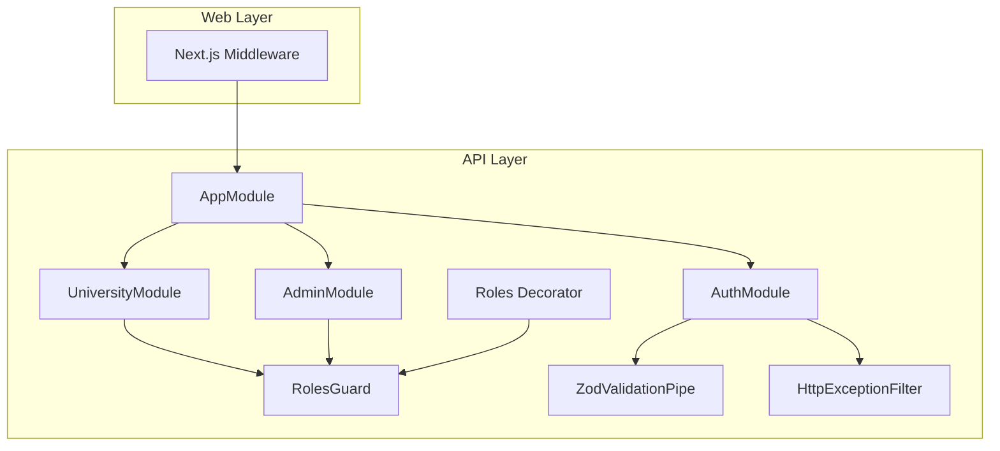
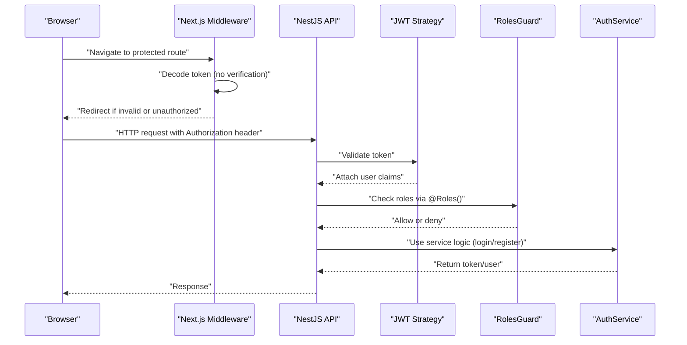
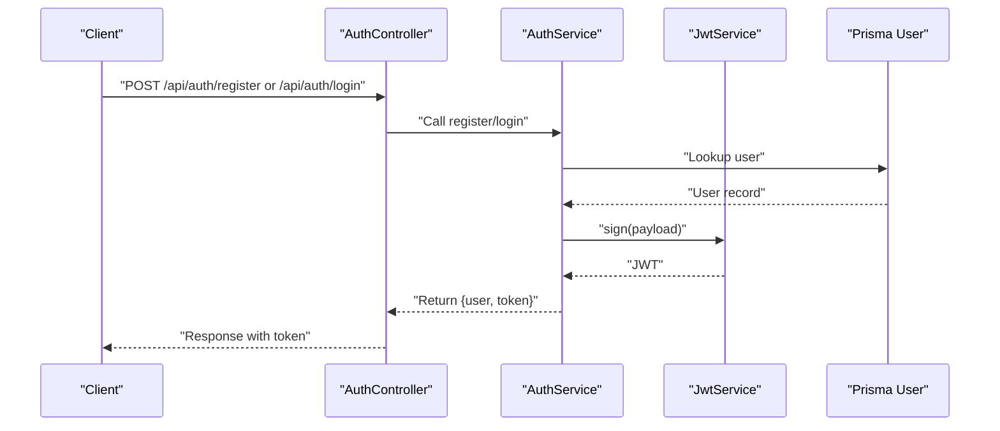
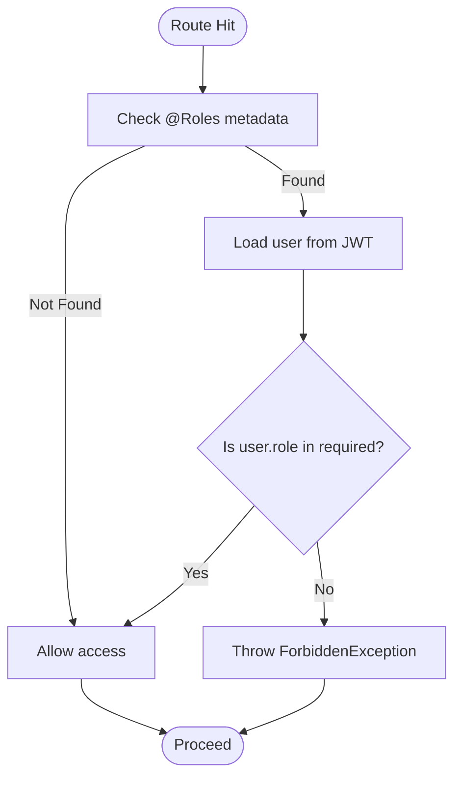
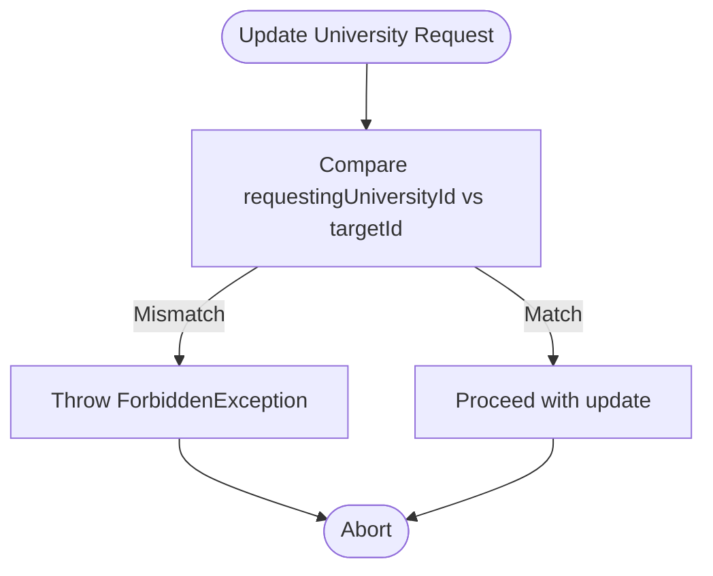
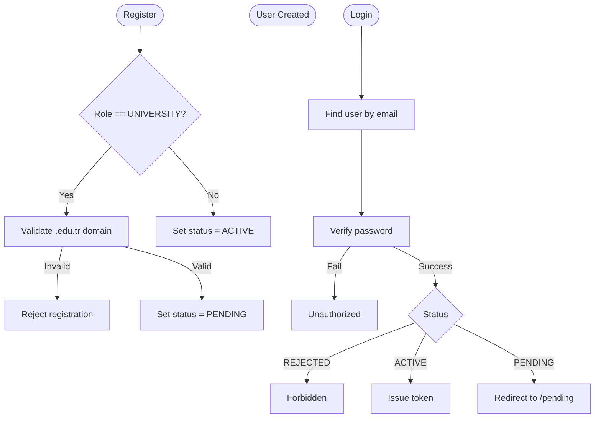
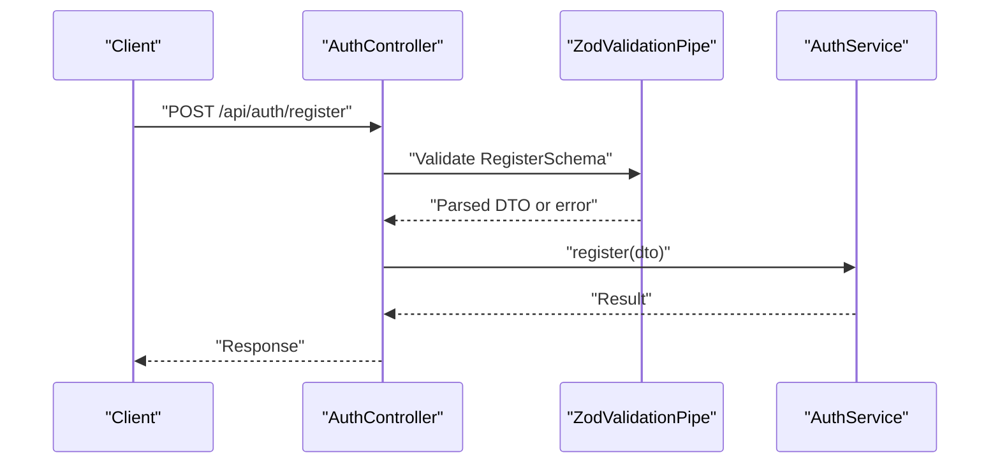
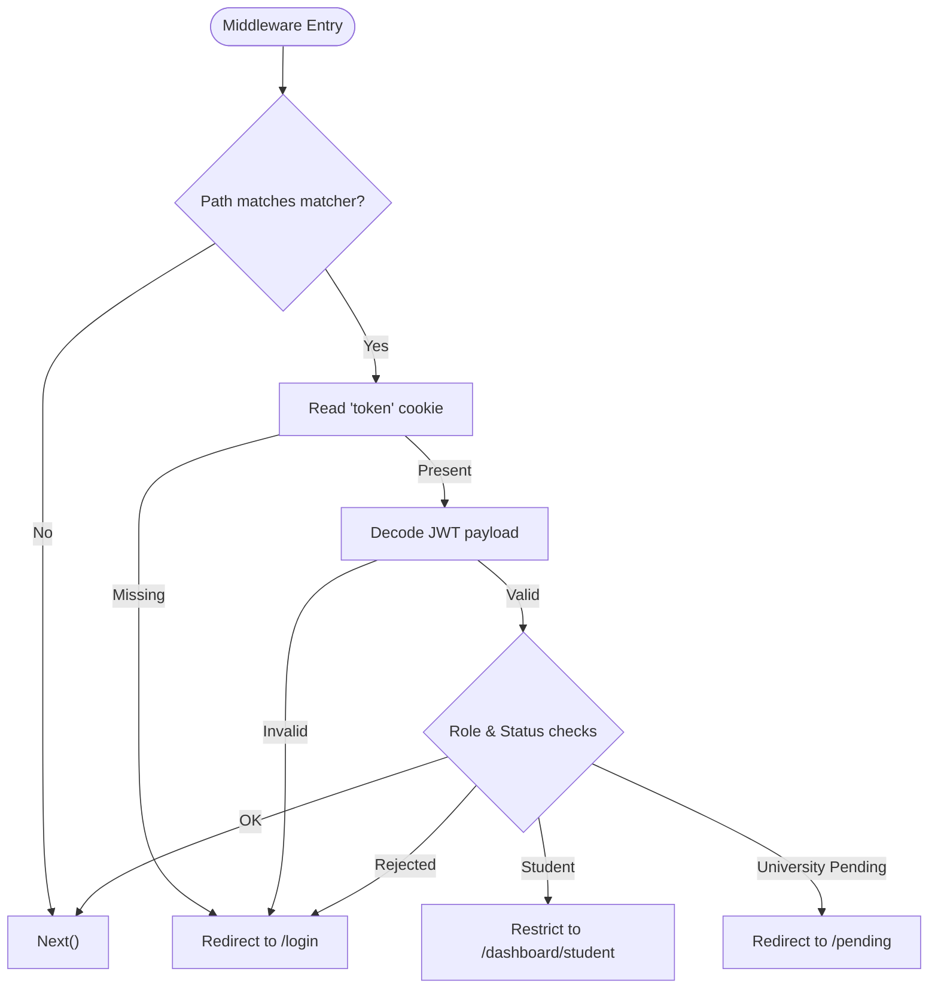
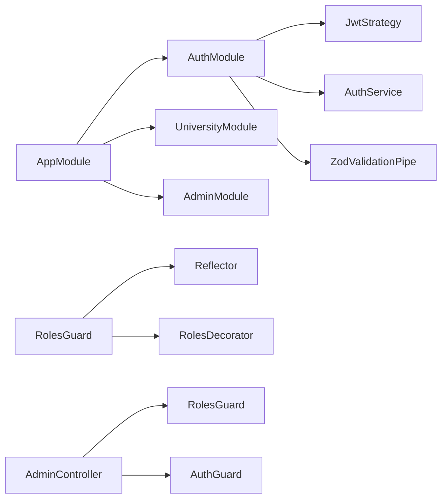

# Security and Authentication

<cite>
**Referenced Files in This Document**
- [roles.decorator.ts](file://apps/api/src/common/decorators/roles.decorator.ts)
- [roles.guard.ts](file://apps/api/src/common/guards/roles.guard.ts)
- [roles.ts](file://apps/api/src/common/constants/roles.ts)
- [auth.service.ts](file://apps/api/src/modules/auth/auth.service.ts)
- [jwt.strategy.ts](file://apps/api/src/modules/auth/jwt.strategy.ts)
- [auth.controller.ts](file://apps/api/src/modules/auth/auth.controller.ts)
- [auth.dto.ts](file://apps/api/src/modules/auth/auth.dto.ts)
- [zod-validation.pipe.ts](file://apps/api/src/common/pipes/zod-validation.pipe.ts)
- [http-exception.filter.ts](file://apps/api/src/common/filters/http-exception.filter.ts)
- [middleware.ts](file://apps/web/middleware.ts)
- [university.service.ts](file://apps/api/src/modules/university/university.service.ts)
- [admin.service.ts](file://apps/api/src/modules/admin/admin.service.ts)
- [admin.controller.ts](file://apps/api/src/modules/admin/admin.controller.ts)
- [app.module.ts](file://apps/api/src/app.module.ts)
- [main.ts](file://apps/api/src/main.ts)
</cite>

## Table of Contents
1. [Introduction](#introduction)
2. [Project Structure](#project-structure)
3. [Core Components](#core-components)
4. [Architecture Overview](#architecture-overview)
5. [Detailed Component Analysis](#detailed-component-analysis)
6. [Dependency Analysis](#dependency-analysis)
7. [Performance Considerations](#performance-considerations)
8. [Troubleshooting Guide](#troubleshooting-guide)
9. [Conclusion](#conclusion)
10. [Appendices](#appendices)

## Introduction
This document provides comprehensive security documentation for the authentication and authorization system. It covers JWT token generation and validation, role-based access control (RBAC) with the @Roles decorator and RolesGuard, multitenancy preventing cross-university data access, the university approval mechanism with .edu.tr domain validation and status management, input validation using Zod, password hashing with bcrypt, CORS configuration, middleware pipeline for route protection, and session management. It also outlines security best practices, audit logging, and potential vulnerability mitigations.

## Project Structure
Security-related components are distributed across:
- Authentication module: JWT strategy, auth service, auth controller, DTOs, and validation pipes.
- Authorization module: Roles decorator and guard.
- Frontend middleware: route-level access control and redirection logic.
- University and Admin modules: multitenancy enforcement and administrative controls.
- Global configuration: CORS, exception filtering, and module composition.

**Diagram sources**
- [app.module.ts](file://apps/api/src/app.module.ts#L30-L48)
- [auth.controller.ts](file://apps/api/src/modules/auth/auth.controller.ts#L12-L27)
- [roles.guard.ts](file://apps/api/src/common/guards/roles.guard.ts#L20-L54)
- [roles.decorator.ts](file://apps/api/src/common/decorators/roles.decorator.ts#L9-L15)
- [zod-validation.pipe.ts](file://apps/api/src/common/pipes/zod-validation.pipe.ts#L14-L43)
- [http-exception.filter.ts](file://apps/api/src/common/filters/http-exception.filter.ts#L16-L48)
- [middleware.ts](file://apps/web/middleware.ts#L25-L101)

**Section sources**
- [app.module.ts](file://apps/api/src/app.module.ts#L30-L48)
- [main.ts](file://apps/api/src/main.ts#L14-L23)

## Core Components
- JWT Strategy: Validates tokens and attaches user claims to requests.
- Auth Service: Handles registration, login, token generation, .edu.tr validation, and status checks.
- Roles Decorator and Guard: Enforce role-based access control.
- Zod Validation Pipe: Provides robust input validation with detailed error reporting.
- Exception Filter: Centralized error handling with structured responses and logging.
- Next.js Middleware: Route-level protection and role-aware redirection.
- University and Admin Services: Multitenancy enforcement and administrative controls.

**Section sources**
- [jwt.strategy.ts](file://apps/api/src/modules/auth/jwt.strategy.ts#L21-L56)
- [auth.service.ts](file://apps/api/src/modules/auth/auth.service.ts#L32-L188)
- [roles.decorator.ts](file://apps/api/src/common/decorators/roles.decorator.ts#L9-L15)
- [roles.guard.ts](file://apps/api/src/common/guards/roles.guard.ts#L20-L54)
- [zod-validation.pipe.ts](file://apps/api/src/common/pipes/zod-validation.pipe.ts#L14-L43)
- [http-exception.filter.ts](file://apps/api/src/common/filters/http-exception.filter.ts#L16-L48)
- [middleware.ts](file://apps/web/middleware.ts#L25-L101)
- [university.service.ts](file://apps/api/src/modules/university/university.service.ts#L108-L128)
- [admin.service.ts](file://apps/api/src/modules/admin/admin.service.ts#L43-L91)

## Architecture Overview
The security architecture combines client-side middleware and server-side guards:
- Client-side middleware validates token presence and role/status, redirects accordingly.
- Server-side guards enforce JWT validation and role checks.
- Auth service manages token creation and user status validation.
- DTOs and Zod pipes ensure strict input validation.
- Exception filter centralizes error reporting and logging.

**Diagram sources**
- [middleware.ts](file://apps/web/middleware.ts#L25-L101)
- [jwt.strategy.ts](file://apps/api/src/modules/auth/jwt.strategy.ts#L38-L56)
- [roles.guard.ts](file://apps/api/src/common/guards/roles.guard.ts#L24-L54)
- [auth.service.ts](file://apps/api/src/modules/auth/auth.service.ts#L136-L170)

## Detailed Component Analysis

### JWT Implementation
- Token generation: Payload includes subject, email, role, status, and universityId. Secret is loaded from environment configuration.
- Token validation: Strategy extracts JWT from Authorization header, verifies signature, and loads user claims from the database.
- Expiration handling: Tokens are configured to expire; invalid/expired tokens lead to unauthorized responses.

**Diagram sources**
- [auth.controller.ts](file://apps/api/src/modules/auth/auth.controller.ts#L16-L26)
- [auth.service.ts](file://apps/api/src/modules/auth/auth.service.ts#L172-L188)
- [jwt.strategy.ts](file://apps/api/src/modules/auth/jwt.strategy.ts#L27-L31)

**Section sources**
- [auth.service.ts](file://apps/api/src/modules/auth/auth.service.ts#L20-L27)
- [auth.service.ts](file://apps/api/src/modules/auth/auth.service.ts#L172-L188)
- [jwt.strategy.ts](file://apps/api/src/modules/auth/jwt.strategy.ts#L12-L19)
- [jwt.strategy.ts](file://apps/api/src/modules/auth/jwt.strategy.ts#L27-L31)

### Role-Based Access Control (RBAC)
- Roles Decorator: Declares permitted roles at controller/method level.
- Roles Guard: Retrieves required roles via reflection and compares against request.user.role.
- Combined with AuthGuard('jwt'): Ensures both token validity and role authorization.

**Diagram sources**
- [roles.decorator.ts](file://apps/api/src/common/decorators/roles.decorator.ts#L9-L15)
- [roles.guard.ts](file://apps/api/src/common/guards/roles.guard.ts#L24-L54)

**Section sources**
- [roles.decorator.ts](file://apps/api/src/common/decorators/roles.decorator.ts#L1-L16)
- [roles.guard.ts](file://apps/api/src/common/guards/roles.guard.ts#L1-L56)
- [roles.ts](file://apps/api/src/common/constants/roles.ts#L1-L6)

### Multitenancy Security Model
- University Service enforces tenant isolation by verifying that the requesting universityId matches the target resource.
- Admin Service operates with elevated privileges and can manage all universities and users.
- Middleware ensures role-specific routing and prevents unauthorized access to dashboards.

**Diagram sources**
- [university.service.ts](file://apps/api/src/modules/university/university.service.ts#L110-L114)

**Section sources**
- [university.service.ts](file://apps/api/src/modules/university/university.service.ts#L108-L128)
- [admin.service.ts](file://apps/api/src/modules/admin/admin.service.ts#L131-L142)
- [middleware.ts](file://apps/web/middleware.ts#L48-L71)

### University Approval Mechanism
- Registration: UNIVERSITY role requires .edu.tr domain; status defaults to PENDING.
- Login: REJECTED users are blocked; ACTIVE/PENDING statuses allow access with appropriate redirects.
- Admin approval: Approve updates user status to ACTIVE and verifies associated university.

**Diagram sources**
- [auth.service.ts](file://apps/api/src/modules/auth/auth.service.ts#L57-L67)
- [auth.service.ts](file://apps/api/src/modules/auth/auth.service.ts#L136-L153)
- [admin.service.ts](file://apps/api/src/modules/admin/admin.service.ts#L43-L72)
- [middleware.ts](file://apps/web/middleware.ts#L61-L71)

**Section sources**
- [auth.service.ts](file://apps/api/src/modules/auth/auth.service.ts#L46-L130)
- [auth.service.ts](file://apps/api/src/modules/auth/auth.service.ts#L136-L170)
- [admin.service.ts](file://apps/api/src/modules/admin/admin.service.ts#L43-L91)
- [middleware.ts](file://apps/web/middleware.ts#L61-L71)

### Input Validation Using Zod
- DTOs define strict schemas for registration and login.
- ZodValidationPipe parses and validates incoming data, logs validation errors, and throws structured exceptions.

**Diagram sources**
- [auth.controller.ts](file://apps/api/src/modules/auth/auth.controller.ts#L16-L20)
- [auth.dto.ts](file://apps/api/src/modules/auth/auth.dto.ts#L9-L30)
- [zod-validation.pipe.ts](file://apps/api/src/common/pipes/zod-validation.pipe.ts#L20-L43)

**Section sources**
- [auth.dto.ts](file://apps/api/src/modules/auth/auth.dto.ts#L9-L45)
- [zod-validation.pipe.ts](file://apps/api/src/common/pipes/zod-validation.pipe.ts#L14-L43)

### Password Hashing with bcrypt
- Passwords are hashed during registration and verified during login using bcrypt comparison.

**Section sources**
- [auth.service.ts](file://apps/api/src/modules/auth/auth.service.ts#L69-L70)
- [auth.service.ts](file://apps/api/src/modules/auth/auth.service.ts#L145-L148)

### CORS Configuration
- Enabled with configurable frontend origin and credentials support.

**Section sources**
- [main.ts](file://apps/api/src/main.ts#L19-L23)

### Middleware Pipeline and Session Management
- Next.js Middleware handles token extraction, decoding, and role-aware redirection.
- Session-like behavior is achieved via cookie-stored JWT tokens and server-side validation.

**Diagram sources**
- [middleware.ts](file://apps/web/middleware.ts#L25-L101)

**Section sources**
- [middleware.ts](file://apps/web/middleware.ts#L11-L23)
- [middleware.ts](file://apps/web/middleware.ts#L25-L101)

## Dependency Analysis
- AppModule composes feature modules and registers global configurations.
- AuthModule depends on JwtService and PrismaService.
- Guards depend on Reflector and role constants.
- Controllers use guards and pipes to enforce security policies.

**Diagram sources**
- [app.module.ts](file://apps/api/src/app.module.ts#L30-L48)
- [roles.guard.ts](file://apps/api/src/common/guards/roles.guard.ts#L20-L22)
- [roles.decorator.ts](file://apps/api/src/common/decorators/roles.decorator.ts#L9-L15)
- [admin.controller.ts](file://apps/api/src/modules/admin/admin.controller.ts#L23-L26)

**Section sources**
- [app.module.ts](file://apps/api/src/app.module.ts#L30-L48)
- [admin.controller.ts](file://apps/api/src/modules/admin/admin.controller.ts#L23-L26)

## Performance Considerations
- Keep JWT payloads minimal to reduce bandwidth and parsing overhead.
- Use database indexes on frequently queried fields (e.g., user email).
- Prefer pagination for admin endpoints to avoid heavy queries.
- Cache non-sensitive, static university data where appropriate.

## Troubleshooting Guide
- Unauthorized responses: Verify token presence, validity, and user status.
- Forbidden errors: Confirm required roles via @Roles decorator and user role.
- Validation failures: Inspect structured error messages returned by ZodValidationPipe.
- CORS issues: Ensure FRONTEND_URL is set and origin matches the browser origin.

**Section sources**
- [jwt.strategy.ts](file://apps/api/src/modules/auth/jwt.strategy.ts#L51-L53)
- [roles.guard.ts](file://apps/api/src/common/guards/roles.guard.ts#L40-L51)
- [zod-validation.pipe.ts](file://apps/api/src/common/pipes/zod-validation.pipe.ts#L24-L42)
- [http-exception.filter.ts](file://apps/api/src/common/filters/http-exception.filter.ts#L35-L47)
- [main.ts](file://apps/api/src/main.ts#L19-L23)

## Conclusion
The system employs a layered security model combining client-side middleware, server-side JWT validation, role-based access control, strict input validation, and multitenancy enforcement. Administrative controls and centralized error handling further strengthen security posture. Adhering to the recommended best practices and monitoring logs will help maintain a robust and secure environment.

## Appendices

### Security Best Practices
- Rotate JWT secrets regularly and store them securely.
- Enforce HTTPS in production to protect tokens in transit.
- Limit token lifetimes and implement refresh token strategies if needed.
- Sanitize and validate all inputs; avoid exposing internal stack traces.
- Monitor and log authentication events for auditing and anomaly detection.
- Regularly review role assignments and tenant boundaries.

### Audit Logging
- Auth and user actions are logged at key points (registration, login, approvals).
- ExceptionFilter captures request context and error details for diagnostics.

**Section sources**
- [auth.service.ts](file://apps/api/src/modules/auth/auth.service.ts#L119-L155)
- [admin.service.ts](file://apps/api/src/modules/admin/admin.service.ts#L67-L90)
- [http-exception.filter.ts](file://apps/api/src/common/filters/http-exception.filter.ts#L35-L39)