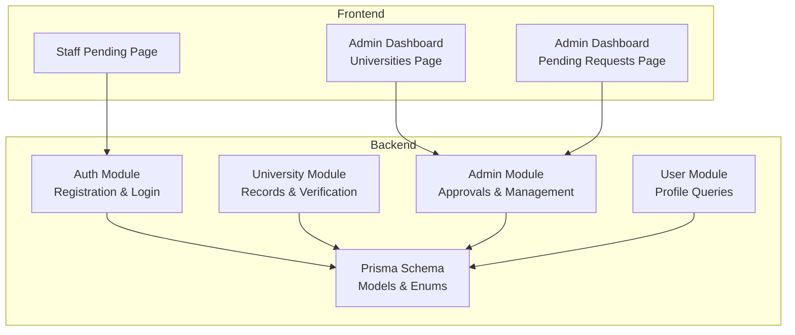
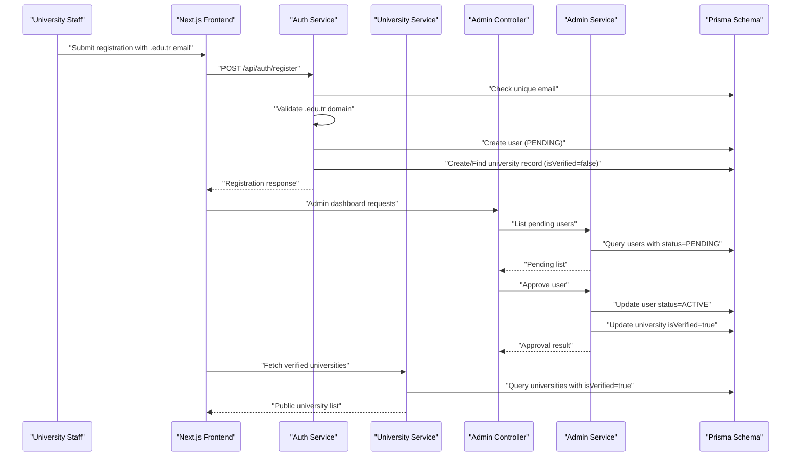
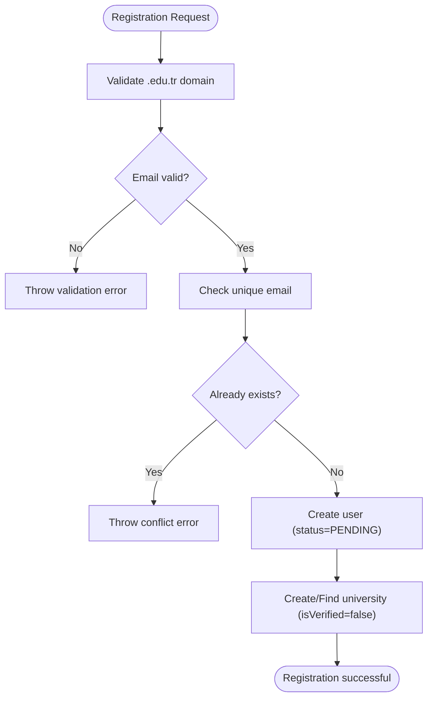
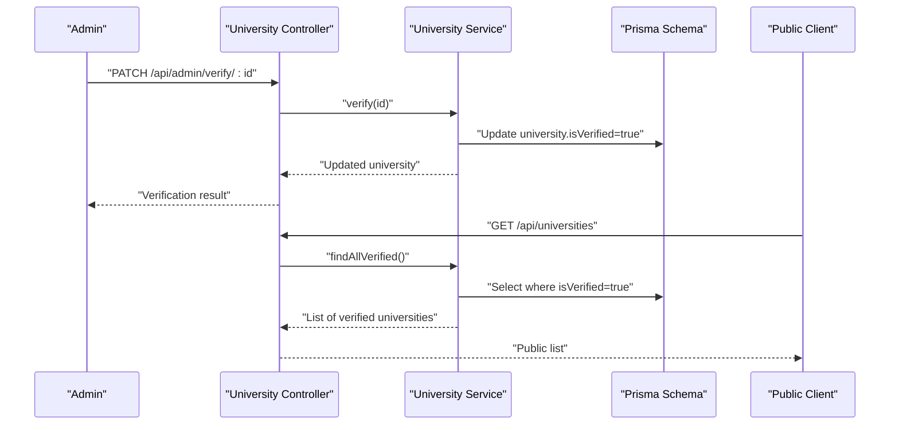
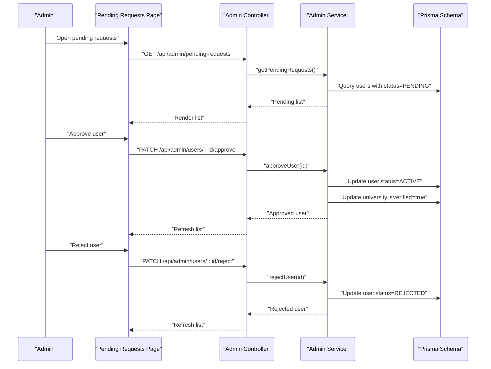
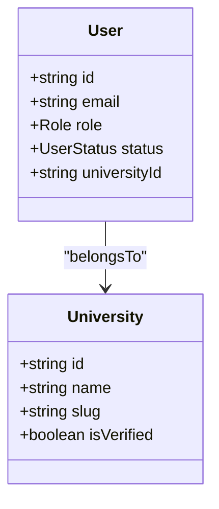
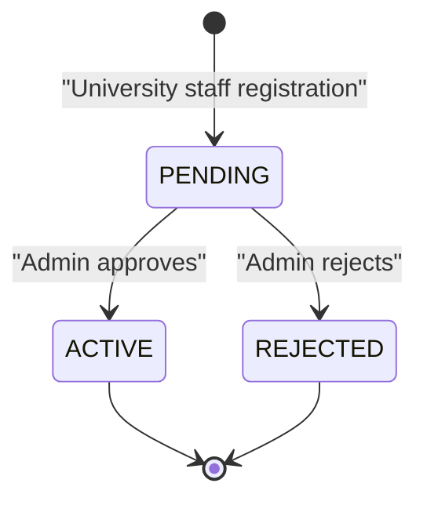
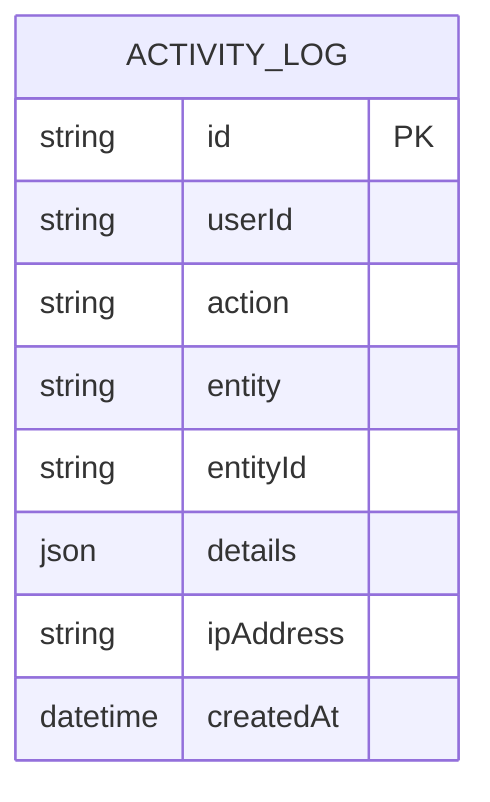
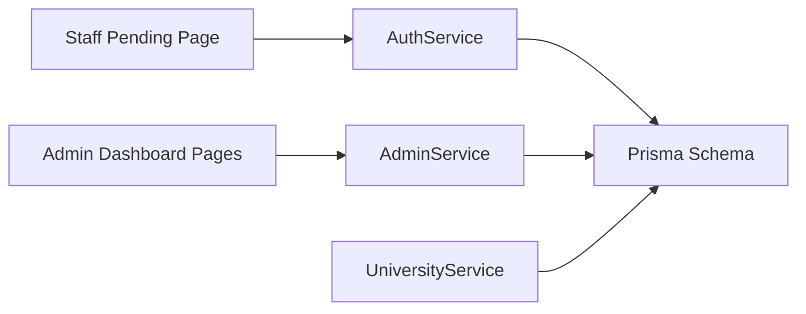

# University Approval and Verification

<cite>
**Referenced Files in This Document**
- [university.controller.ts](file://apps/api/src/modules/university/university.controller.ts)
- [university.service.ts](file://apps/api/src/modules/university/university.service.ts)
- [university.dto.ts](file://apps/api/src/modules/university/university.dto.ts)
- [admin.controller.ts](file://apps/api/src/modules/admin/admin.controller.ts)
- [admin.service.ts](file://apps/api/src/modules/admin/admin.service.ts)
- [auth.controller.ts](file://apps/api/src/modules/auth/auth.controller.ts)
- [auth.service.ts](file://apps/api/src/modules/auth/auth.service.ts)
- [roles.ts](file://apps/api/src/common/constants/roles.ts)
- [schema.prisma](file://apps/api/prisma/schema.prisma)
- [user.service.ts](file://apps/api/src/modules/user/user.service.ts)
- [universities.page.tsx](file://apps/web/app/dashboard/universities/page.tsx)
- [pending.page.tsx](file://apps/web/app/dashboard/pending/page.tsx)
- [web.pending.page.tsx](file://apps/web/app/pending/page.tsx)
</cite>

## Table of Contents
1. [Introduction](#introduction)
2. [Project Structure](#project-structure)
3. [Core Components](#core-components)
4. [Architecture Overview](#architecture-overview)
5. [Detailed Component Analysis](#detailed-component-analysis)
6. [Dependency Analysis](#dependency-analysis)
7. [Performance Considerations](#performance-considerations)
8. [Troubleshooting Guide](#troubleshooting-guide)
9. [Conclusion](#conclusion)
10. [Appendices](#appendices)

## Introduction
This document explains the university approval and verification workflow in the system. It covers the university registration process, institutional email validation, administrative review and approval, verification states, integration between university staff accounts and institution verification, bulk approval capabilities, and audit trail requirements for compliance. The documentation also outlines security measures to prevent fraudulent registrations and maintain data integrity.

## Project Structure
The approval and verification workflow spans backend NestJS modules and frontend Next.js pages:
- Backend modules:
  - Authentication module validates institutional emails during registration.
  - University module manages university records and verification state.
  - Admin module handles administrative actions for approvals and university management.
  - User module provides user profile queries.
- Frontend pages:
  - Admin dashboard for managing universities and reviewing pending requests.
  - Pending status page for university staff awaiting approval.

**Diagram sources**
- [auth.controller.ts](file://apps/api/src/modules/auth/auth.controller.ts#L1-L28)
- [auth.service.ts](file://apps/api/src/modules/auth/auth.service.ts#L1-L205)
- [university.controller.ts](file://apps/api/src/modules/university/university.controller.ts#L1-L114)
- [university.service.ts](file://apps/api/src/modules/university/university.service.ts#L1-L451)
- [admin.controller.ts](file://apps/api/src/modules/admin/admin.controller.ts#L1-L119)
- [admin.service.ts](file://apps/api/src/modules/admin/admin.service.ts#L1-L281)
- [user.service.ts](file://apps/api/src/modules/user/user.service.ts#L1-L76)
- [schema.prisma](file://apps/api/prisma/schema.prisma#L1-L183)
- [universities.page.tsx](file://apps/web/app/dashboard/universities/page.tsx#L1-L177)
- [pending.page.tsx](file://apps/web/app/dashboard/pending/page.tsx#L1-L126)
- [web.pending.page.tsx](file://apps/web/app/pending/page.tsx#L1-L64)

**Section sources**
- [auth.controller.ts](file://apps/api/src/modules/auth/auth.controller.ts#L1-L28)
- [auth.service.ts](file://apps/api/src/modules/auth/auth.service.ts#L1-L205)
- [university.controller.ts](file://apps/api/src/modules/university/university.controller.ts#L1-L114)
- [university.service.ts](file://apps/api/src/modules/university/university.service.ts#L1-L451)
- [admin.controller.ts](file://apps/api/src/modules/admin/admin.controller.ts#L1-L119)
- [admin.service.ts](file://apps/api/src/modules/admin/admin.service.ts#L1-L281)
- [user.service.ts](file://apps/api/src/modules/user/user.service.ts#L1-L76)
- [schema.prisma](file://apps/api/prisma/schema.prisma#L1-L183)
- [universities.page.tsx](file://apps/web/app/dashboard/universities/page.tsx#L1-L177)
- [pending.page.tsx](file://apps/web/app/dashboard/pending/page.tsx#L1-L126)
- [web.pending.page.tsx](file://apps/web/app/pending/page.tsx#L1-L64)

## Core Components
- Authentication and Registration:
  - Institutional email validation for university staff using .edu.tr domain pattern.
  - Automatic creation of university records when registering university staff.
  - Status assignment: university staff are registered as PENDING; students as ACTIVE.
- University Management:
  - CRUD operations for universities with multitenancy constraints.
  - Verification toggle controlled by administrators.
  - Public endpoints for verified university listings and details.
- Admin Review and Approval:
  - Pending user requests listing for university staff.
  - Approve or reject user requests; approving triggers institution verification.
  - Bulk-like operations via toggling verification flags in the admin dashboard.
- Audit Trail:
  - Activity logs capture administrative actions for compliance reporting.

**Section sources**
- [auth.service.ts](file://apps/api/src/modules/auth/auth.service.ts#L46-L130)
- [university.controller.ts](file://apps/api/src/modules/university/university.controller.ts#L68-L99)
- [university.service.ts](file://apps/api/src/modules/university/university.service.ts#L26-L44)
- [admin.controller.ts](file://apps/api/src/modules/admin/admin.controller.ts#L43-L83)
- [admin.service.ts](file://apps/api/src/modules/admin/admin.service.ts#L24-L92)
- [schema.prisma](file://apps/api/prisma/schema.prisma#L140-L154)

## Architecture Overview
The approval workflow integrates frontend dashboards with backend services and database models. University staff registration triggers institutional checks and creates a pending account. Administrators review and approve requests, which activates the user and verifies the associated institution. All administrative actions are recorded for audit purposes.

**Diagram sources**
- [auth.service.ts](file://apps/api/src/modules/auth/auth.service.ts#L46-L130)
- [admin.controller.ts](file://apps/api/src/modules/admin/admin.controller.ts#L43-L83)
- [admin.service.ts](file://apps/api/src/modules/admin/admin.service.ts#L24-L92)
- [university.service.ts](file://apps/api/src/modules/university/university.service.ts#L47-L61)
- [schema.prisma](file://apps/api/prisma/schema.prisma#L60-L85)

## Detailed Component Analysis

### University Registration and Domain Validation
- Domain validation:
  - Registration enforces .edu.tr for university staff accounts.
  - Non-compliant emails trigger validation errors.
- Automatic university record creation:
  - When registering university staff without an explicit universityId, the system derives a slug from the university name and creates or finds a matching university record with isVerified set to false.
- Status assignment:
  - University staff are registered as PENDING until approved by an administrator.
  - Students are registered as ACTIVE immediately.

**Diagram sources**
- [auth.service.ts](file://apps/api/src/modules/auth/auth.service.ts#L46-L130)

**Section sources**
- [auth.service.ts](file://apps/api/src/modules/auth/auth.service.ts#L46-L130)

### Institutional Email Verification and Public Listing
- Public endpoints:
  - Retrieve verified universities and details for display.
- Verification toggle:
  - Admins can toggle isVerified per university.
  - Public listings filter by isVerified=true.

**Diagram sources**
- [university.controller.ts](file://apps/api/src/modules/university/university.controller.ts#L93-L99)
- [university.service.ts](file://apps/api/src/modules/university/university.service.ts#L47-L61)
- [university.service.ts](file://apps/api/src/modules/university/university.service.ts#L130-L144)

**Section sources**
- [university.controller.ts](file://apps/api/src/modules/university/university.controller.ts#L42-L58)
- [university.controller.ts](file://apps/api/src/modules/university/university.controller.ts#L93-L99)
- [university.service.ts](file://apps/api/src/modules/university/university.service.ts#L47-L61)
- [university.service.ts](file://apps/api/src/modules/university/university.service.ts#L130-L144)

### Admin Review Workflow and Bulk Approval
- Pending requests:
  - Admins can view all PENDING users.
- Approval and rejection:
  - Approving a user sets status to ACTIVE and automatically verifies the associated university.
  - Rejecting a user sets status to REJECTED.
- Bulk-like operations:
  - Admins can toggle verification flags for multiple universities in the dashboard.

**Diagram sources**
- [admin.controller.ts](file://apps/api/src/modules/admin/admin.controller.ts#L43-L56)
- [admin.service.ts](file://apps/api/src/modules/admin/admin.service.ts#L24-L92)
- [pending.page.tsx](file://apps/web/app/dashboard/pending/page.tsx#L26-L62)

**Section sources**
- [admin.controller.ts](file://apps/api/src/modules/admin/admin.controller.ts#L43-L56)
- [admin.service.ts](file://apps/api/src/modules/admin/admin.service.ts#L24-L92)
- [pending.page.tsx](file://apps/web/app/dashboard/pending/page.tsx#L26-L62)

### University Staff Accounts and Institution Verification Integration
- When a university staff member registers:
  - If universityName is provided and universityId is missing, the system creates or retrieves a university record with isVerified=false.
  - The staff member’s universityId is linked to this record.
- Upon approval:
  - The staff member’s status becomes ACTIVE.
  - The associated university is automatically verified.

**Diagram sources**
- [auth.service.ts](file://apps/api/src/modules/auth/auth.service.ts#L72-L97)
- [admin.service.ts](file://apps/api/src/modules/admin/admin.service.ts#L62-L68)
- [schema.prisma](file://apps/api/prisma/schema.prisma#L60-L85)
- [schema.prisma](file://apps/api/prisma/schema.prisma#L35-L58)

**Section sources**
- [auth.service.ts](file://apps/api/src/modules/auth/auth.service.ts#L72-L97)
- [admin.service.ts](file://apps/api/src/modules/admin/admin.service.ts#L62-L68)

### Verification Status System
- States:
  - PENDING: Initial state for university staff registrations.
  - APPROVED: Internal state used by the system; not exposed to clients.
  - REJECTED: Final state after admin rejection.
  - ACTIVE: Final state after admin approval.
- Public visibility:
  - Public listing depends on university.isVerified=true.
  - Users’ status affects login permissions.

**Diagram sources**
- [roles.ts](file://apps/api/src/common/constants/roles.ts#L1-L6)
- [auth.service.ts](file://apps/api/src/modules/auth/auth.service.ts#L67-L67)
- [admin.service.ts](file://apps/api/src/modules/admin/admin.service.ts#L54-L59)
- [admin.service.ts](file://apps/api/src/modules/admin/admin.service.ts#L84-L88)

**Section sources**
- [roles.ts](file://apps/api/src/common/constants/roles.ts#L1-L6)
- [auth.service.ts](file://apps/api/src/modules/auth/auth.service.ts#L67-L67)
- [admin.service.ts](file://apps/api/src/modules/admin/admin.service.ts#L54-L59)
- [admin.service.ts](file://apps/api/src/modules/admin/admin.service.ts#L84-L88)

### Security Measures and Fraud Prevention
- Institutional email enforcement:
  - Strict .edu.tr domain validation for university staff registration.
- Account lifecycle controls:
  - PENDING status prevents access until approved.
  - REJECTED status blocks login attempts.
- Access control:
  - Guards restrict endpoints by role (ADMIN, UNIVERSITY).
  - Multitenancy ensures university staff edit only their own data.
- Data integrity:
  - Unique constraints on university name and slug.
  - Unique constraints on user email.
  - Indexes optimize filtering and reduce risk of bypass queries.

**Section sources**
- [auth.service.ts](file://apps/api/src/modules/auth/auth.service.ts#L57-L64)
- [auth.service.ts](file://apps/api/src/modules/auth/auth.service.ts#L150-L153)
- [university.controller.ts](file://apps/api/src/modules/university/university.controller.ts#L78-L91)
- [schema.prisma](file://apps/api/prisma/schema.prisma#L35-L58)
- [schema.prisma](file://apps/api/prisma/schema.prisma#L60-L85)

### Audit Trail and Compliance
- Activity logging:
  - Administrative actions (e.g., verifying universities, approving users) are captured in ActivityLog with details, IP address, and timestamps.
- Compliance support:
  - Logs enable tracking of who performed actions, when, and on which entities.

**Diagram sources**
- [schema.prisma](file://apps/api/prisma/schema.prisma#L140-L154)

**Section sources**
- [schema.prisma](file://apps/api/prisma/schema.prisma#L140-L154)
- [admin.service.ts](file://apps/api/src/modules/admin/admin.service.ts#L62-L68)

## Dependency Analysis
The approval workflow depends on:
- Authentication service for validating institutional emails and status assignment.
- Admin service for reviewing and approving users, and for verifying institutions.
- University service for listing verified institutions and updating widget configurations.
- Prisma schema for enforcing uniqueness, multitenancy, and indexes.

**Diagram sources**
- [auth.service.ts](file://apps/api/src/modules/auth/auth.service.ts#L1-L205)
- [admin.service.ts](file://apps/api/src/modules/admin/admin.service.ts#L1-L281)
- [university.service.ts](file://apps/api/src/modules/university/university.service.ts#L1-L451)
- [schema.prisma](file://apps/api/prisma/schema.prisma#L1-L183)
- [universities.page.tsx](file://apps/web/app/dashboard/universities/page.tsx#L1-L177)
- [pending.page.tsx](file://apps/web/app/dashboard/pending/page.tsx#L1-L126)
- [web.pending.page.tsx](file://apps/web/app/pending/page.tsx#L1-L64)

**Section sources**
- [auth.service.ts](file://apps/api/src/modules/auth/auth.service.ts#L1-L205)
- [admin.service.ts](file://apps/api/src/modules/admin/admin.service.ts#L1-L281)
- [university.service.ts](file://apps/api/src/modules/university/university.service.ts#L1-L451)
- [schema.prisma](file://apps/api/prisma/schema.prisma#L1-L183)
- [universities.page.tsx](file://apps/web/app/dashboard/universities/page.tsx#L1-L177)
- [pending.page.tsx](file://apps/web/app/dashboard/pending/page.tsx#L1-L126)
- [web.pending.page.tsx](file://apps/web/app/pending/page.tsx#L1-L64)

## Performance Considerations
- Indexes:
  - City and isVerified indices on University improve filtering performance.
  - Status index on User supports efficient pending request queries.
- Aggregation queries:
  - University analytics rely on aggregated counts and time-series queries; ensure proper indexing on related fields.
- Pagination:
  - Admin endpoints use pagination to limit payload sizes for large datasets.

[No sources needed since this section provides general guidance]

## Troubleshooting Guide
- Registration fails with domain validation error:
  - Ensure the email uses a .edu.tr domain for university staff.
- Pending status persists:
  - Verify that an administrator has reviewed and approved the request.
- Cannot log in after rejection:
  - Rejected users are blocked from logging in; contact an administrator.
- University not appearing in public list:
  - Confirm that the university’s isVerified flag is set to true.

**Section sources**
- [auth.service.ts](file://apps/api/src/modules/auth/auth.service.ts#L59-L63)
- [auth.service.ts](file://apps/api/src/modules/auth/auth.service.ts#L150-L153)
- [admin.service.ts](file://apps/api/src/modules/admin/admin.service.ts#L75-L92)
- [university.service.ts](file://apps/api/src/modules/university/university.service.ts#L47-L61)

## Conclusion
The system enforces institutional email validation during registration, assigns appropriate statuses, and automates institution verification upon staff approval. Administrators manage the entire workflow through dedicated dashboards, while robust security controls and audit trails support compliance and integrity.

[No sources needed since this section summarizes without analyzing specific files]

## Appendices

### Example Approval Workflows
- New university staff registration:
  - Submit .edu.tr email; system validates domain and creates PENDING user.
  - Admin reviews pending list and approves; user becomes ACTIVE and institution is verified.
- Existing university staff:
  - Register with an existing universityId; approval follows the same process.

**Section sources**
- [auth.service.ts](file://apps/api/src/modules/auth/auth.service.ts#L46-L130)
- [admin.controller.ts](file://apps/api/src/modules/admin/admin.controller.ts#L43-L56)
- [admin.service.ts](file://apps/api/src/modules/admin/admin.service.ts#L44-L72)

### Rejection Reasons and Appeals
- Typical rejection scenarios:
  - Invalid or non-institutional email.
  - Duplicate registration or conflicting data.
- Appeal process:
  - Users with REJECTED status should contact support for reconsideration.

**Section sources**
- [admin.service.ts](file://apps/api/src/modules/admin/admin.service.ts#L75-L92)
- [web.pending.page.tsx](file://apps/web/app/pending/page.tsx#L33-L43)

### Bulk Approval and Audit Trail
- Bulk-like verification:
  - Admins can toggle verification flags for multiple universities in the dashboard.
- Audit trail:
  - All administrative actions are logged for compliance reporting.

**Section sources**
- [universities.page.tsx](file://apps/web/app/dashboard/universities/page.tsx#L63-L70)
- [admin.service.ts](file://apps/api/src/modules/admin/admin.service.ts#L62-L68)
- [schema.prisma](file://apps/api/prisma/schema.prisma#L140-L154)