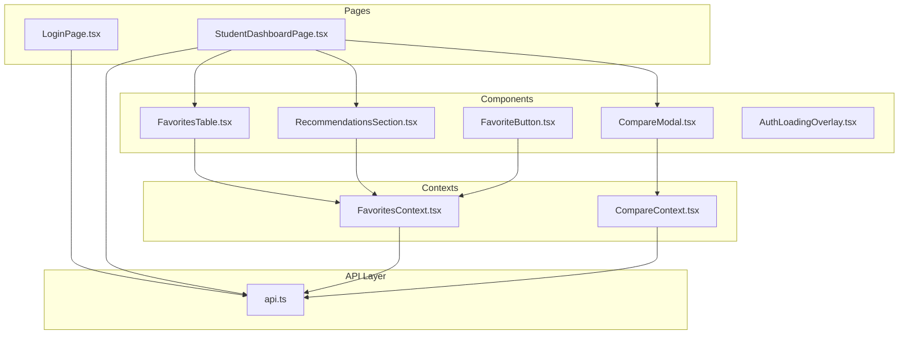
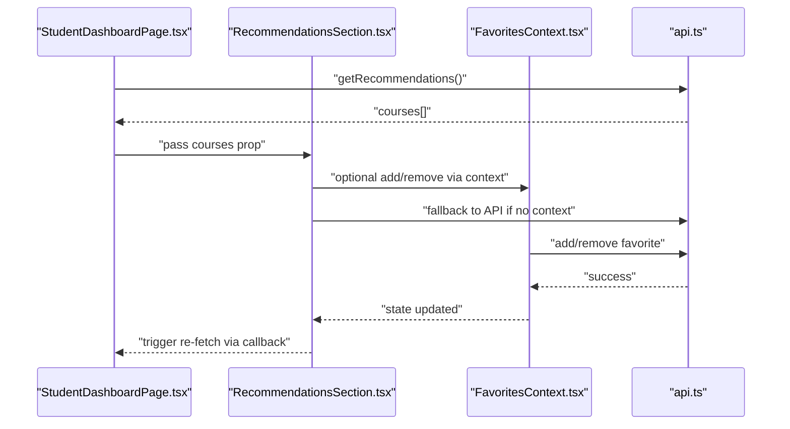
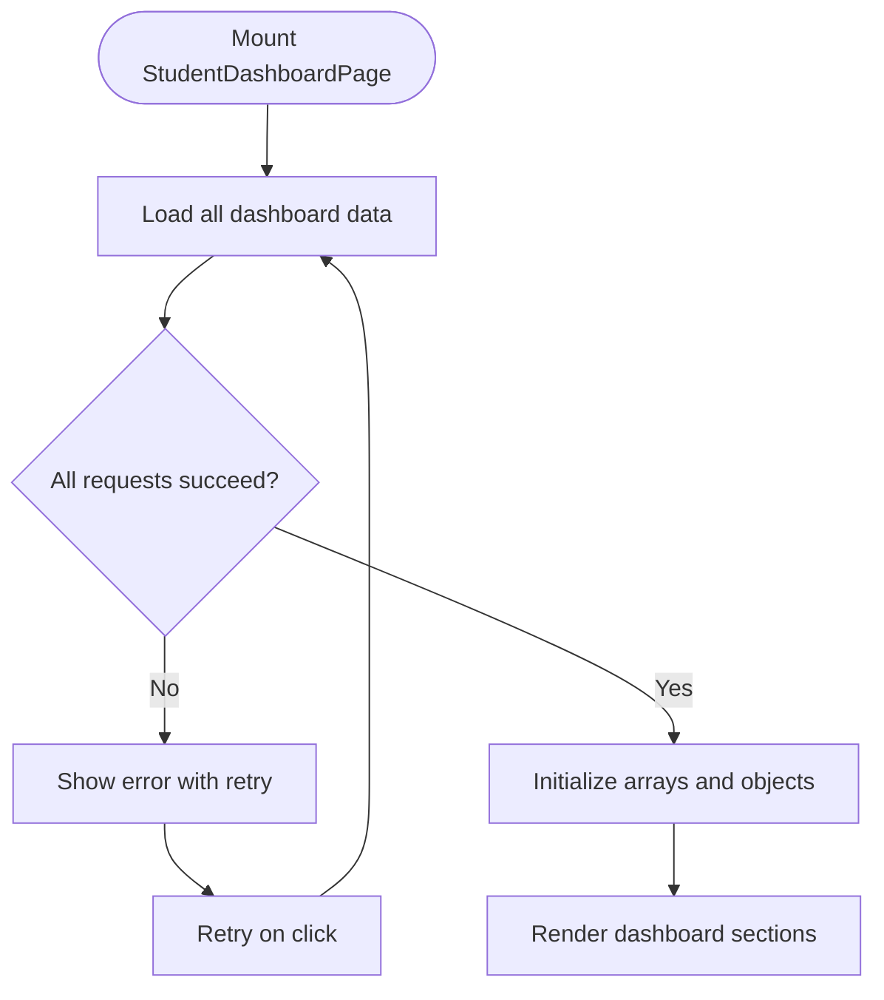
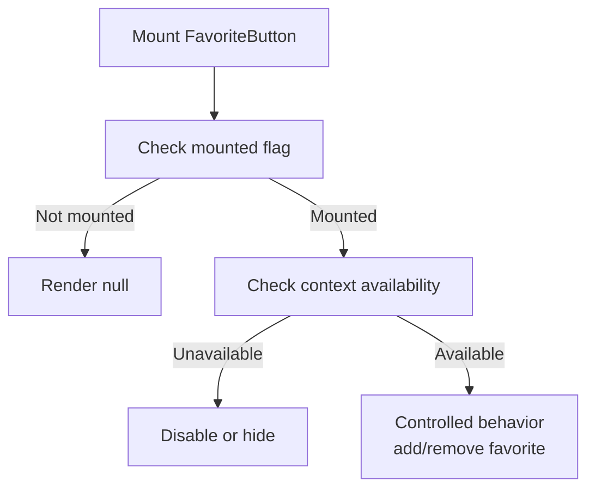
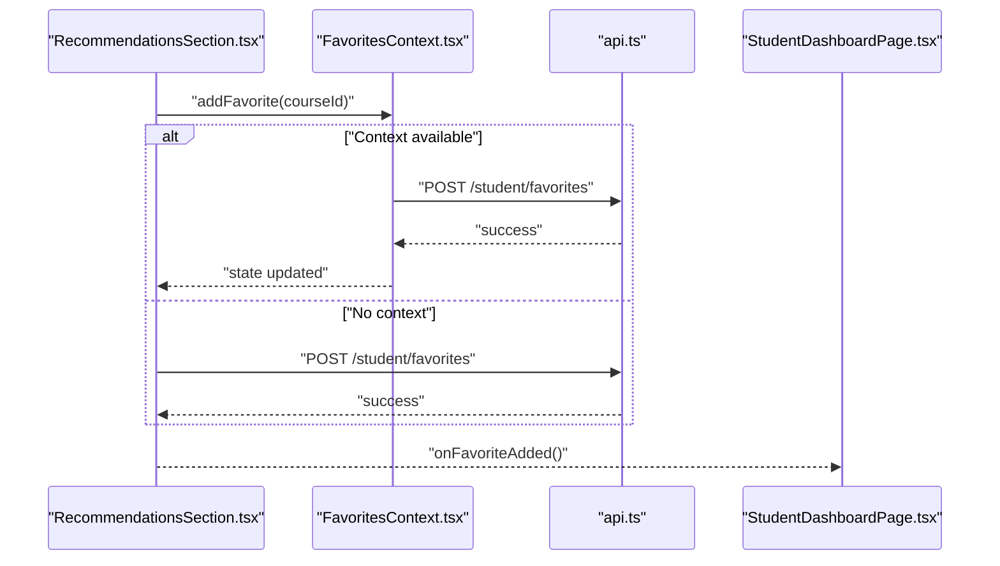
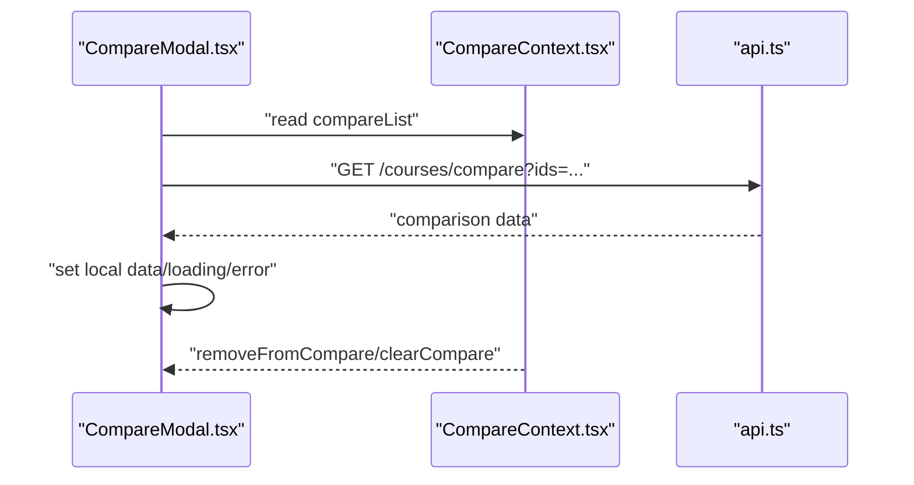
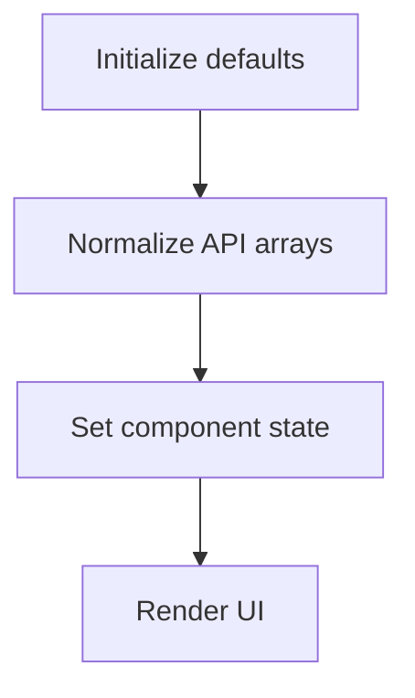
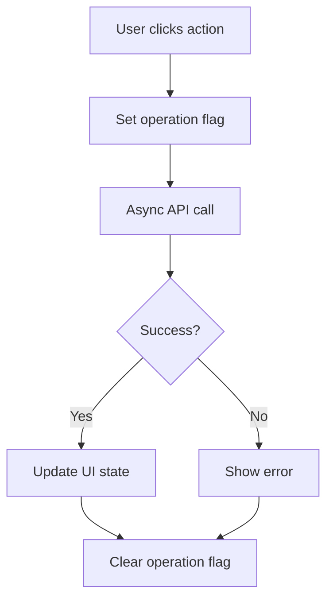
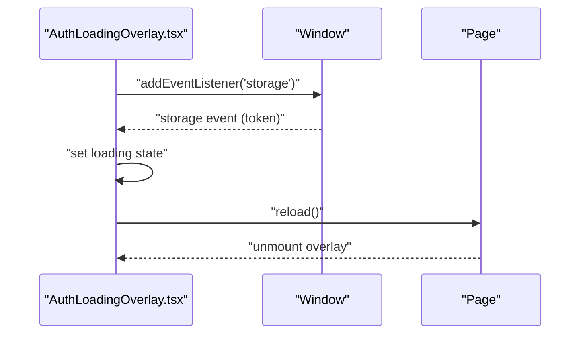
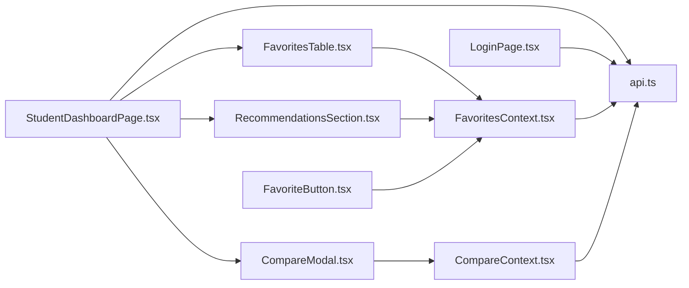

# Component State Patterns

<cite>
**Referenced Files in This Document**
- [StudentDashboardPage.tsx](file://apps/web/app/dashboard/student/page.tsx)
- [LoginPage.tsx](file://apps/web/app/(auth)/login/page.tsx)
- [FavoritesContext.tsx](file://apps/web/contexts/favorites-context.tsx)
- [CompareContext.tsx](file://apps/web/contexts/compare-context.tsx)
- [FavoritesTable.tsx](file://apps/web/app/dashboard/student/components/FavoritesTable.tsx)
- [RecommendationsSection.tsx](file://apps/web/app/dashboard/student/components/RecommendationsSection.tsx)
- [FavoriteButton.tsx](file://apps/web/components/course/FavoriteButton.tsx)
- [CompareModal.tsx](file://apps/web/components/compare/CompareModal.tsx)
- [AuthLoadingOverlay.tsx](file://apps/web/components/layout/AuthLoadingOverlay.tsx)
- [api.ts](file://apps/web/lib/api.ts)
</cite>

## Table of Contents
1. [Introduction](#introduction)
2. [Project Structure](#project-structure)
3. [Core Components](#core-components)
4. [Architecture Overview](#architecture-overview)
5. [Detailed Component Analysis](#detailed-component-analysis)
6. [Dependency Analysis](#dependency-analysis)
7. [Performance Considerations](#performance-considerations)
8. [Troubleshooting Guide](#troubleshooting-guide)
9. [Conclusion](#conclusion)

## Introduction
This document explains component-level state management patterns implemented across the Next.js application. It covers:
- Local component state usage for UI and transient data
- Controlled vs uncontrolled patterns
- State lifting strategies and when to lift vs keep state local
- Integration between local component state and shared context state
- Initialization patterns, conditional updates, and cleanup strategies
- Practical examples from the student dashboard and authentication overlay
- Performance considerations and memory management for state updates

## Project Structure
The state management spans client components, shared contexts, and API clients:
- Client pages and components use React hooks for local state
- Shared contexts centralize cross-component state (favorites and comparison lists)
- API client encapsulates HTTP requests and token handling

**Diagram sources**
- [StudentDashboardPage.tsx](file://apps/web/app/dashboard/student/page.tsx#L21-L190)
- [LoginPage.tsx](file://apps/web/app/(auth)/login/page.tsx#L13-L135)
- [FavoritesTable.tsx](file://apps/web/app/dashboard/student/components/FavoritesTable.tsx#L28-L141)
- [RecommendationsSection.tsx](file://apps/web/app/dashboard/student/components/RecommendationsSection.tsx#L30-L152)
- [FavoriteButton.tsx](file://apps/web/components/course/FavoriteButton.tsx#L17-L92)
- [CompareModal.tsx](file://apps/web/components/compare/CompareModal.tsx#L317-L429)
- [AuthLoadingOverlay.tsx](file://apps/web/components/layout/AuthLoadingOverlay.tsx#L6-L37)
- [FavoritesContext.tsx](file://apps/web/contexts/favorites-context.tsx#L29-L132)
- [CompareContext.tsx](file://apps/web/contexts/compare-context.tsx#L30-L98)
- [api.ts](file://apps/web/lib/api.ts#L11-L36)

**Section sources**
- [StudentDashboardPage.tsx](file://apps/web/app/dashboard/student/page.tsx#L21-L190)
- [LoginPage.tsx](file://apps/web/app/(auth)/login/page.tsx#L13-L135)
- [FavoritesContext.tsx](file://apps/web/contexts/favorites-context.tsx#L29-L132)
- [CompareContext.tsx](file://apps/web/contexts/compare-context.tsx#L30-L98)
- [api.ts](file://apps/web/lib/api.ts#L11-L36)

## Core Components
- StudentDashboardPage: orchestrates multiple data fetches, manages loading/error states, and passes data to child components. It demonstrates local state initialization, conditional rendering, and event-driven updates.
- LoginPage: form state management with controlled inputs, loading/error flags, and navigation after successful authentication.
- FavoritesContext: centralized state for favorites with synchronization across pages, including token parsing and optimistic UI updates.
- CompareContext: centralized comparison list persisted in localStorage with guarded mutations and derived flags.
- FavoritesTable and RecommendationsSection: hybrid pattern combining local UI state with optional context-driven persistence.
- FavoriteButton: controlled component behavior with hydration guard and conditional rendering based on context availability.
- CompareModal: local state for modal visibility and fetched comparison data, with cleanup via dialog close and storage-backed persistence.
- AuthLoadingOverlay: local state reacting to storage events for seamless account switching.

**Section sources**
- [StudentDashboardPage.tsx](file://apps/web/app/dashboard/student/page.tsx#L21-L190)
- [LoginPage.tsx](file://apps/web/app/(auth)/login/page.tsx#L13-L135)
- [FavoritesContext.tsx](file://apps/web/contexts/favorites-context.tsx#L29-L132)
- [CompareContext.tsx](file://apps/web/contexts/compare-context.tsx#L30-L98)
- [FavoritesTable.tsx](file://apps/web/app/dashboard/student/components/FavoritesTable.tsx#L28-L141)
- [RecommendationsSection.tsx](file://apps/web/app/dashboard/student/components/RecommendationsSection.tsx#L30-L152)
- [FavoriteButton.tsx](file://apps/web/components/course/FavoriteButton.tsx#L17-L92)
- [CompareModal.tsx](file://apps/web/components/compare/CompareModal.tsx#L317-L429)
- [AuthLoadingOverlay.tsx](file://apps/web/components/layout/AuthLoadingOverlay.tsx#L6-L37)

## Architecture Overview
The system blends local component state with shared context state:
- Local state: UI flags, transient selections, and small datasets scoped to a single component
- Context state: cross-component data requiring persistence and synchronization (favorites, compare list)
- API layer: centralized request logic with token injection and error normalization

**Diagram sources**
- [StudentDashboardPage.tsx](file://apps/web/app/dashboard/student/page.tsx#L33-L55)
- [RecommendationsSection.tsx](file://apps/web/app/dashboard/student/components/RecommendationsSection.tsx#L30-L54)
- [FavoritesContext.tsx](file://apps/web/contexts/favorites-context.tsx#L71-L99)
- [api.ts](file://apps/web/lib/api.ts#L265-L284)

## Detailed Component Analysis

### Local Component State Usage
- StudentDashboardPage initializes multiple local states for profile, stats, favorites, search history, recommendations, and interactions. It uses a single effect to load data and sets loading/error flags accordingly. Conditional rendering displays either a spinner, an error message with retry, or the main content.
- LoginPage maintains controlled inputs for email/password, toggles password visibility, and uses loading/error flags during submission. On success, it persists tokens and navigates based on role.

**Diagram sources**
- [StudentDashboardPage.tsx](file://apps/web/app/dashboard/student/page.tsx#L33-L59)

**Section sources**
- [StudentDashboardPage.tsx](file://apps/web/app/dashboard/student/page.tsx#L21-L190)
- [LoginPage.tsx](file://apps/web/app/(auth)/login/page.tsx#L13-L135)

### Controlled vs Uncontrolled Components
- LoginPage inputs are controlled: state drives input values and change handlers ensure immediate synchronization.
- FavoriteButton demonstrates a controlled-like pattern with a hydration guard: it avoids rendering until mounted, then conditionally enables actions based on context availability and role.

**Diagram sources**
- [FavoriteButton.tsx](file://apps/web/components/course/FavoriteButton.tsx#L17-L57)

**Section sources**
- [LoginPage.tsx](file://apps/web/app/(auth)/login/page.tsx#L15-L113)
- [FavoriteButton.tsx](file://apps/web/components/course/FavoriteButton.tsx#L17-L92)

### State Lifting Strategies
- RecommendationsSection and FavoritesTable demonstrate selective lifting:
  - They accept initial data via props and maintain local UI state for transient operations (e.g., adding/removing items).
  - When context is present, they delegate persistence to FavoritesContext; otherwise, they call API directly.
  - Parent components are notified via callbacks to refresh their own data.

**Diagram sources**
- [RecommendationsSection.tsx](file://apps/web/app/dashboard/student/components/RecommendationsSection.tsx#L30-L54)
- [FavoritesContext.tsx](file://apps/web/contexts/favorites-context.tsx#L71-L82)
- [api.ts](file://apps/web/lib/api.ts#L226-L235)

**Section sources**
- [RecommendationsSection.tsx](file://apps/web/app/dashboard/student/components/RecommendationsSection.tsx#L30-L54)
- [FavoritesTable.tsx](file://apps/web/app/dashboard/student/components/FavoritesTable.tsx#L34-L49)
- [StudentDashboardPage.tsx](file://apps/web/app/dashboard/student/page.tsx#L134-L146)

### Integration Between Local State and Context State
- CompareContext persists the compare list in localStorage and synchronizes it across sessions. CompareModal reads the list from context, fetches comparison data, and updates local state for the modal content.
- FavoritesContext parses the JWT to determine student eligibility and synchronizes the favorite set from the backend. Components can use FavoritesContext for global consistency or fall back to direct API calls.

**Diagram sources**
- [CompareModal.tsx](file://apps/web/components/compare/CompareModal.tsx#L317-L345)
- [CompareContext.tsx](file://apps/web/contexts/compare-context.tsx#L30-L98)
- [api.ts](file://apps/web/lib/api.ts#L71-L76)

**Section sources**
- [CompareModal.tsx](file://apps/web/components/compare/CompareModal.tsx#L317-L429)
- [CompareContext.tsx](file://apps/web/contexts/compare-context.tsx#L30-L98)
- [FavoritesContext.tsx](file://apps/web/contexts/favorites-context.tsx#L29-L132)

### State Initialization Patterns
- StudentDashboardPage initializes arrays and objects to empty defaults and normalizes API responses to arrays before setting state.
- FavoritesContext initializes an empty Set for favorite IDs and derives flags like isLoading and isStudent based on token parsing and API calls.
- CompareContext initializes an empty array and hydrates from localStorage after mount, ensuring safe client-side operations.

**Diagram sources**
- [StudentDashboardPage.tsx](file://apps/web/app/dashboard/student/page.tsx#L44-L49)
- [FavoritesContext.tsx](file://apps/web/contexts/favorites-context.tsx#L34-L65)
- [CompareContext.tsx](file://apps/web/contexts/compare-context.tsx#L38-L51)

**Section sources**
- [StudentDashboardPage.tsx](file://apps/web/app/dashboard/student/page.tsx#L24-L54)
- [FavoritesContext.tsx](file://apps/web/contexts/favorites-context.tsx#L30-L69)
- [CompareContext.tsx](file://apps/web/contexts/compare-context.tsx#L30-L56)

### Conditional State Updates
- RecommendationsSection and FavoritesTable use local flags (addingId/removingId) to disable buttons during async operations, preventing duplicate submissions.
- CompareModal conditionally renders skeletons, error messages, or comparison data based on loading and error flags.

**Diagram sources**
- [RecommendationsSection.tsx](file://apps/web/app/dashboard/student/components/RecommendationsSection.tsx#L39-L54)
- [FavoritesTable.tsx](file://apps/web/app/dashboard/student/components/FavoritesTable.tsx#L34-L49)
- [CompareModal.tsx](file://apps/web/components/compare/CompareModal.tsx#L323-L345)

**Section sources**
- [RecommendationsSection.tsx](file://apps/web/app/dashboard/student/components/RecommendationsSection.tsx#L34-L54)
- [FavoritesTable.tsx](file://apps/web/app/dashboard/student/components/FavoritesTable.tsx#L34-L49)
- [CompareModal.tsx](file://apps/web/components/compare/CompareModal.tsx#L323-L345)

### Cleanup Strategies
- AuthLoadingOverlay listens to storage events and reloads the page when the token changes, clearing the overlay state after reload.
- CompareModal clears local state when closed or when the compare list becomes insufficient; it also removes localStorage entries when clearing all.

**Diagram sources**
- [AuthLoadingOverlay.tsx](file://apps/web/components/layout/AuthLoadingOverlay.tsx#L6-L23)

**Section sources**
- [AuthLoadingOverlay.tsx](file://apps/web/components/layout/AuthLoadingOverlay.tsx#L6-L37)
- [CompareModal.tsx](file://apps/web/components/compare/CompareModal.tsx#L347-L356)
- [CompareContext.tsx](file://apps/web/contexts/compare-context.tsx#L70-L75)

## Dependency Analysis
- Pages depend on components and contexts for data and behavior.
- Components optionally consume contexts; when unavailable, they fall back to API calls.
- Contexts depend on the API client for persistence and synchronization.
- API client depends on environment configuration and localStorage for token management.

**Diagram sources**
- [StudentDashboardPage.tsx](file://apps/web/app/dashboard/student/page.tsx#L21-L190)
- [FavoritesTable.tsx](file://apps/web/app/dashboard/student/components/FavoritesTable.tsx#L28-L141)
- [RecommendationsSection.tsx](file://apps/web/app/dashboard/student/components/RecommendationsSection.tsx#L30-L152)
- [FavoriteButton.tsx](file://apps/web/components/course/FavoriteButton.tsx#L17-L92)
- [CompareModal.tsx](file://apps/web/components/compare/CompareModal.tsx#L317-L429)
- [LoginPage.tsx](file://apps/web/app/(auth)/login/page.tsx#L13-L135)
- [FavoritesContext.tsx](file://apps/web/contexts/favorites-context.tsx#L29-L132)
- [CompareContext.tsx](file://apps/web/contexts/compare-context.tsx#L30-L98)
- [api.ts](file://apps/web/lib/api.ts#L11-L36)

**Section sources**
- [StudentDashboardPage.tsx](file://apps/web/app/dashboard/student/page.tsx#L21-L190)
- [FavoritesContext.tsx](file://apps/web/contexts/favorites-context.tsx#L29-L132)
- [CompareContext.tsx](file://apps/web/contexts/compare-context.tsx#L30-L98)
- [api.ts](file://apps/web/lib/api.ts#L11-L36)

## Performance Considerations
- Prefer local state for UI flags and small, component-scoped data to minimize unnecessary re-renders.
- Use memoization and callbacks (e.g., useCallback) in contexts to prevent re-renders of consumers when dependencies have not changed.
- Defer heavy computations to effects and avoid synchronous heavy work in render paths.
- Keep context providers near the root to reduce propagation overhead.
- Use controlled inputs to avoid redundant reconciliation loops.
- Avoid frequent re-renders by batching state updates and using stable references for props passed to child components.

[No sources needed since this section provides general guidance]

## Troubleshooting Guide
- Authentication flow issues:
  - Verify token presence in localStorage and cookie handling during login.
  - Confirm role-based routing after login.
- Context availability:
  - Ensure components using optional hooks still render gracefully when context is absent.
  - Check token parsing logic in FavoritesContext for role validation.
- Storage synchronization:
  - Confirm localStorage keys and limits in CompareContext.
  - Use storage event listeners to trigger reloads when tokens change.
- API errors:
  - Inspect normalized error messages from the API client and surface user-friendly feedback.

**Section sources**
- [LoginPage.tsx](file://apps/web/app/(auth)/login/page.tsx#L21-L45)
- [FavoritesContext.tsx](file://apps/web/contexts/favorites-context.tsx#L34-L65)
- [CompareContext.tsx](file://apps/web/contexts/compare-context.tsx#L38-L56)
- [AuthLoadingOverlay.tsx](file://apps/web/components/layout/AuthLoadingOverlay.tsx#L9-L23)
- [api.ts](file://apps/web/lib/api.ts#L28-L36)

## Conclusion
The application employs a pragmatic mix of local and shared state:
- Local state handles UI flags and small datasets efficiently
- Contexts centralize cross-component concerns with fallbacks to direct API calls
- Controlled patterns ensure predictable user interactions
- Careful initialization, conditional updates, and cleanup strategies improve reliability and UX

[No sources needed since this section summarizes without analyzing specific files]