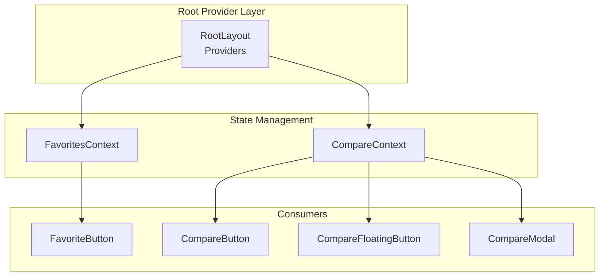
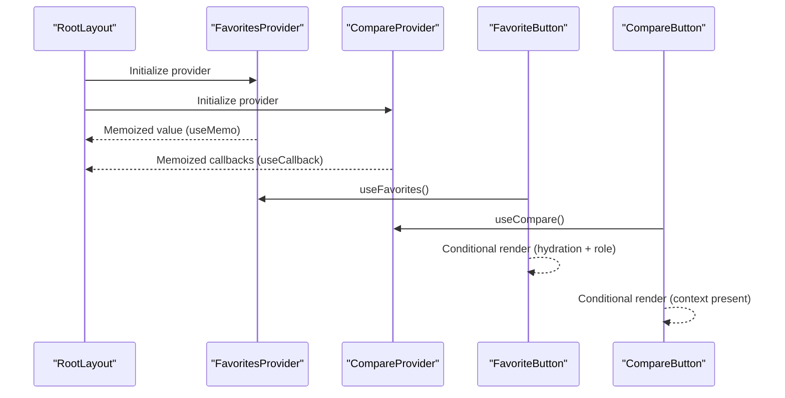
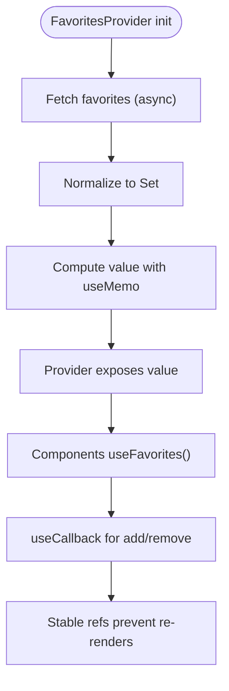
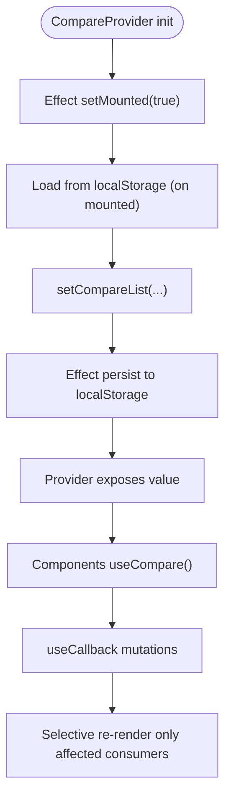
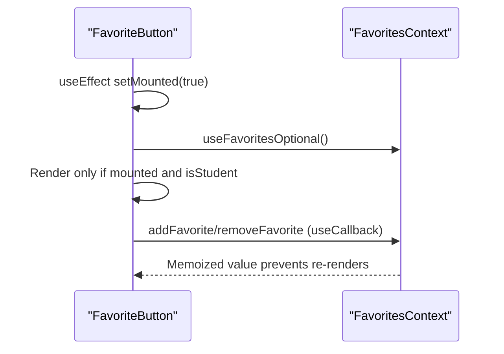
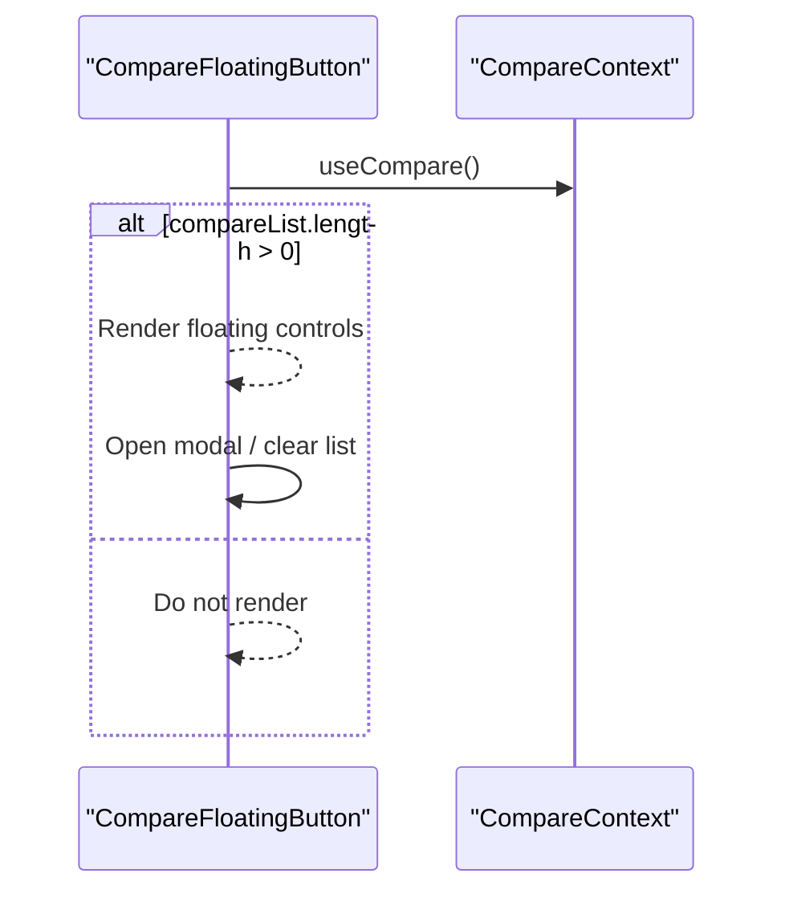
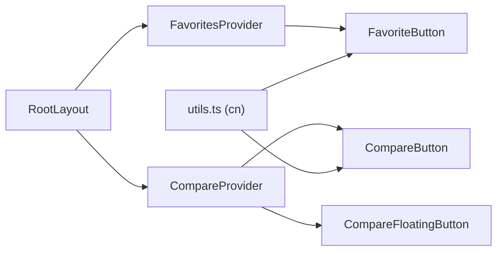

# Performance Optimization

<cite>
**Referenced Files in This Document**
- [compare-context.tsx](file://apps/web/contexts/compare-context.tsx)
- [favorites-context.tsx](file://apps/web/contexts/favorites-context.tsx)
- [layout.tsx](file://apps/web/app/layout.tsx)
- [CompareButton.tsx](file://apps/web/components/course/CompareButton.tsx)
- [FavoriteButton.tsx](file://apps/web/components/course/FavoriteButton.tsx)
- [CompareFloatingButton.tsx](file://apps/web/components/compare/CompareFloatingButton.tsx)
- [CompareModal.tsx](file://apps/web/components/compare/CompareModal.tsx)
- [utils.ts](file://apps/web/lib/utils.ts)
- [page.tsx](file://apps/web/app/dashboard/student/page.tsx)
</cite>

## Table of Contents
1. [Introduction](#introduction)
2. [Project Structure](#project-structure)
3. [Core Components](#core-components)
4. [Architecture Overview](#architecture-overview)
5. [Detailed Component Analysis](#detailed-component-analysis)
6. [Dependency Analysis](#dependency-analysis)
7. [Performance Considerations](#performance-considerations)
8. [Troubleshooting Guide](#troubleshooting-guide)
9. [Conclusion](#conclusion)

## Introduction
This document focuses on state management performance optimization techniques implemented in the frontend application. It explains how memoization strategies using useMemo and useCallback reduce unnecessary re-renders, how efficient state updates prevent expensive tree-wide re-renders, and how state normalization patterns improve scalability. It also covers the impact of context updates on component trees, selective re-rendering, memory leak prevention, localStorage performance considerations, batched state updates, and debouncing strategies for frequent state changes. Practical examples from the compare and favorites contexts illustrate these techniques, along with guidance for profiling and debugging state-related performance bottlenecks.

## Project Structure
The state management layer centers around two React contexts:
- FavoritesContext: centralized favorites state with normalization via a Set and memoized provider value.
- CompareContext: centralized comparison list with normalization via array limits and memoized callbacks.

These contexts are provided at the root level and consumed by course and compare components.

**Diagram sources**
- [layout.tsx](file://apps/web/app/layout.tsx#L24-L42)
- [favorites-context.tsx](file://apps/web/contexts/favorites-context.tsx#L29-L132)
- [compare-context.tsx](file://apps/web/contexts/compare-context.tsx#L30-L98)
- [CompareButton.tsx](file://apps/web/components/course/CompareButton.tsx#L15-L44)
- [FavoriteButton.tsx](file://apps/web/components/course/FavoriteButton.tsx#L17-L91)
- [CompareFloatingButton.tsx](file://apps/web/components/compare/CompareFloatingButton.tsx#L13-L45)

**Section sources**
- [layout.tsx](file://apps/web/app/layout.tsx#L24-L42)

## Core Components
- FavoritesContext: Normalizes favorites as a Set for O(1) membership checks and memoizes the provider value to avoid re-renders downstream. Uses useCallback for async add/remove operations and useMemo for the exposed value.
- CompareContext: Normalizes the comparison list as a string array with a fixed cap and uses localStorage persistence with guarded writes. Uses useCallback for list mutations and memoizes helpers like isInCompare.

Key performance techniques:
- Memoization: useMemo for the provider value and useCallback for event handlers and derived helpers.
- Normalization: Set for favorites and bounded arrays for compare lists.
- Selective rendering: Consumers check context availability and mount state before rendering sensitive UI.

**Section sources**
- [favorites-context.tsx](file://apps/web/contexts/favorites-context.tsx#L29-L132)
- [compare-context.tsx](file://apps/web/contexts/compare-context.tsx#L30-L98)

## Architecture Overview
The application initializes providers at the root and exposes memoized values to consumers. FavoritesContext encapsulates async fetching and normalization, while CompareContext handles local persistence and controlled growth.

**Diagram sources**
- [layout.tsx](file://apps/web/app/layout.tsx#L24-L42)
- [favorites-context.tsx](file://apps/web/contexts/favorites-context.tsx#L29-L132)
- [compare-context.tsx](file://apps/web/contexts/compare-context.tsx#L30-L98)
- [FavoriteButton.tsx](file://apps/web/components/course/FavoriteButton.tsx#L17-L91)
- [CompareButton.tsx](file://apps/web/components/course/CompareButton.tsx#L15-L44)

## Detailed Component Analysis

### FavoritesContext: Memoization and Normalization
- Normalization: favoriteIds is a Set, enabling O(1) inclusion checks and efficient updates.
- Memoization: The provider value is computed with useMemo and depends on normalized state and callbacks, preventing downstream re-renders when unrelated fields change.
- Callbacks: addFavorite/removeFavorite are useCallback-bound to isStudent, ensuring stable references across renders.
- Derived helper: isFavorited is a useCallback that depends on favoriteIds, avoiding recomputation when the set is unchanged.

**Diagram sources**
- [favorites-context.tsx](file://apps/web/contexts/favorites-context.tsx#L29-L132)

**Section sources**
- [favorites-context.tsx](file://apps/web/contexts/favorites-context.tsx#L29-L132)

### CompareContext: Controlled Growth and Local Persistence
- Normalization: compareList is a string array with a fixed maximum length and deduplication logic.
- Memoization: addToCompare/removeFromCompare/clearCompare are useCallback with empty deps; isInCompare is memoized with compareList as dependency.
- Persistence: Effects write to localStorage only after mounting and when the list changes, guarding against SSR issues.

**Diagram sources**
- [compare-context.tsx](file://apps/web/contexts/compare-context.tsx#L30-L98)

**Section sources**
- [compare-context.tsx](file://apps/web/contexts/compare-context.tsx#L30-L98)

### Consumer Components: Selective Rendering and Hydration Guards
- FavoriteButton: Hydration guard prevents rendering until mounted; conditional rendering based on context presence and role; loading state avoids redundant renders during async operations.
- CompareButton: Renders only when context is available; disables checkbox when adding would exceed capacity.

**Diagram sources**
- [FavoriteButton.tsx](file://apps/web/components/course/FavoriteButton.tsx#L17-L91)
- [favorites-context.tsx](file://apps/web/contexts/favorites-context.tsx#L29-L132)

**Section sources**
- [FavoriteButton.tsx](file://apps/web/components/course/FavoriteButton.tsx#L17-L91)
- [CompareButton.tsx](file://apps/web/components/course/CompareButton.tsx#L15-L44)

### Floating Compare Button: Conditional Visibility and Modal Trigger
- Renders only when compareList is non-empty.
- Triggers a modal for comparison actions and clears the list via a memoized callback.

**Diagram sources**
- [CompareFloatingButton.tsx](file://apps/web/components/compare/CompareFloatingButton.tsx#L13-L45)
- [compare-context.tsx](file://apps/web/contexts/compare-context.tsx#L30-L98)

**Section sources**
- [CompareFloatingButton.tsx](file://apps/web/components/compare/CompareFloatingButton.tsx#L13-L45)

## Dependency Analysis
- Providers are initialized at the root, ensuring a single source of truth and minimizing cross-tree invalidation.
- Consumers depend on stable references from memoized hooks, reducing re-renders across the tree.
- Utilities like cn help keep class composition lightweight and predictable.

**Diagram sources**
- [layout.tsx](file://apps/web/app/layout.tsx#L24-L42)
- [utils.ts](file://apps/web/lib/utils.ts#L8-L10)

**Section sources**
- [layout.tsx](file://apps/web/app/layout.tsx#L24-L42)
- [utils.ts](file://apps/web/lib/utils.ts#L8-L10)

## Performance Considerations
- Memoization strategies
  - useMemo for provider values normalizes state and reduces object churn.
  - useCallback for event handlers and derived helpers stabilizes references across renders.
- Efficient state updates
  - Using Set for favorites ensures constant-time membership checks and minimal update overhead.
  - Limiting compare list size and deduplicating entries prevents unbounded growth.
- Context update impact
  - Because provider values are memoized, updates to unrelated fields do not trigger re-renders in consumers.
  - Consumers conditionally render only when context is available and hydration is complete.
- Memory leak prevention
  - No long-lived subscriptions or intervals are used in contexts; effects guard against SSR and mount conditions.
- localStorage performance considerations
  - Writes occur only after mounting and when the list changes; parsing and stringification are minimized.
  - Reads are performed once on mount to hydrate state.
- Batched state updates
  - Async operations (favorites fetch/add/remove) are batched per operation; avoid interleaving multiple small updates in tight loops.
- Debouncing strategies
  - For frequent state changes (e.g., search filters), debounce user input handlers to limit rapid state transitions and API calls.
- Utility optimization
  - Use cn for class merging to avoid heavy concatenations and reduce DOM churn.

[No sources needed since this section provides general guidance]

## Troubleshooting Guide
- Symptom: Excessive re-renders in consumer components
  - Verify provider value is memoized and callbacks are stable.
  - Ensure consumers guard rendering with hydration checks and optional context hooks.
- Symptom: Favorites not updating across pages
  - Confirm FavoritesProvider wraps the entire app and that tokens/roles are correctly handled.
- Symptom: Compare list resets unexpectedly
  - Check localStorage availability and SSR guards; confirm effects run after mount.
- Debugging tools
  - React DevTools Profiler: Identify components re-rendering frequently and inspect why provider values change.
  - React DevTools Components tab: Inspect props and context values passed down.
  - Network tab: Monitor API calls for favorites fetch/add/remove to ensure batching and throttling.
  - Console logs: Temporarily add logs around memoized callbacks to verify stability.

**Section sources**
- [favorites-context.tsx](file://apps/web/contexts/favorites-context.tsx#L29-L132)
- [compare-context.tsx](file://apps/web/contexts/compare-context.tsx#L30-L98)

## Conclusion
By combining memoization, normalization, and selective rendering, the application achieves efficient state management with minimal re-renders. FavoritesContext leverages a Set and useMemo/useCallback to stabilize references, while CompareContext caps growth and persists state safely. Consumers apply hydration guards and conditional rendering to further optimize performance. These patterns provide a strong foundation for scalable state management and can be extended to other contexts with similar techniques.