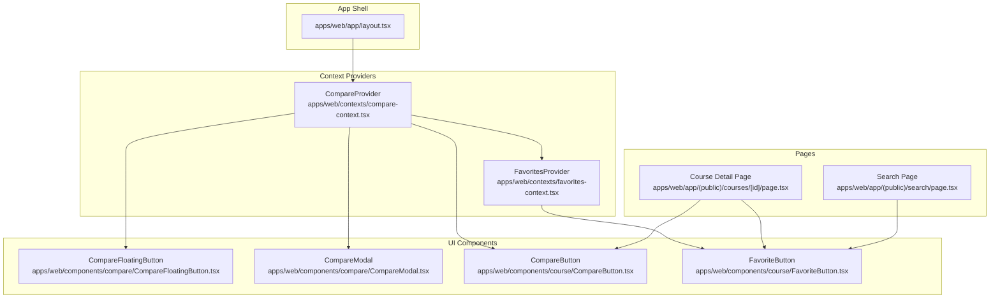
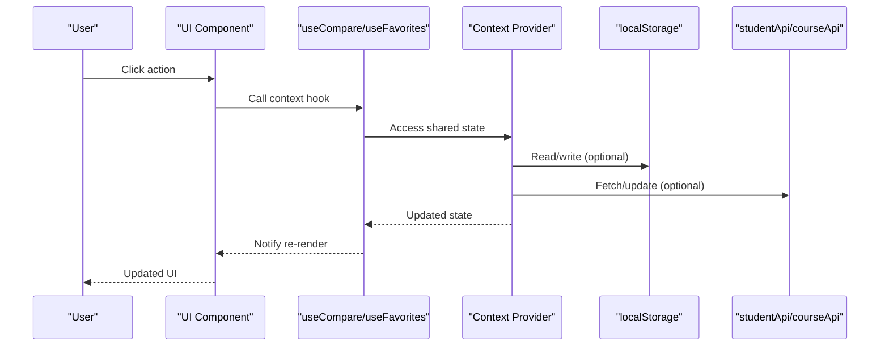
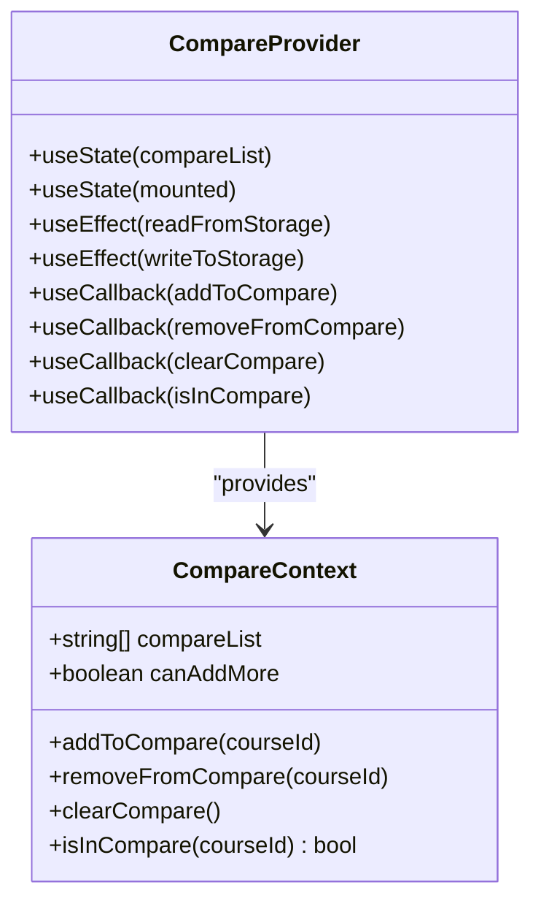
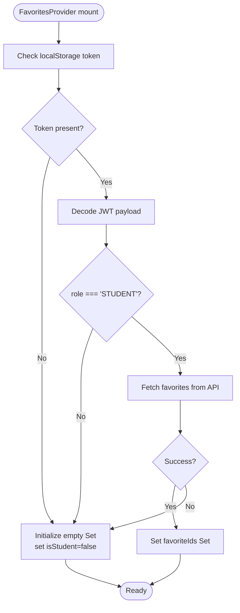
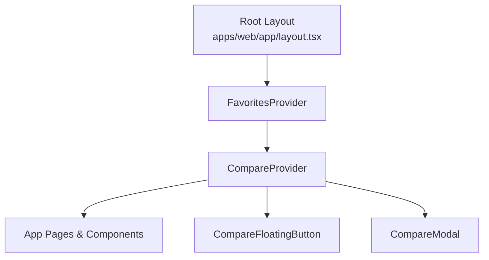
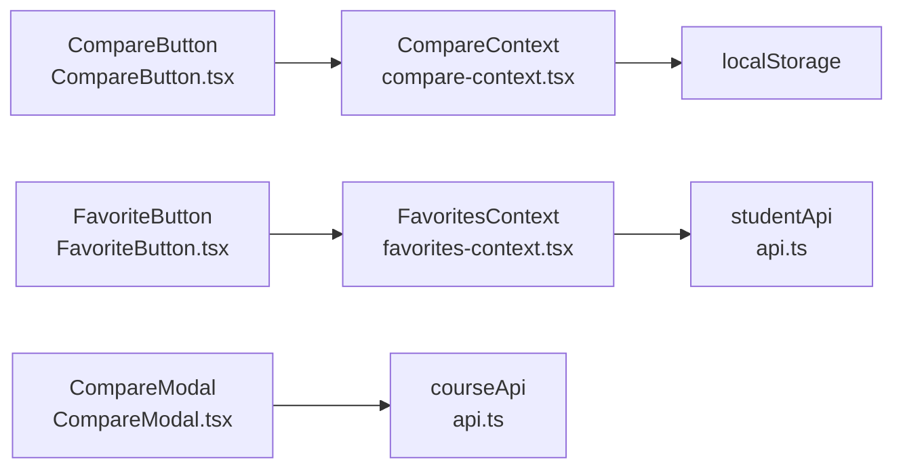

# React Context System

<cite>
**Referenced Files in This Document**
- [compare-context.tsx](file://apps/web/contexts/compare-context.tsx)
- [favorites-context.tsx](file://apps/web/contexts/favorites-context.tsx)
- [layout.tsx](file://apps/web/app/layout.tsx)
- [CompareButton.tsx](file://apps/web/components/course/CompareButton.tsx)
- [FavoriteButton.tsx](file://apps/web/components/course/FavoriteButton.tsx)
- [CompareFloatingButton.tsx](file://apps/web/components/compare/CompareFloatingButton.tsx)
- [CompareModal.tsx](file://apps/web/components/compare/CompareModal.tsx)
- [page.tsx](file://apps/web/app/(public)/courses/[id]/page.tsx)
- [page.tsx](file://apps/web/app/(public)/search/page.tsx)
- [api.ts](file://apps/web/lib/api.ts)
</cite>

## Table of Contents
1. [Introduction](#introduction)
2. [Project Structure](#project-structure)
3. [Core Components](#core-components)
4. [Architecture Overview](#architecture-overview)
5. [Detailed Component Analysis](#detailed-component-analysis)
6. [Dependency Analysis](#dependency-analysis)
7. [Performance Considerations](#performance-considerations)
8. [Troubleshooting Guide](#troubleshooting-guide)
9. [Conclusion](#conclusion)

## Introduction
This document explains the React Context system implementation for course comparison and favorites functionality. It covers how CompareContext and FavoritesContext manage centralized state, their provider structure, consumer hooks, state update mechanisms, localStorage persistence, initialization patterns, error handling, and component re-rendering behavior. Practical examples demonstrate context consumption in components and best practices for context composition.

## Project Structure
The context system is organized under the web application with dedicated context files and reusable UI components that consume these contexts.

**Diagram sources**
- [layout.tsx](file://apps/web/app/layout.tsx#L24-L42)
- [compare-context.tsx](file://apps/web/contexts/compare-context.tsx#L30-L98)
- [favorites-context.tsx](file://apps/web/contexts/favorites-context.tsx#L29-L132)
- [CompareFloatingButton.tsx](file://apps/web/components/compare/CompareFloatingButton.tsx#L13-L45)
- [CompareModal.tsx](file://apps/web/components/compare/CompareModal.tsx#L317-L428)
- [CompareButton.tsx](file://apps/web/components/course/CompareButton.tsx#L15-L45)
- [FavoriteButton.tsx](file://apps/web/components/course/FavoriteButton.tsx#L17-L92)
- [page.tsx](file://apps/web/app/(public)/courses/[id]/page.tsx#L29-L285)
- [page.tsx](file://apps/web/app/(public)/search/page.tsx#L44-L237)

**Section sources**
- [layout.tsx](file://apps/web/app/layout.tsx#L24-L42)

## Core Components
- CompareContext: Manages a local comparison list with localStorage persistence, limits, and basic CRUD operations for adding/removing/clearing items.
- FavoritesContext: Manages a student's favorite courses with server synchronization, loading states, and role-based access.

Key capabilities:
- Centralized state for cross-page features
- Automatic hydration-safe initialization
- Controlled mutation APIs
- Optional hooks for graceful fallbacks

**Section sources**
- [compare-context.tsx](file://apps/web/contexts/compare-context.tsx#L16-L106)
- [favorites-context.tsx](file://apps/web/contexts/favorites-context.tsx#L17-L145)

## Architecture Overview
The context providers wrap the entire application in the root layout. Components consume context through dedicated hooks and trigger state updates that propagate to all consumers.

**Diagram sources**
- [layout.tsx](file://apps/web/app/layout.tsx#L32-L37)
- [compare-context.tsx](file://apps/web/contexts/compare-context.tsx#L34-L56)
- [favorites-context.tsx](file://apps/web/contexts/favorites-context.tsx#L34-L65)
- [api.ts](file://apps/web/lib/api.ts#L212-L236)

## Detailed Component Analysis

### CompareContext Pattern
CompareContext manages a fixed-size comparison list persisted in localStorage. It exposes:
- compareList: Current comparison items
- addToCompare: Add item if under capacity and not present
- removeFromCompare: Remove specific item
- clearCompare: Reset list and localStorage
- isInCompare: Check membership
- canAddMore: Capacity indicator

Implementation highlights:
- Hydration safety: Mounted flag prevents SSR mismatches
- Persistence: Reads initial state from localStorage on mount; writes updates back
- Capacity control: Maximum 4 items enforced
- Stable callbacks: useCallback for mutation functions prevent unnecessary re-renders

**Diagram sources**
- [compare-context.tsx](file://apps/web/contexts/compare-context.tsx#L16-L106)

**Section sources**
- [compare-context.tsx](file://apps/web/contexts/compare-context.tsx#L30-L106)

### FavoritesContext Pattern
FavoritesContext synchronizes a student's favorite courses with backend APIs and maintains loading and role state:
- favoriteIds: Set of course IDs
- isLoading: Loading state during initialization
- isStudent: Role gating for mutations
- addFavorite/removeFavorite: Async mutations via studentApi
- refetch: Refresh favorites from server
- isFavorited: Membership check

Initialization and error handling:
- Reads JWT from localStorage to decode role and fetch favorites
- Falls back gracefully when token is missing or invalid
- Provides user-friendly error messages on mutation failures

**Diagram sources**
- [favorites-context.tsx](file://apps/web/contexts/favorites-context.tsx#L29-L132)

**Section sources**
- [favorites-context.tsx](file://apps/web/contexts/favorites-context.tsx#L29-L145)

### Consumer Hooks and Usage Patterns
- useCompare: Enforces provider presence with a descriptive error
- useCompareOptional: Allows rendering without provider for gradual adoption
- useFavorites: Enforces provider presence with a descriptive error
- useFavoritesOptional: Optional hook returning null

Common usage patterns:
- CompareButton uses useCompareOptional to safely render in contexts where provider may not be available
- FavoriteButton uses useFavoritesOptional and internal mounting guard to avoid SSR mismatches
- CompareFloatingButton and CompareModal consume useCompare to drive UI state and actions

**Section sources**
- [compare-context.tsx](file://apps/web/contexts/compare-context.tsx#L100-L111)
- [favorites-context.tsx](file://apps/web/contexts/favorites-context.tsx#L134-L145)
- [CompareButton.tsx](file://apps/web/components/course/CompareButton.tsx#L15-L45)
- [FavoriteButton.tsx](file://apps/web/components/course/FavoriteButton.tsx#L17-L92)
- [CompareFloatingButton.tsx](file://apps/web/components/compare/CompareFloatingButton.tsx#L13-L45)
- [CompareModal.tsx](file://apps/web/components/compare/CompareModal.tsx#L317-L428)

### Provider Wrapping Strategy
Providers are wrapped in the root layout to ensure global availability:
- FavoritesProvider wraps CompareProvider to ensure favorites context is available globally
- CompareFloatingButton and CompareModal are rendered alongside children to remain accessible anywhere

**Diagram sources**
- [layout.tsx](file://apps/web/app/layout.tsx#L32-L37)

**Section sources**
- [layout.tsx](file://apps/web/app/layout.tsx#L24-L42)

### State Update Mechanisms and Re-rendering
- CompareContext: Updates are batched via setState; localStorage writes occur after state changes; consumers re-render when any field in the context value changes
- FavoritesContext: Uses a memoized value object to minimize re-renders; mutations update the Set immutably to preserve referential stability

Re-rendering patterns:
- Components consuming useCompare/useFavorites re-render when their respective context values change
- CompareModal conditionally fetches data only when opened and when sufficient items exist
- FavoriteButton defers rendering until mounted to avoid hydration mismatches

**Section sources**
- [compare-context.tsx](file://apps/web/contexts/compare-context.tsx#L53-L56)
- [favorites-context.tsx](file://apps/web/contexts/favorites-context.tsx#L106-L125)
- [CompareModal.tsx](file://apps/web/components/compare/CompareModal.tsx#L317-L345)

### Practical Examples

#### Consuming CompareContext in a Course Detail Page
- CompareButton integrates with CompareContext to toggle items and reflects capacity limits
- CompareFloatingButton displays a floating action when items exist and opens CompareModal

**Section sources**
- [page.tsx](file://apps/web/app/(public)/courses/[id]/page.tsx#L250-L255)
- [CompareButton.tsx](file://apps/web/components/course/CompareButton.tsx#L15-L45)
- [CompareFloatingButton.tsx](file://apps/web/components/compare/CompareFloatingButton.tsx#L13-L45)

#### Consuming FavoritesContext in Search Results
- FavoriteButton appears in course cards and respects role-based visibility and loading states

**Section sources**
- [page.tsx](file://apps/web/app/(public)/search/page.tsx#L154-L156)
- [FavoriteButton.tsx](file://apps/web/components/course/FavoriteButton.tsx#L17-L92)

#### Provider Composition Best Practices
- Wrap providers early in the tree for global accessibility
- Use optional hooks for components that may appear outside providers
- Guard against SSR mismatches by deferring rendering until mounted

**Section sources**
- [layout.tsx](file://apps/web/app/layout.tsx#L32-L37)
- [CompareButton.tsx](file://apps/web/components/course/CompareButton.tsx#L15-L17)
- [FavoriteButton.tsx](file://apps/web/components/course/FavoriteButton.tsx#L17-L34)

## Dependency Analysis
- Context providers depend on:
  - React hooks for state and effects
  - localStorage for persistence (CompareContext)
  - studentApi for server synchronization (FavoritesContext)
  - courseApi for comparison data (CompareModal)

Potential circular dependencies:
- None observed between contexts and components
- API clients are imported from a single module

**Diagram sources**
- [compare-context.tsx](file://apps/web/contexts/compare-context.tsx#L34-L56)
- [favorites-context.tsx](file://apps/web/contexts/favorites-context.tsx#L34-L65)
- [api.ts](file://apps/web/lib/api.ts#L212-L236)
- [CompareModal.tsx](file://apps/web/components/compare/CompareModal.tsx#L317-L345)
- [CompareButton.tsx](file://apps/web/components/course/CompareButton.tsx#L15-L45)
- [FavoriteButton.tsx](file://apps/web/components/course/FavoriteButton.tsx#L17-L92)

**Section sources**
- [api.ts](file://apps/web/lib/api.ts#L212-L236)

## Performance Considerations
- Memoization: FavoritesContext memoizes its value object to reduce re-renders
- Stable callbacks: CompareContext uses useCallback for mutation functions
- Conditional fetching: CompareModal only fetches comparison data when opened and when sufficient items exist
- Hydration guards: FavoriteButton defers rendering until mounted to avoid SSR mismatches

[No sources needed since this section provides general guidance]

## Troubleshooting Guide
Common issues and resolutions:
- Context not wrapped: useCompare/useFavorites throw descriptive errors when used outside providers
- Hydration mismatch: FavoriteButton uses a mounting guard to avoid SSR mismatches
- Missing token: FavoritesContext initializes empty state when token is absent or invalid
- Mutation errors: FavoritesContext throws user-friendly errors on add/remove failures

**Section sources**
- [compare-context.tsx](file://apps/web/contexts/compare-context.tsx#L100-L106)
- [favorites-context.tsx](file://apps/web/contexts/favorites-context.tsx#L71-L99)
- [FavoriteButton.tsx](file://apps/web/components/course/FavoriteButton.tsx#L42-L56)

## Conclusion
The React Context system in this project provides robust, scalable state management for course comparison and favorites. CompareContext offers simple, persistent state with capacity control, while FavoritesContext integrates with backend APIs and handles role-based access. The provider composition in the root layout ensures global availability, and consumer hooks enable flexible usage patterns with proper error handling and performance considerations.