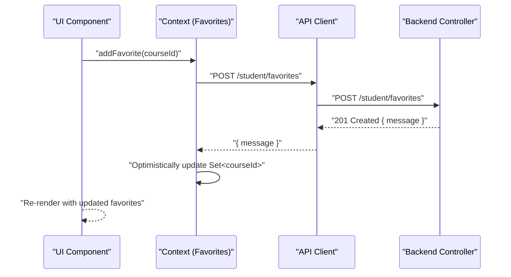
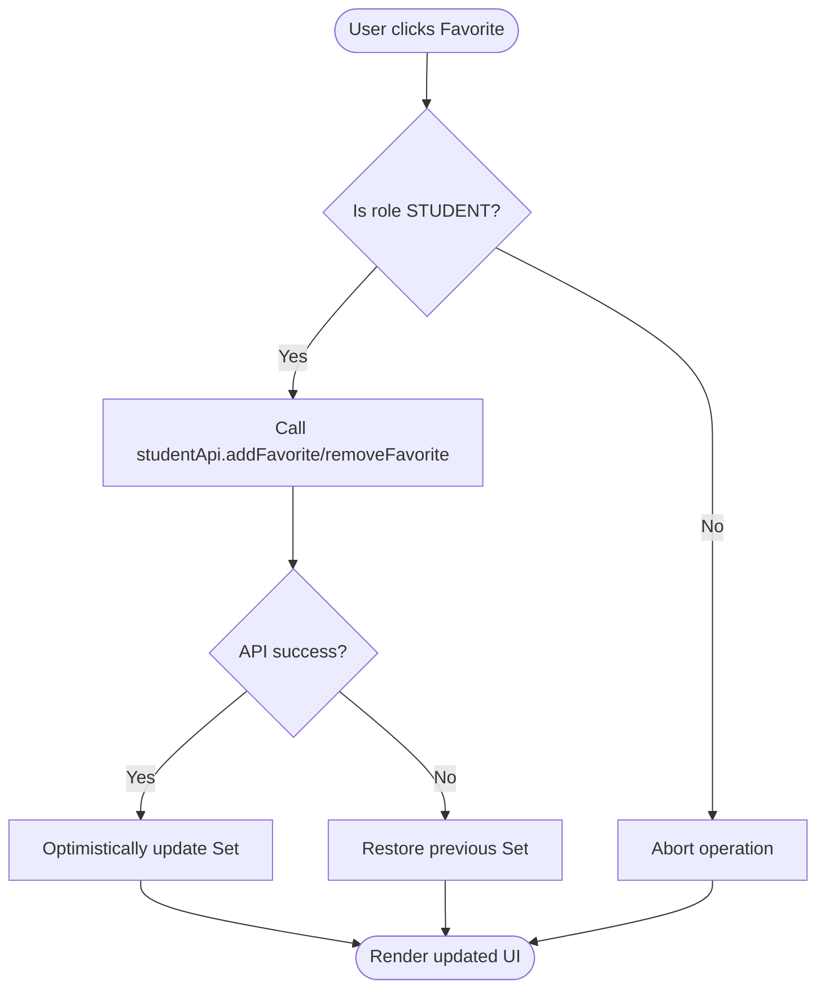
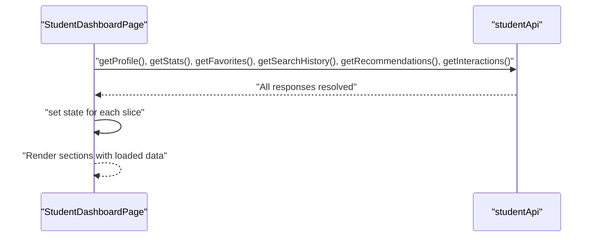
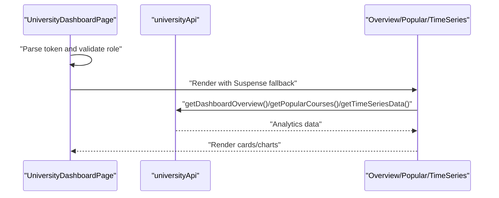
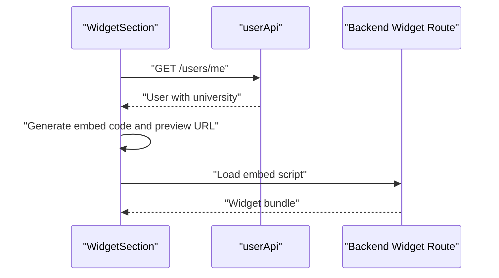
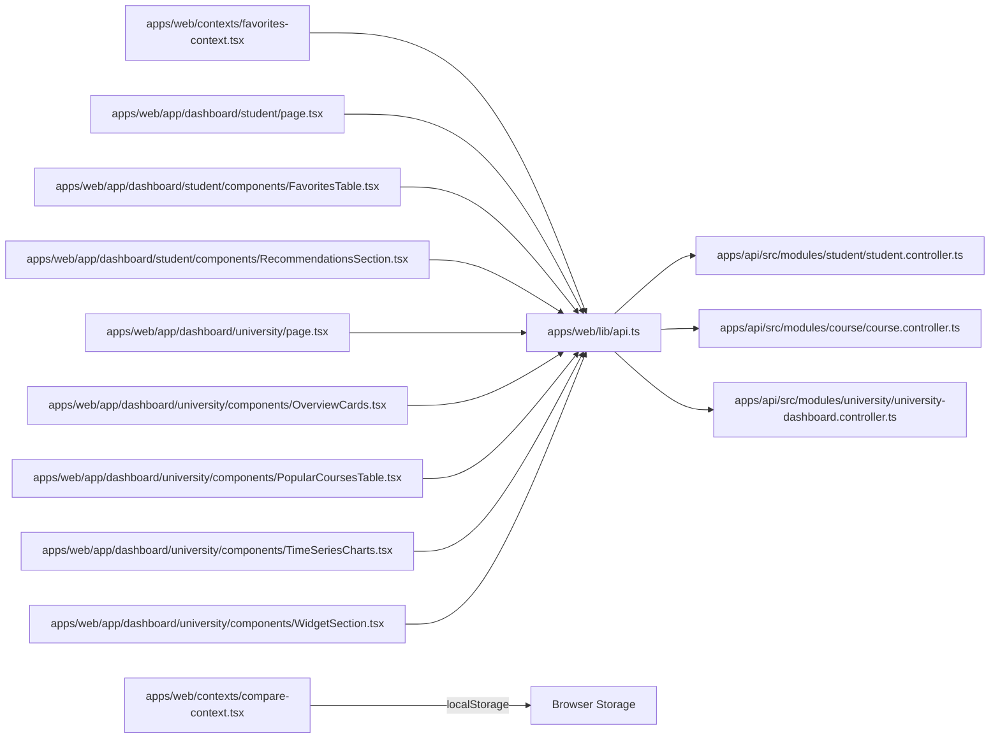

# Server State Integration

<cite>
**Referenced Files in This Document**
- [api.ts](file://apps/web/lib/api.ts)
- [favorites-context.tsx](file://apps/web/contexts/favorites-context.tsx)
- [compare-context.tsx](file://apps/web/contexts/compare-context.tsx)
- [student.controller.ts](file://apps/api/src/modules/student/student.controller.ts)
- [course.controller.ts](file://apps/api/src/modules/course/course.controller.ts)
- [university-dashboard.controller.ts](file://apps/api/src/modules/university/university-dashboard.controller.ts)
- [student-dashboard-page.tsx](file://apps/web/app/dashboard/student/page.tsx)
- [favorites-table.tsx](file://apps/web/app/dashboard/student/components/FavoritesTable.tsx)
- [recommendations-section.tsx](file://apps/web/app/dashboard/student/components/RecommendationsSection.tsx)
- [university-dashboard-page.tsx](file://apps/web/app/dashboard/university/page.tsx)
- [overview-cards.tsx](file://apps/web/app/dashboard/university/components/OverviewCards.tsx)
- [popular-courses-table.tsx](file://apps/web/app/dashboard/university/components/PopularCoursesTable.tsx)
- [time-series-charts.tsx](file://apps/web/app/dashboard/university/components/TimeSeriesCharts.tsx)
- [widget-section.tsx](file://apps/web/app/dashboard/university/components/WidgetSection.tsx)
</cite>

## Table of Contents
1. [Introduction](#introduction)
2. [Project Structure](#project-structure)
3. [Core Components](#core-components)
4. [Architecture Overview](#architecture-overview)
5. [Detailed Component Analysis](#detailed-component-analysis)
6. [Dependency Analysis](#dependency-analysis)
7. [Performance Considerations](#performance-considerations)
8. [Troubleshooting Guide](#troubleshooting-guide)
9. [Conclusion](#conclusion)

## Introduction
This document explains how the frontend integrates with backend APIs to synchronize server state with local UI state. It covers the API client design, data fetching patterns, state synchronization strategies, loading and error handling, optimistic updates, and cache invalidation. Practical examples demonstrate how server responses update component and context state in the student dashboard, and how university dashboards consume analytics endpoints. Best practices for network failure handling, retries, and data normalization are included.

## Project Structure
The integration spans two primary areas:
- Frontend API client and UI components under apps/web
- Backend controllers and services under apps/api

```mermaid
graph TB
subgraph "Web Frontend"
API["apps/web/lib/api.ts"]
C_Fav["apps/web/contexts/favorites-context.tsx"]
C_Compare["apps/web/contexts/compare-context.tsx"]
SD_Page["apps/web/app/dashboard/student/page.tsx"]
SD_Fav["apps/web/app/dashboard/student/components/FavoritesTable.tsx"]
SD_Rec["apps/web/app/dashboard/student/components/RecommendationsSection.tsx"]
U_Page["apps/web/app/dashboard/university/page.tsx"]
U_Overview["apps/web/app/dashboard/university/components/OverviewCards.tsx"]
U_Popular["apps/web/app/dashboard/university/components/PopularCoursesTable.tsx"]
U_Time["apps/web/app/dashboard/university/components/TimeSeriesCharts.tsx"]
U_Widget["apps/web/app/dashboard/university/components/WidgetSection.tsx"]
end
subgraph "API Backend"
SC["apps/api/src/modules/student/student.controller.ts"]
CC["apps/api/src/modules/course/course.controller.ts"]
UC["apps/api/src/modules/university/university-dashboard.controller.ts"]
end
API --> SC
API --> CC
API --> UC
SD_Page --> API
SD_Fav --> API
SD_Rec --> API
U_Page --> API
U_Overview --> API
U_Popular --> API
U_Time --> API
U_Widget --> API
C_Fav --> SD_Page
C_Fav --> SD_Fav
C_Fav --> SD_Rec
C_Compare --> SD_Fav
C_Compare --> SD_Rec
```

**Diagram sources**
- [api.ts](file://apps/web/lib/api.ts#L1-L378)
- [favorites-context.tsx](file://apps/web/contexts/favorites-context.tsx#L1-L146)
- [compare-context.tsx](file://apps/web/contexts/compare-context.tsx#L1-L111)
- [student.controller.ts](file://apps/api/src/modules/student/student.controller.ts#L1-L101)
- [course.controller.ts](file://apps/api/src/modules/course/course.controller.ts#L1-L148)
- [university-dashboard.controller.ts](file://apps/api/src/modules/university/university-dashboard.controller.ts#L1-L81)
- [student-dashboard-page.tsx](file://apps/web/app/dashboard/student/page.tsx#L1-L190)
- [favorites-table.tsx](file://apps/web/app/dashboard/student/components/FavoritesTable.tsx#L1-L141)
- [recommendations-section.tsx](file://apps/web/app/dashboard/student/components/RecommendationsSection.tsx#L1-L152)
- [university-dashboard-page.tsx](file://apps/web/app/dashboard/university/page.tsx#L1-L94)
- [overview-cards.tsx](file://apps/web/app/dashboard/university/components/OverviewCards.tsx#L1-L132)
- [popular-courses-table.tsx](file://apps/web/app/dashboard/university/components/PopularCoursesTable.tsx#L1-L141)
- [time-series-charts.tsx](file://apps/web/app/dashboard/university/components/TimeSeriesCharts.tsx#L1-L116)
- [widget-section.tsx](file://apps/web/app/dashboard/university/components/WidgetSection.tsx#L1-L219)

**Section sources**
- [api.ts](file://apps/web/lib/api.ts#L1-L378)
- [student.controller.ts](file://apps/api/src/modules/student/student.controller.ts#L1-L101)
- [course.controller.ts](file://apps/api/src/modules/course/course.controller.ts#L1-L148)
- [university-dashboard.controller.ts](file://apps/api/src/modules/university/university-dashboard.controller.ts#L1-L81)

## Core Components
- API Client: Centralized fetch wrapper with token injection and unified error handling. Provides typed modules for auth, course, university, user, student, widget, and admin domains.
- Context State: FavoritesContext maintains a synchronized set of favorite course IDs across components and persists to the server via student API. CompareContext manages a persistent comparison list in localStorage.
- Dashboard Pages: Student dashboard loads multiple slices concurrently and composes domain-specific sections. University dashboard loads analytics cards and charts with suspense fallbacks.

Key responsibilities:
- API Client: Base URL normalization, Authorization header injection, response parsing, and error propagation.
- Context State: Loading flags, role gating, optimistic updates, and refetch strategies.
- Dashboard Components: Loading skeletons, error surfaces, and event handlers that trigger server mutations and refresh data.

**Section sources**
- [api.ts](file://apps/web/lib/api.ts#L7-L36)
- [favorites-context.tsx](file://apps/web/contexts/favorites-context.tsx#L29-L132)
- [compare-context.tsx](file://apps/web/contexts/compare-context.tsx#L30-L98)
- [student-dashboard-page.tsx](file://apps/web/app/dashboard/student/page.tsx#L33-L59)

## Architecture Overview
The integration follows a unidirectional data flow:
- UI triggers actions (fetch, mutate).
- API client executes HTTP requests and returns normalized data.
- Components update local state; contexts maintain cross-component consistency.
- On mutation, components either refetch or invalidate caches locally.

**Diagram sources**
- [favorites-context.tsx](file://apps/web/contexts/favorites-context.tsx#L71-L82)
- [api.ts](file://apps/web/lib/api.ts#L226-L235)
- [student.controller.ts](file://apps/api/src/modules/student/student.controller.ts#L55-L62)

## Detailed Component Analysis

### API Client Implementation
- Base URL normalization ensures consistent endpoint construction regardless of environment configuration.
- Token retrieval from localStorage and automatic Authorization header injection.
- Unified error extraction from response JSON with fallback to HTTP status messages.
- Domain-specific modules encapsulate endpoints and return strongly-typed responses.

Best practices:
- Keep the base URL normalized to avoid double "/api" suffixes.
- Centralize token handling to prevent duplication across modules.
- Surface server-side validation errors as user-friendly messages.

**Section sources**
- [api.ts](file://apps/web/lib/api.ts#L7-L36)
- [api.ts](file://apps/web/lib/api.ts#L39-L59)
- [api.ts](file://apps/web/lib/api.ts#L61-L96)
- [api.ts](file://apps/web/lib/api.ts#L98-L165)
- [api.ts](file://apps/web/lib/api.ts#L167-L187)
- [api.ts](file://apps/web/lib/api.ts#L189-L284)
- [api.ts](file://apps/web/lib/api.ts#L286-L290)
- [api.ts](file://apps/web/lib/api.ts#L292-L377)

### Favorites Context and Optimistic Updates
FavoritesContext:
- Loads initial favorite IDs from the server and validates JWT role.
- Exposes add/remove favorite functions that optimistically update local state before or after server responses.
- Provides refetch capability to reconcile with server state.

Optimistic patterns:
- On successful add/remove, immediately update the Set<courseId>.
- On failure, revert to previous state to maintain consistency.

**Diagram sources**
- [favorites-context.tsx](file://apps/web/contexts/favorites-context.tsx#L34-L65)
- [favorites-context.tsx](file://apps/web/contexts/favorites-context.tsx#L71-L99)

**Section sources**
- [favorites-context.tsx](file://apps/web/contexts/favorites-context.tsx#L29-L132)

### Student Dashboard Data Fetching and State Synchronization
Student dashboard page:
- Concurrently fetches profile, stats, favorites, search history, recommendations, and interactions.
- Uses a single loader and error surface; on error, displays a retry button.
- Passes callbacks to child sections to refresh data after mutations.

**Diagram sources**
- [student-dashboard-page.tsx](file://apps/web/app/dashboard/student/page.tsx#L33-L59)

Child components:
- FavoritesTable and RecommendationsSection accept props and callbacks to refresh parent state after add/remove.
- They conditionally use context hooks when available, otherwise fall back to direct API calls.

**Section sources**
- [student-dashboard-page.tsx](file://apps/web/app/dashboard/student/page.tsx#L21-L190)
- [favorites-table.tsx](file://apps/web/app/dashboard/student/components/FavoritesTable.tsx#L28-L49)
- [recommendations-section.tsx](file://apps/web/app/dashboard/student/components/RecommendationsSection.tsx#L30-L54)

### University Dashboard Analytics Integration
University dashboard:
- Guards role via token parsing and redirects if unauthorized.
- Uses Suspense boundaries around analytics components to show skeletons while data loads.
- Components fetch analytics independently and render charts and tables.

**Diagram sources**
- [university-dashboard-page.tsx](file://apps/web/app/dashboard/university/page.tsx#L31-L49)
- [overview-cards.tsx](file://apps/web/app/dashboard/university/components/OverviewCards.tsx#L37-L47)
- [popular-courses-table.tsx](file://apps/web/app/dashboard/university/components/PopularCoursesTable.tsx#L42-L52)
- [time-series-charts.tsx](file://apps/web/app/dashboard/university/components/TimeSeriesCharts.tsx#L33-L43)

**Section sources**
- [university-dashboard-page.tsx](file://apps/web/app/dashboard/university/page.tsx#L27-L94)
- [overview-cards.tsx](file://apps/web/app/dashboard/university/components/OverviewCards.tsx#L37-L132)
- [popular-courses-table.tsx](file://apps/web/app/dashboard/university/components/PopularCoursesTable.tsx#L42-L141)
- [time-series-charts.tsx](file://apps/web/app/dashboard/university/components/TimeSeriesCharts.tsx#L33-L116)

### Widget Embed Code Generation and Server Data
WidgetSection:
- Retrieves current user’s university info to generate embed code and preview URL.
- Builds a script tag pointing to the backend embed endpoint and copies HTML to clipboard.

**Diagram sources**
- [widget-section.tsx](file://apps/web/app/dashboard/university/components/WidgetSection.tsx#L26-L50)
- [widget-section.tsx](file://apps/web/app/dashboard/university/components/WidgetSection.tsx#L52-L74)
- [widget-section.tsx](file://apps/web/app/dashboard/university/components/WidgetSection.tsx#L164-L213)

**Section sources**
- [widget-section.tsx](file://apps/web/app/dashboard/university/components/WidgetSection.tsx#L26-L219)

## Dependency Analysis
- Frontend depends on API client modules for all HTTP operations.
- Controllers define endpoint contracts and guard access by role.
- Contexts depend on API client for mutations and initial hydration.
- Dashboard components depend on contexts and API client for data and actions.

**Diagram sources**
- [api.ts](file://apps/web/lib/api.ts#L1-L378)
- [student.controller.ts](file://apps/api/src/modules/student/student.controller.ts#L1-L101)
- [course.controller.ts](file://apps/api/src/modules/course/course.controller.ts#L1-L148)
- [university-dashboard.controller.ts](file://apps/api/src/modules/university/university-dashboard.controller.ts#L1-L81)
- [favorites-context.tsx](file://apps/web/contexts/favorites-context.tsx#L1-L146)
- [compare-context.tsx](file://apps/web/contexts/compare-context.tsx#L1-L111)
- [student-dashboard-page.tsx](file://apps/web/app/dashboard/student/page.tsx#L1-L190)
- [favorites-table.tsx](file://apps/web/app/dashboard/student/components/FavoritesTable.tsx#L1-L141)
- [recommendations-section.tsx](file://apps/web/app/dashboard/student/components/RecommendationsSection.tsx#L1-L152)
- [university-dashboard-page.tsx](file://apps/web/app/dashboard/university/page.tsx#L1-L94)
- [overview-cards.tsx](file://apps/web/app/dashboard/university/components/OverviewCards.tsx#L1-L132)
- [popular-courses-table.tsx](file://apps/web/app/dashboard/university/components/PopularCoursesTable.tsx#L1-L141)
- [time-series-charts.tsx](file://apps/web/app/dashboard/university/components/TimeSeriesCharts.tsx#L1-L116)
- [widget-section.tsx](file://apps/web/app/dashboard/university/components/WidgetSection.tsx#L1-L219)

**Section sources**
- [api.ts](file://apps/web/lib/api.ts#L1-L378)
- [student.controller.ts](file://apps/api/src/modules/student/student.controller.ts#L1-L101)
- [course.controller.ts](file://apps/api/src/modules/course/course.controller.ts#L1-L148)
- [university-dashboard.controller.ts](file://apps/api/src/modules/university/university-dashboard.controller.ts#L1-L81)

## Performance Considerations
- Concurrent data fetching: The student dashboard uses Promise.all to load multiple slices in parallel, reducing total load time.
- Suspense-based loading: University dashboard components use Suspense to progressively reveal content, improving perceived performance.
- Local caching: FavoritesContext caches IDs in memory and persists to server; CompareContext persists to localStorage to avoid re-fetching on reload.
- Minimal re-renders: Contexts expose memoized values and callbacks to reduce unnecessary renders.

[No sources needed since this section provides general guidance]

## Troubleshooting Guide
Common issues and resolutions:
- Unauthorized access: University dashboard checks JWT role and redirects accordingly. Verify token presence and role.
- Network errors: Student dashboard displays a centralized error surface with a retry button. Ensure API client returns proper error messages.
- Role-gated endpoints: Student endpoints require STUDENT role; favorites and recommendations are only available to students.
- Token parsing: Both dashboard pages parse JWT payload from localStorage to validate roles.

**Section sources**
- [university-dashboard-page.tsx](file://apps/web/app/dashboard/university/page.tsx#L31-L49)
- [student-dashboard-page.tsx](file://apps/web/app/dashboard/student/page.tsx#L69-L82)
- [student.controller.ts](file://apps/api/src/modules/student/student.controller.ts#L31-L34)

## Conclusion
The frontend-backend integration leverages a centralized API client, role-gated controllers, and context-driven state management to keep UI state synchronized with server data. Optimistic updates improve responsiveness, while concurrent fetching and suspense-based loading enhance user experience. Clear separation of concerns across modules and components enables maintainability and scalability.