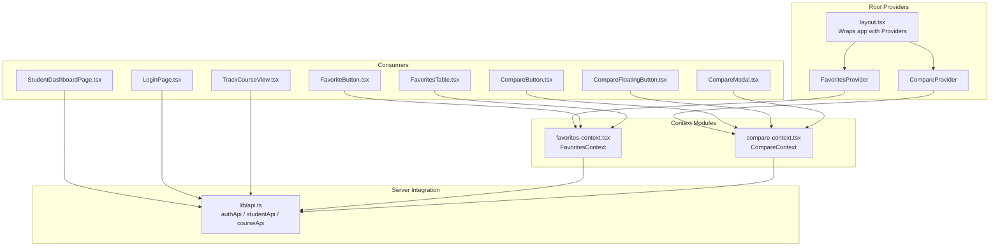
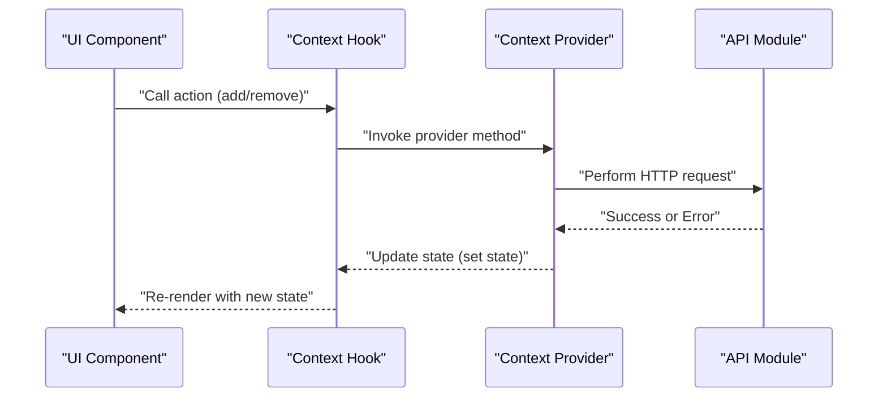
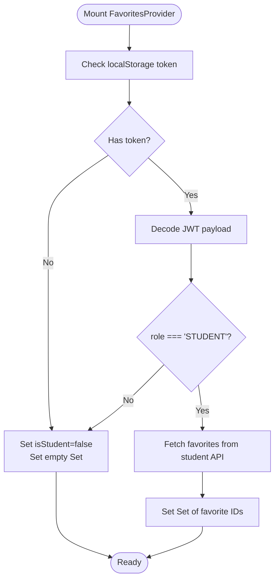
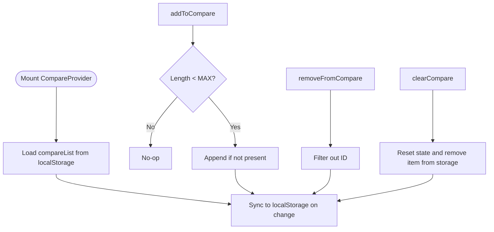
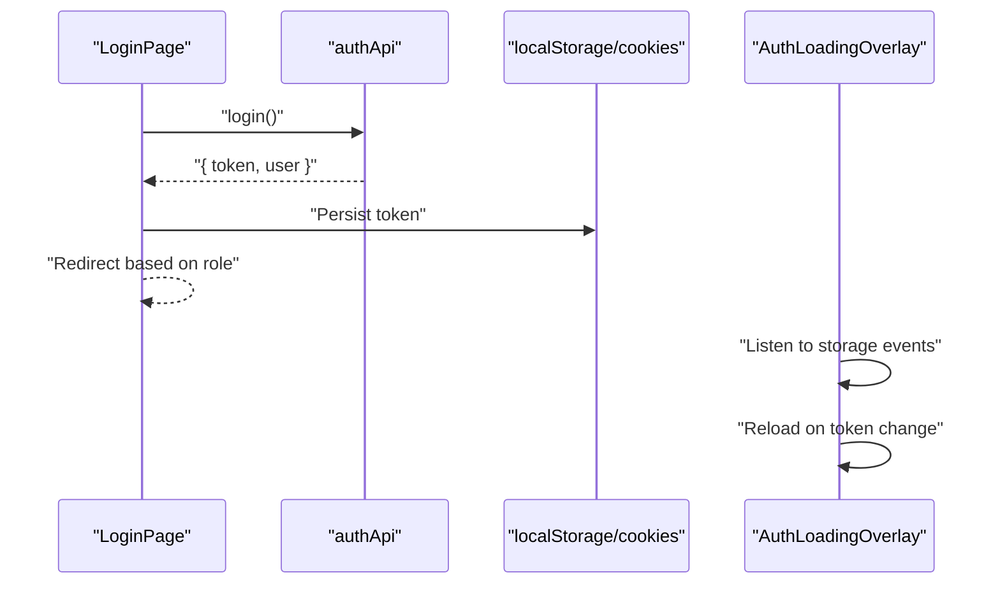
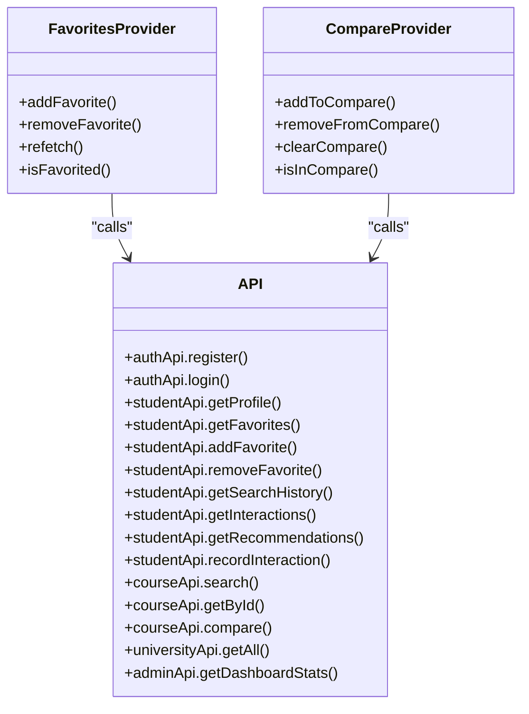
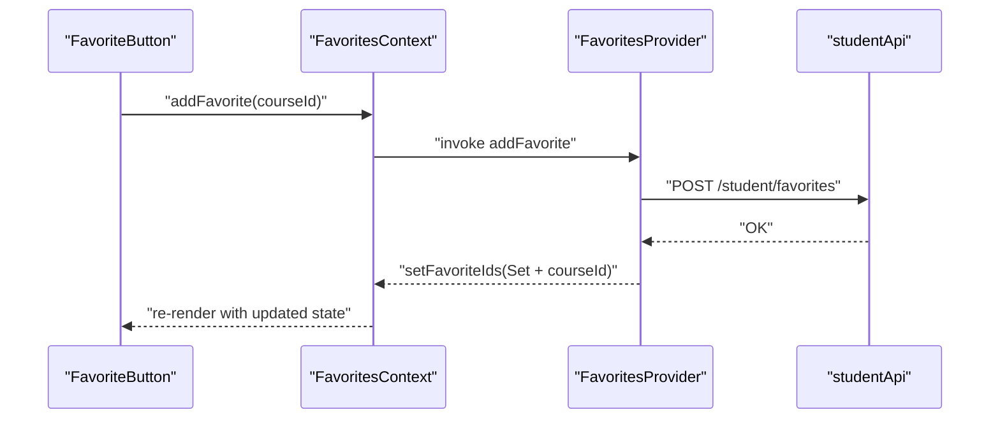
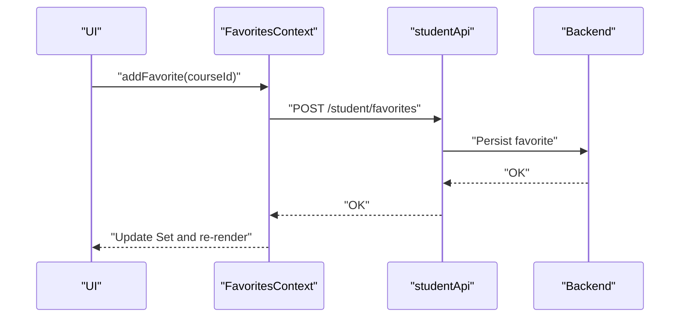
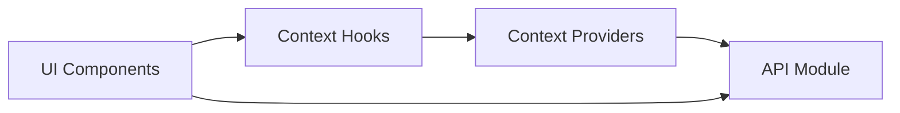

# State Management

<cite>
**Referenced Files in This Document**
- [favorites-context.tsx](file://apps/web/contexts/favorites-context.tsx)
- [compare-context.tsx](file://apps/web/contexts/compare-context.tsx)
- [api.ts](file://apps/web/lib/api.ts)
- [layout.tsx](file://apps/web/app/layout.tsx)
- [AuthLoadingOverlay.tsx](file://apps/web/components/layout/AuthLoadingOverlay.tsx)
- [FavoriteButton.tsx](file://apps/web/components/course/FavoriteButton.tsx)
- [CompareModal.tsx](file://apps/web/components/compare/CompareModal.tsx)
- [CompareFloatingButton.tsx](file://apps/web/components/compare/CompareFloatingButton.tsx)
- [CompareButton.tsx](file://apps/web/components/course/CompareButton.tsx)
- [TrackCourseView.tsx](file://apps/web/components/course/TrackCourseView.tsx)
- [LoginPage.tsx](file://apps/web/app/(auth)/login/page.tsx)
- [StudentDashboardPage.tsx](file://apps/web/app/dashboard/student/page.tsx)
- [FavoritesTable.tsx](file://apps/web/app/dashboard/student/components/FavoritesTable.tsx)
- [DashboardPage.tsx](file://apps/web/app/dashboard/page.tsx)
- [course-detail-page.tsx](file://apps/web/app/(public)/courses/[id]/page.tsx)
</cite>

## Table of Contents
1. [Introduction](#introduction)
2. [Project Structure](#project-structure)
3. [Core Components](#core-components)
4. [Architecture Overview](#architecture-overview)
5. [Detailed Component Analysis](#detailed-component-analysis)
6. [Dependency Analysis](#dependency-analysis)
7. [Performance Considerations](#performance-considerations)
8. [Troubleshooting Guide](#troubleshooting-guide)
9. [Conclusion](#conclusion)

## Introduction
This document explains the React state management system used in the application. It focuses on:
- The React Context pattern for favorites synchronization, course comparison state, and authentication state handling
- Component state versus context patterns
- Server state integration via API calls
- Loading and error handling strategies
- Performance optimizations (memoization, lazy loading, state normalization)
- Provider/consumer patterns and state update mechanisms
- Best practices for state persistence, error handling, and debugging
- Frontend-backend synchronization for favorites and analytics

## Project Structure
The state management spans three layers:
- Providers at the root layout level
- Context modules that encapsulate state and actions
- Consumers across pages and components that read/update state

**Diagram sources**
- [layout.tsx](file://apps/web/app/layout.tsx#L24-L42)
- [favorites-context.tsx](file://apps/web/contexts/favorites-context.tsx#L29-L132)
- [compare-context.tsx](file://apps/web/contexts/compare-context.tsx#L30-L98)
- [FavoriteButton.tsx](file://apps/web/components/course/FavoriteButton.tsx#L17-L91)
- [CompareButton.tsx](file://apps/web/components/course/CompareButton.tsx#L15-L45)
- [CompareFloatingButton.tsx](file://apps/web/components/compare/CompareFloatingButton.tsx#L13-L45)
- [CompareModal.tsx](file://apps/web/components/compare/CompareModal.tsx#L317-L428)
- [FavoritesTable.tsx](file://apps/web/app/dashboard/student/components/FavoritesTable.tsx#L28-L141)
- [StudentDashboardPage.tsx](file://apps/web/app/dashboard/student/page.tsx#L21-L190)
- [LoginPage.tsx](file://apps/web/app/(auth)/login/page.tsx#L13-L135)
- [TrackCourseView.tsx](file://apps/web/components/course/TrackCourseView.tsx#L14-L34)
- [api.ts](file://apps/web/lib/api.ts#L11-L36)

**Section sources**
- [layout.tsx](file://apps/web/app/layout.tsx#L24-L42)
- [favorites-context.tsx](file://apps/web/contexts/favorites-context.tsx#L29-L132)
- [compare-context.tsx](file://apps/web/contexts/compare-context.tsx#L30-L98)

## Core Components
- FavoritesContext: Centralizes favorite course IDs, loading state, and student role gating. Provides add/remove/refetch/isFavorited helpers backed by the student API.
- CompareContext: Centralizes the comparison list persisted in localStorage with a fixed cap, plus add/remove/clear helpers.
- API layer: Unified fetch wrapper and typed endpoints for auth, student, course, university, and admin domains.

Key patterns:
- Context providers wrap the entire app to ensure global availability
- Consumers use optional hooks to degrade gracefully when outside providers
- API calls are centralized with token injection and error extraction

**Section sources**
- [favorites-context.tsx](file://apps/web/contexts/favorites-context.tsx#L17-L140)
- [compare-context.tsx](file://apps/web/contexts/compare-context.tsx#L16-L111)
- [api.ts](file://apps/web/lib/api.ts#L11-L36)

## Architecture Overview
The system follows a layered approach:
- Root providers initialize and synchronize state
- Context consumers trigger updates and read normalized state
- API module handles HTTP requests and error surfaces
- UI components orchestrate loading and error states

**Diagram sources**
- [favorites-context.tsx](file://apps/web/contexts/favorites-context.tsx#L71-L104)
- [compare-context.tsx](file://apps/web/contexts/compare-context.tsx#L58-L82)
- [api.ts](file://apps/web/lib/api.ts#L11-L36)

## Detailed Component Analysis

### Favorites Context
- Purpose: Maintain synchronized favorites across pages for students
- State: favoriteIds (Set), isLoading, isStudent
- Actions: addFavorite, removeFavorite, refetch, isFavorited
- Persistence: None (client-only); refetched on mount using token and student API
- Authentication gating: Only active when token role equals STUDENT

**Diagram sources**
- [favorites-context.tsx](file://apps/web/contexts/favorites-context.tsx#L34-L65)

**Section sources**
- [favorites-context.tsx](file://apps/web/contexts/favorites-context.tsx#L29-L132)
- [FavoriteButton.tsx](file://apps/web/components/course/FavoriteButton.tsx#L17-L91)
- [FavoritesTable.tsx](file://apps/web/app/dashboard/student/components/FavoritesTable.tsx#L28-L141)

### Compare Context
- Purpose: Persist and manage a comparison list with localStorage and a fixed cap
- State: compareList (string[]), computed canAddMore
- Actions: addToCompare, removeFromCompare, clearCompare, isInCompare
- Persistence: localStorage keyed by a constant storage key

**Diagram sources**
- [compare-context.tsx](file://apps/web/contexts/compare-context.tsx#L34-L96)

**Section sources**
- [compare-context.tsx](file://apps/web/contexts/compare-context.tsx#L30-L111)
- [CompareFloatingButton.tsx](file://apps/web/components/compare/CompareFloatingButton.tsx#L13-L45)
- [CompareModal.tsx](file://apps/web/components/compare/CompareModal.tsx#L317-L428)
- [CompareButton.tsx](file://apps/web/components/course/CompareButton.tsx#L15-L45)

### Authentication State Handling
- Token lifecycle: Stored in localStorage and cookies on login; AuthLoadingOverlay listens to storage events to refresh on token change
- Role routing: After login, route differs by role (STUDENT vs others)
- No dedicated AuthContext: Role and token are derived from JWT payload and used conditionally in UI

**Diagram sources**
- [LoginPage.tsx](file://apps/web/app/(auth)/login/page.tsx#L21-L45)
- [AuthLoadingOverlay.tsx](file://apps/web/components/layout/AuthLoadingOverlay.tsx#L6-L36)

**Section sources**
- [LoginPage.tsx](file://apps/web/app/(auth)/login/page.tsx#L13-L135)
- [AuthLoadingOverlay.tsx](file://apps/web/components/layout/AuthLoadingOverlay.tsx#L1-L37)

### Server State Integration and API Layer
- Centralized fetch wrapper injects Authorization header when available and parses errors
- Typed endpoints for auth, student, course, university, and admin domains
- Consumers call endpoints directly or via context actions that delegate to API

**Diagram sources**
- [api.ts](file://apps/web/lib/api.ts#L11-L36)
- [favorites-context.tsx](file://apps/web/contexts/favorites-context.tsx#L71-L104)
- [compare-context.tsx](file://apps/web/contexts/compare-context.tsx#L58-L82)

**Section sources**
- [api.ts](file://apps/web/lib/api.ts#L11-L36)
- [StudentDashboardPage.tsx](file://apps/web/app/dashboard/student/page.tsx#L33-L59)
- [course-detail-page.tsx](file://apps/web/app/(public)/courses/[id]/page.tsx#L18-L27)

### Component State vs Context Patterns
- Context-driven components:
  - FavoriteButton reads from FavoritesContext and delegates mutations to provider actions
  - CompareButton reads from CompareContext and toggles add/remove
  - CompareFloatingButton and CompareModal consume CompareContext for visibility and data
  - FavoritesTable optionally uses context for removal fallback to API
- Component-local state:
  - LoginPage maintains local form state and error/loading
  - StudentDashboardPage maintains local lists and error state for server data
  - CompareModal maintains local loading/error/data for comparison results
  - TrackCourseView uses minimal effect-based side effects

Best practice: Prefer context for cross-cutting concerns (favorites, comparisons) and component-local state for UI-only transient data.

**Section sources**
- [FavoriteButton.tsx](file://apps/web/components/course/FavoriteButton.tsx#L17-L91)
- [CompareButton.tsx](file://apps/web/components/course/CompareButton.tsx#L15-L45)
- [CompareFloatingButton.tsx](file://apps/web/components/compare/CompareFloatingButton.tsx#L13-L45)
- [CompareModal.tsx](file://apps/web/components/compare/CompareModal.tsx#L317-L428)
- [FavoritesTable.tsx](file://apps/web/app/dashboard/student/components/FavoritesTable.tsx#L28-L141)
- [LoginPage.tsx](file://apps/web/app/(auth)/login/page.tsx#L13-L135)
- [StudentDashboardPage.tsx](file://apps/web/app/dashboard/student/page.tsx#L21-L190)
- [TrackCourseView.tsx](file://apps/web/components/course/TrackCourseView.tsx#L14-L34)

### Loading and Error Boundaries
- Global overlay: AuthLoadingOverlay displays during token-switch transitions
- Component-level loaders:
  - CompareModal shows skeletons while fetching comparison data
  - StudentDashboardPage shows spinners while loading server data
  - LoginPage shows spinner during login submission
- Error handling:
  - CompareModal surfaces errors and offers retry
  - StudentDashboardPage shows an error banner with retry
  - LoginPage shows user-facing error messages
  - Favorites actions throw localized errors for user feedback

Note: There are no React ErrorBoundary components in the current codebase; error boundaries are not implemented.

**Section sources**
- [AuthLoadingOverlay.tsx](file://apps/web/components/layout/AuthLoadingOverlay.tsx#L1-L37)
- [CompareModal.tsx](file://apps/web/components/compare/CompareModal.tsx#L317-L428)
- [StudentDashboardPage.tsx](file://apps/web/app/dashboard/student/page.tsx#L21-L190)
- [LoginPage.tsx](file://apps/web/app/(auth)/login/page.tsx#L13-L135)
- [favorites-context.tsx](file://apps/web/contexts/favorites-context.tsx#L71-L104)

### State Update Mechanisms
- FavoritesProvider updates Set immutably and re-creates value object with useMemo to avoid unnecessary re-renders
- CompareProvider updates array immutably and persists to localStorage on change
- Consumers call provider actions which in turn call API endpoints and update state

**Diagram sources**
- [FavoriteButton.tsx](file://apps/web/components/course/FavoriteButton.tsx#L39-L57)
- [favorites-context.tsx](file://apps/web/contexts/favorites-context.tsx#L71-L82)
- [api.ts](file://apps/web/lib/api.ts#L226-L235)

**Section sources**
- [favorites-context.tsx](file://apps/web/contexts/favorites-context.tsx#L106-L125)
- [compare-context.tsx](file://apps/web/contexts/compare-context.tsx#L58-L82)

### Frontend-Backend Synchronization
- Favorites: Provider fetches initial state from student API; subsequent adds/removes call API and update local Set
- Interactions: TrackCourseView records VIEW interactions for STUDENT users
- Recommendations and analytics: StudentDashboardPage loads multiple datasets concurrently from student API

**Diagram sources**
- [TrackCourseView.tsx](file://apps/web/components/course/TrackCourseView.tsx#L14-L30)
- [StudentDashboardPage.tsx](file://apps/web/app/dashboard/student/page.tsx#L33-L59)
- [favorites-context.tsx](file://apps/web/contexts/favorites-context.tsx#L71-L82)

**Section sources**
- [TrackCourseView.tsx](file://apps/web/components/course/TrackCourseView.tsx#L14-L34)
- [StudentDashboardPage.tsx](file://apps/web/app/dashboard/student/page.tsx#L33-L59)
- [course-detail-page.tsx](file://apps/web/app/(public)/courses/[id]/page.tsx#L18-L27)

## Dependency Analysis
- Providers depend on API module for server interactions
- Consumers depend on context modules for state and actions
- UI components depend on both context and API depending on whether they use context actions or direct API calls

**Diagram sources**
- [layout.tsx](file://apps/web/app/layout.tsx#L24-L42)
- [favorites-context.tsx](file://apps/web/contexts/favorites-context.tsx#L29-L132)
- [compare-context.tsx](file://apps/web/contexts/compare-context.tsx#L30-L98)
- [api.ts](file://apps/web/lib/api.ts#L11-L36)

**Section sources**
- [layout.tsx](file://apps/web/app/layout.tsx#L24-L42)
- [api.ts](file://apps/web/lib/api.ts#L11-L36)

## Performance Considerations
- Memoization:
  - FavoritesProvider uses useMemo to memoize the context value object, preventing downstream re-renders when identity does not change
  - useCallback wraps action functions to keep referential stability across renders
- Lazy loading:
  - CompareModal defers comparison API calls until modal opens and has sufficient items
  - Course detail page fetches data server-side with cache disabled for freshness
- State normalization:
  - Favorites are normalized as a Set for O(1) membership checks
  - Compare list is normalized as an array with a fixed cap to bound memory usage
- Rendering:
  - Skeleton loaders improve perceived performance during async operations
  - Optional hooks allow components to render without providers, reducing coupling

Recommendations:
- Consider adding React.useMemo/useCallback around frequently re-computed values in consumers
- Debounce or batch frequent updates when extending the compare list
- Introduce caching strategies for repeated course queries if needed

**Section sources**
- [favorites-context.tsx](file://apps/web/contexts/favorites-context.tsx#L106-L125)
- [compare-context.tsx](file://apps/web/contexts/compare-context.tsx#L58-L82)
- [CompareModal.tsx](file://apps/web/components/compare/CompareModal.tsx#L323-L345)
- [course-detail-page.tsx](file://apps/web/app/(public)/courses/[id]/page.tsx#L18-L27)

## Troubleshooting Guide
Common issues and resolutions:
- Favorites not updating after add/remove:
  - Verify token role is STUDENT; provider disables actions otherwise
  - Ensure provider is rendered at root; consumers must be within FavoritesProvider
  - Check network tab for API failures; errors are thrown locally for user feedback
- Compare list not persisting:
  - Confirm localStorage is enabled and accessible
  - Ensure storage key matches the constant used by the provider
- Auth transitions:
  - On token change, AuthLoadingOverlay triggers a reload; wait for the overlay to disappear
  - If stuck, clear token manually and reload
- Dashboard data errors:
  - StudentDashboardPage shows an error banner with a retry button
  - Verify token presence and role; ADMIN/UNIVERSITY dashboards load different endpoints

Debugging tips:
- Use browser devtools to inspect localStorage for token and compare-list
- Temporarily disable provider wrappers to test fallback behavior
- Add logging around context actions to trace state updates

**Section sources**
- [favorites-context.tsx](file://apps/web/contexts/favorites-context.tsx#L34-L65)
- [compare-context.tsx](file://apps/web/contexts/compare-context.tsx#L38-L56)
- [AuthLoadingOverlay.tsx](file://apps/web/components/layout/AuthLoadingOverlay.tsx#L6-L36)
- [StudentDashboardPage.tsx](file://apps/web/app/dashboard/student/page.tsx#L69-L82)

## Conclusion
The application employs a pragmatic state management approach:
- Context providers centralize cross-cutting state (favorites, comparisons) with minimal coupling
- API layer encapsulates HTTP concerns and error handling
- Consumers use either context actions or direct API calls depending on scope
- Performance is optimized through memoization, immutable updates, and selective rendering
- Authentication state is handled at the edges with a global overlay for seamless transitions

Future enhancements could include:
- Adding ErrorBoundary components for robust error handling
- Introducing a shared cache layer for repeated server queries
- Normalizing complex server payloads for efficient UI updates