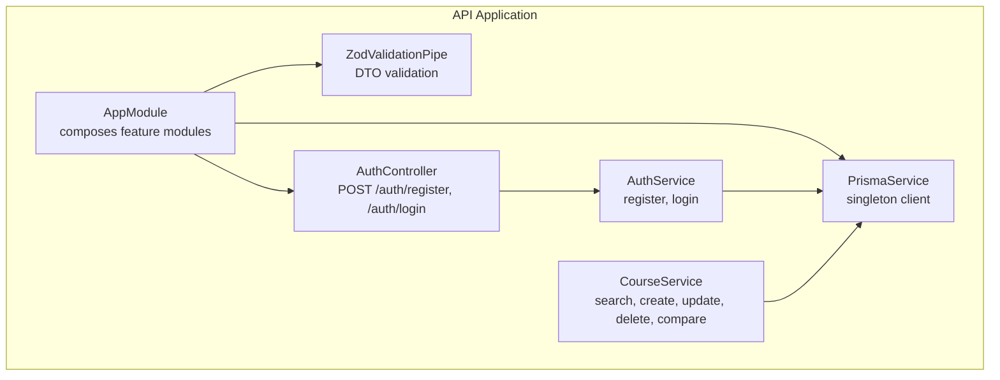
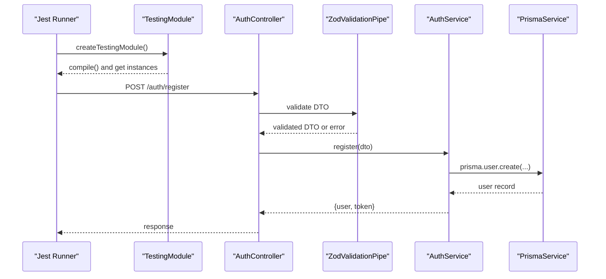
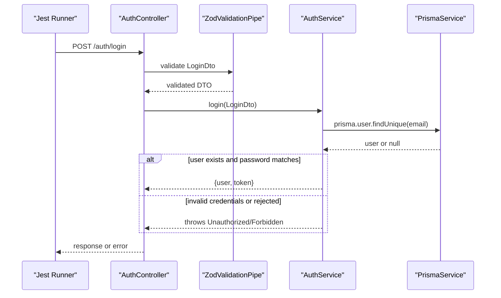
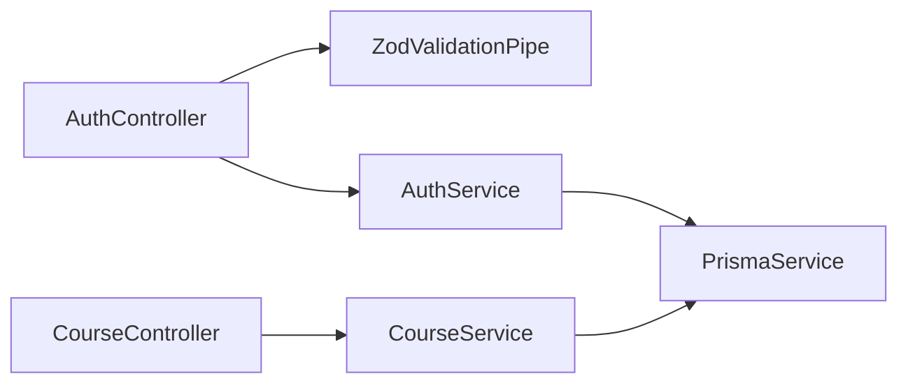

# Testing Strategy

<cite>
**Referenced Files in This Document**
- [jest.config.js](file://apps/api/jest.config.js)
- [package.json](file://apps/api/package.json)
- [app.module.ts](file://apps/api/src/app.module.ts)
- [prisma.service.ts](file://apps/api/src/prisma/prisma.service.ts)
- [zod-validation.pipe.ts](file://apps/api/src/common/pipes/zod-validation.pipe.ts)
- [auth.controller.ts](file://apps/api/src/modules/auth/auth.controller.ts)
- [auth.service.ts](file://apps/api/src/modules/auth/auth.service.ts)
- [course.service.ts](file://apps/api/src/modules/course/course.service.ts)
- [search-parser.service.spec.ts](file://apps/api/src/modules/course/search-parser.service.spec.ts)
</cite>

## Table of Contents
1. [Introduction](#introduction)
2. [Project Structure](#project-structure)
3. [Core Components](#core-components)
4. [Architecture Overview](#architecture-overview)
5. [Detailed Component Analysis](#detailed-component-analysis)
6. [Dependency Analysis](#dependency-analysis)
7. [Performance Considerations](#performance-considerations)
8. [Troubleshooting Guide](#troubleshooting-guide)
9. [Conclusion](#conclusion)
10. [Appendices](#appendices)

## Introduction
This document defines a comprehensive testing strategy for the full-stack application. It covers Jest configuration, unit testing for services and controllers, validation testing, mocking strategies for database and authentication, integration testing approaches, environment setup, test containers for database testing, CI practices, best practices, coverage requirements, debugging failures, testing utilities, test data management, performance and security testing, and end-to-end testing.

## Project Structure
The API application uses NestJS with Jest for unit tests. Tests are colocated alongside source files with a .spec.ts suffix and are executed via the Jest CLI configured in the package.json scripts.

Key testing-related files:
- Jest configuration defines test environment, transform pipeline, coverage collection, and test file pattern.
- Package scripts define test commands and Prisma seed command for test data initialization.
- The application module composes feature modules and exposes a health check endpoint.
- Prisma service encapsulates database client lifecycle.
- Validation pipe integrates Zod for DTO validation.
- Controllers and services implement business logic tested through unit and integration tests.

**Diagram sources**
- [app.module.ts](file://apps/api/src/app.module.ts#L30-L48)
- [prisma.service.ts](file://apps/api/src/prisma/prisma.service.ts#L8-L32)
- [zod-validation.pipe.ts](file://apps/api/src/common/pipes/zod-validation.pipe.ts#L14-L44)
- [auth.controller.ts](file://apps/api/src/modules/auth/auth.controller.ts#L12-L27)
- [auth.service.ts](file://apps/api/src/modules/auth/auth.service.ts#L32-L39)
- [course.service.ts](file://apps/api/src/modules/course/course.service.ts#L18-L25)

**Section sources**
- [jest.config.js](file://apps/api/jest.config.js#L1-L13)
- [package.json](file://apps/api/package.json#L6-L19)
- [app.module.ts](file://apps/api/src/app.module.ts#L1-L49)
- [prisma.service.ts](file://apps/api/src/prisma/prisma.service.ts#L1-L33)
- [zod-validation.pipe.ts](file://apps/api/src/common/pipes/zod-validation.pipe.ts#L1-L45)
- [auth.controller.ts](file://apps/api/src/modules/auth/auth.controller.ts#L1-L28)
- [auth.service.ts](file://apps/api/src/modules/auth/auth.service.ts#L1-L205)
- [course.service.ts](file://apps/api/src/modules/course/course.service.ts#L1-L310)

## Core Components
- Jest configuration: Defines test environment, TypeScript transform, coverage collection, and test file discovery.
- Package scripts: Provides test commands and Prisma seed command for initializing test data.
- AppModule: Composes feature modules and exposes a health check endpoint for readiness verification.
- PrismaService: Singleton database client with lifecycle hooks for connection and disconnection.
- ZodValidationPipe: Validates DTOs using Zod schemas and throws structured validation errors.
- AuthController/AuthService: Expose registration and login endpoints with Zod validation and JWT token generation.
- CourseService: Implements search, CRUD, and comparison logic with multitenancy and logging.

**Section sources**
- [jest.config.js](file://apps/api/jest.config.js#L1-L13)
- [package.json](file://apps/api/package.json#L6-L19)
- [app.module.ts](file://apps/api/src/app.module.ts#L17-L28)
- [prisma.service.ts](file://apps/api/src/prisma/prisma.service.ts#L8-L32)
- [zod-validation.pipe.ts](file://apps/api/src/common/pipes/zod-validation.pipe.ts#L14-L44)
- [auth.controller.ts](file://apps/api/src/modules/auth/auth.controller.ts#L12-L27)
- [auth.service.ts](file://apps/api/src/modules/auth/auth.service.ts#L32-L39)
- [course.service.ts](file://apps/api/src/modules/course/course.service.ts#L18-L25)

## Architecture Overview
The testing architecture leverages NestJS TestingModule to bootstrap modules and inject dependencies for unit tests. Services are tested in isolation with mocked dependencies, while controller tests validate request/response flows with DTO validation enforced by ZodValidationPipe.

**Diagram sources**
- [auth.controller.ts](file://apps/api/src/modules/auth/auth.controller.ts#L16-L20)
- [auth.service.ts](file://apps/api/src/modules/auth/auth.service.ts#L46-L130)
- [prisma.service.ts](file://apps/api/src/prisma/prisma.service.ts#L8-L32)
- [zod-validation.pipe.ts](file://apps/api/src/common/pipes/zod-validation.pipe.ts#L20-L43)

## Detailed Component Analysis

### Jest Configuration and Coverage
- Test environment: Node-based Jest environment.
- Transform: TypeScript files processed via ts-jest.
- Coverage: Collects coverage from all TypeScript files under src.
- Test discovery: Matches files ending with .spec.ts under src.

Best practices:
- Keep test files adjacent to source files with .spec.ts suffix.
- Use describe blocks to group related tests and beforeEach to configure TestingModule.
- Prefer testing services in isolation with minimal dependencies.

**Section sources**
- [jest.config.js](file://apps/api/jest.config.js#L2-L12)

### Unit Testing Strategies for Service Layers
Service layer tests focus on business logic correctness, error conditions, and interactions with external dependencies (e.g., PrismaService). Tests should:
- Mock PrismaService to isolate service logic.
- Verify return values and thrown exceptions.
- Validate side effects (e.g., logging, search logs).

Recommended patterns:
- Use TestingModule to create a module with providers.
- Inject the service under test and stub dependencies.
- Assert on method outcomes and error conditions.

Example patterns are demonstrated in the search parser service tests.

**Section sources**
- [search-parser.service.spec.ts](file://apps/api/src/modules/course/search-parser.service.spec.ts#L8-L69)

### Controller Testing Patterns
Controllers should be tested for:
- Request validation via ZodValidationPipe.
- Correct routing and response shape.
- Error propagation from services.

Patterns:
- Instantiate controller with mocked service.
- Call handler methods with test DTOs.
- Assert status codes, response bodies, and thrown exceptions.

**Section sources**
- [auth.controller.ts](file://apps/api/src/modules/auth/auth.controller.ts#L12-L27)
- [zod-validation.pipe.ts](file://apps/api/src/common/pipes/zod-validation.pipe.ts#L14-L44)

### Validation Testing Approaches
Validation tests ensure ZodValidationPipe enforces DTO schemas and returns structured errors:
- Positive cases: Valid DTOs pass validation.
- Negative cases: Invalid DTOs trigger BadRequestException with formatted errors.

Guidelines:
- Test each schema field with valid and invalid inputs.
- Verify error messages and field paths match expectations.

**Section sources**
- [zod-validation.pipe.ts](file://apps/api/src/common/pipes/zod-validation.pipe.ts#L20-L43)

### Mock Strategies for Database Interactions
Mock PrismaService in unit tests to:
- Control return values for queries and mutations.
- Simulate database errors and edge cases.
- Avoid real database writes during unit tests.

Approach:
- Create a mock PrismaService with jest.fn() for required methods.
- Provide the mock via TestingModule overrides.
- Assert calls and return values.

Note: The current PrismaService is a singleton; consider injecting an interface or factory to enable easier mocking.

**Section sources**
- [prisma.service.ts](file://apps/api/src/prisma/prisma.service.ts#L8-L32)

### Authentication Testing
Authentication tests should cover:
- Registration: Valid and invalid role/domain combinations, duplicate emails, hashing behavior.
- Login: Valid credentials, invalid credentials, rejected accounts.
- Token generation: Payload composition and signing.

Patterns:
- Mock PrismaService to simulate user existence and creation.
- Verify AuthService methods are called with correct arguments.
- Assert response shape and error codes.

**Diagram sources**
- [auth.controller.ts](file://apps/api/src/modules/auth/auth.controller.ts#L22-L26)
- [auth.service.ts](file://apps/api/src/modules/auth/auth.service.ts#L136-L170)
- [prisma.service.ts](file://apps/api/src/prisma/prisma.service.ts#L8-L32)

**Section sources**
- [auth.controller.ts](file://apps/api/src/modules/auth/auth.controller.ts#L12-L27)
- [auth.service.ts](file://apps/api/src/modules/auth/auth.service.ts#L46-L170)

### Integration Testing Methodologies
Integration tests validate end-to-end flows:
- Full request lifecycle: controller → validation → service → database.
- Use a separate test database or ephemeral database via test containers.
- Seed test data using Prisma seed script before running tests.

Recommended setup:
- Separate environment variables for test database.
- Use docker-compose to provision a test database container.
- Run Prisma migrations and seed before executing integration tests.

[No sources needed since this section provides general guidance]

### Test Environment Setup
- Use environment variables for database connections and JWT secrets.
- Configure a dedicated test database URL for CI and local runs.
- Ensure Prisma schema is applied and seed data is loaded.

[No sources needed since this section provides general guidance]

### Database Testing with Test Containers
- Provision a temporary database per test session using test containers.
- Initialize schema and seed data before tests.
- Clean up after tests to avoid cross-test contamination.

[No sources needed since this section provides general guidance]

### Continuous Integration Practices
- Run unit tests on every commit.
- Gate pull requests on passing tests and coverage thresholds.
- Cache dependencies and Prisma binaries to speed up builds.

[No sources needed since this section provides general guidance]

### Testing Utilities, Helper Functions, and Test Data Management
- Shared test utilities: factories for DTOs, JWT tokens, and Prisma records.
- Helper functions: assertions for response shapes, error structures, and pagination metadata.
- Test data management: seed script for deterministic datasets; truncate/refresh strategy between suites.

[No sources needed since this section provides general guidance]

### Performance Testing
- Load tests: measure response times and throughput under load.
- Database query profiling: ensure efficient queries and indexes.
- Caching: validate caching layers reduce database load.

[No sources needed since this section provides general guidance]

### Security Testing
- Input validation: ensure ZodValidationPipe rejects malformed inputs.
- Authentication: verify unauthorized access attempts are blocked.
- Authorization: enforce multitenancy rules in service methods.

[No sources needed since this section provides general guidance]

### End-to-End Testing Approaches
- Use a headless browser or API testing tool to exercise full application flows.
- Validate UI interactions and backend responses.
- Automate e2e tests in CI with a dedicated test environment.

[No sources needed since this section provides general guidance]

## Dependency Analysis
Testing dependencies and coupling:
- Services depend on PrismaService; mock it to avoid tight coupling.
- Controllers depend on services and validation pipes; test them together for integration coverage.
- Validation depends on Zod schemas; test schema compliance separately.

**Diagram sources**
- [auth.controller.ts](file://apps/api/src/modules/auth/auth.controller.ts#L12-L27)
- [auth.service.ts](file://apps/api/src/modules/auth/auth.service.ts#L32-L39)
- [prisma.service.ts](file://apps/api/src/prisma/prisma.service.ts#L8-L32)
- [course.service.ts](file://apps/api/src/modules/course/course.service.ts#L18-L25)

**Section sources**
- [auth.controller.ts](file://apps/api/src/modules/auth/auth.controller.ts#L12-L27)
- [auth.service.ts](file://apps/api/src/modules/auth/auth.service.ts#L32-L39)
- [course.service.ts](file://apps/api/src/modules/course/course.service.ts#L18-L25)
- [prisma.service.ts](file://apps/api/src/prisma/prisma.service.ts#L8-L32)

## Performance Considerations
- Prefer unit tests for pure logic; reserve integration tests for I/O-bound operations.
- Use fast in-memory databases for unit tests; persist to disk only for integration tests.
- Minimize network calls in tests; mock external services and database.

[No sources needed since this section provides general guidance]

## Troubleshooting Guide
Common issues and resolutions:
- Tests failing due to database connectivity: ensure Prisma client connects/disconnects properly; verify environment variables.
- Validation errors: confirm Zod schemas match DTOs and error messages are surfaced correctly.
- Authentication failures: verify JWT payload fields and token generation logic.
- Coverage gaps: add missing tests for edge cases and error branches.

**Section sources**
- [prisma.service.ts](file://apps/api/src/prisma/prisma.service.ts#L23-L31)
- [zod-validation.pipe.ts](file://apps/api/src/common/pipes/zod-validation.pipe.ts#L20-L43)
- [auth.service.ts](file://apps/api/src/modules/auth/auth.service.ts#L172-L188)

## Conclusion
This testing strategy emphasizes robust unit tests for services and controllers, strict validation testing with Zod, and pragmatic integration testing with mocked or ephemeral databases. By following the outlined patterns, environments, and best practices, the team can maintain high-quality, reliable, and secure code with strong coverage and fast feedback loops.

## Appendices
- Coverage requirements: Enforce minimum thresholds for statements, branches, functions, and lines.
- Debugging test failures: Use Jest’s watch mode, verbose logging, and targeted mocks to isolate issues.
- CI checklist: Run unit tests, integration tests, and coverage checks; fail fast on errors.

[No sources needed since this section provides general guidance]