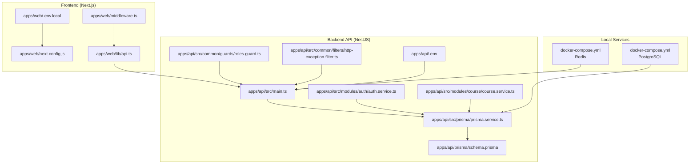
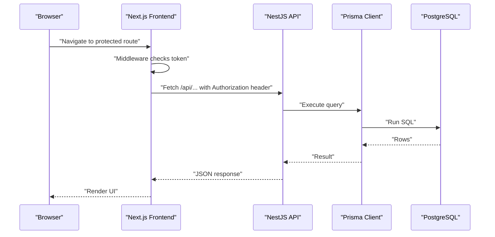

# Troubleshooting and FAQ

<cite>
**Referenced Files in This Document**
- [apps/api/src/main.ts](file://apps/api/src/main.ts)
- [apps/api/.env](file://apps/api/.env)
- [apps/web/.env.local](file://apps/web/.env.local)
- [apps/web/next.config.js](file://apps/web/next.config.js)
- [apps/api/prisma/schema.prisma](file://apps/api/prisma/schema.prisma)
- [apps/api/package.json](file://apps/api/package.json)
- [apps/web/package.json](file://apps/web/package.json)
- [docker-compose.yml](file://docker-compose.yml)
- [apps/api/src/common/filters/http-exception.filter.ts](file://apps/api/src/common/filters/http-exception.filter.ts)
- [apps/api/src/common/guards/roles.guard.ts](file://apps/api/src/common/guards/roles.guard.ts)
- [apps/api/src/modules/auth/auth.service.ts](file://apps/api/src/modules/auth/auth.service.ts)
- [apps/api/src/modules/course/course.service.ts](file://apps/api/src/modules/course/course.service.ts)
- [apps/api/src/prisma/prisma.service.ts](file://apps/api/src/prisma/prisma.service.ts)
- [apps/web/lib/api.ts](file://apps/web/lib/api.ts)
- [apps/web/middleware.ts](file://apps/web/middleware.ts)
- [DEPLOYMENT.md](file://DEPLOYMENT.md)
</cite>

## Table of Contents
1. [Introduction](#introduction)
2. [Project Structure](#project-structure)
3. [Core Components](#core-components)
4. [Architecture Overview](#architecture-overview)
5. [Detailed Component Analysis](#detailed-component-analysis)
6. [Dependency Analysis](#dependency-analysis)
7. [Performance Considerations](#performance-considerations)
8. [Troubleshooting Guide](#troubleshooting-guide)
9. [Conclusion](#conclusion)
10. [Appendices](#appendices)

## Introduction
This document provides a comprehensive troubleshooting guide for the Yaz Okulu Var mı? application. It focuses on diagnosing and resolving common issues across the development and production environments, including database connectivity, authentication failures, build errors, and performance bottlenecks. It also covers debugging techniques for the API and frontend, logging configuration, error analysis, performance profiling, maintenance tasks (cleanup, cache, backups), environment-specific pitfalls, dependency conflicts, deployment problems, and preventive monitoring strategies.

## Project Structure
The project is a monorepo with two primary applications:
- Backend API built with NestJS (apps/api)
- Frontend built with Next.js (apps/web)
- Shared Prisma schema and migrations (apps/api/prisma)
- Docker Compose for local services (PostgreSQL and Redis)

**Diagram sources**
- [apps/api/src/main.ts](file://apps/api/src/main.ts#L10-L31)
- [apps/api/.env](file://apps/api/.env#L1-L6)
- [apps/api/prisma/schema.prisma](file://apps/api/prisma/schema.prisma#L1-L183)
- [apps/api/src/prisma/prisma.service.ts](file://apps/api/src/prisma/prisma.service.ts#L1-L33)
- [apps/api/src/modules/auth/auth.service.ts](file://apps/api/src/modules/auth/auth.service.ts#L1-L205)
- [apps/api/src/modules/course/course.service.ts](file://apps/api/src/modules/course/course.service.ts#L1-L310)
- [apps/api/src/common/guards/roles.guard.ts](file://apps/api/src/common/guards/roles.guard.ts#L1-L56)
- [apps/api/src/common/filters/http-exception.filter.ts](file://apps/api/src/common/filters/http-exception.filter.ts#L1-L50)
- [apps/web/next.config.js](file://apps/web/next.config.js#L1-L26)
- [apps/web/.env.local](file://apps/web/.env.local#L1-L3)
- [apps/web/lib/api.ts](file://apps/web/lib/api.ts#L1-L378)
- [apps/web/middleware.ts](file://apps/web/middleware.ts#L1-L107)
- [docker-compose.yml](file://docker-compose.yml#L1-L34)

**Section sources**
- [apps/api/src/main.ts](file://apps/api/src/main.ts#L10-L31)
- [apps/web/next.config.js](file://apps/web/next.config.js#L1-L26)
- [docker-compose.yml](file://docker-compose.yml#L1-L34)

## Core Components
- API bootstrap and global configuration (CORS, global prefix, global filter)
- Environment variables for database, JWT, ports, and frontend URL
- Prisma schema defining models, enums, relations, and indexes
- Authentication service handling registration, login, and JWT generation
- Course service implementing search, filtering, pagination, and multitenancy
- Prisma service managing database connection lifecycle
- Frontend API client and middleware for route protection and token handling
- Docker Compose for local PostgreSQL and Redis services

Key areas to troubleshoot:
- Database connectivity via Prisma and environment variables
- Authentication flow and JWT payload validation
- Frontend API base URL and proxy configuration
- Middleware route protection and token decoding
- Global exception filter and logging behavior

**Section sources**
- [apps/api/src/main.ts](file://apps/api/src/main.ts#L10-L31)
- [apps/api/.env](file://apps/api/.env#L1-L6)
- [apps/api/prisma/schema.prisma](file://apps/api/prisma/schema.prisma#L1-L183)
- [apps/api/src/modules/auth/auth.service.ts](file://apps/api/src/modules/auth/auth.service.ts#L1-L205)
- [apps/api/src/modules/course/course.service.ts](file://apps/api/src/modules/course/course.service.ts#L1-L310)
- [apps/api/src/prisma/prisma.service.ts](file://apps/api/src/prisma/prisma.service.ts#L1-L33)
- [apps/web/lib/api.ts](file://apps/web/lib/api.ts#L1-L378)
- [apps/web/middleware.ts](file://apps/web/middleware.ts#L1-L107)

## Architecture Overview
The system follows a client-server pattern:
- Next.js frontend communicates with the NestJS API via HTTP requests proxied through Next.js rewrites.
- The API uses Prisma to connect to PostgreSQL and optionally Redis for caching.
- Authentication relies on JWT tokens stored in the browser and sent via Authorization headers.
- Middleware enforces role-based access control and redirects unauthorized users.

**Diagram sources**
- [apps/web/middleware.ts](file://apps/web/middleware.ts#L25-L102)
- [apps/web/lib/api.ts](file://apps/web/lib/api.ts#L10-L36)
- [apps/api/src/main.ts](file://apps/api/src/main.ts#L10-L31)
- [apps/api/src/prisma/prisma.service.ts](file://apps/api/src/prisma/prisma.service.ts#L23-L31)
- [apps/api/prisma/schema.prisma](file://apps/api/prisma/schema.prisma#L7-L10)

## Detailed Component Analysis

### Database Connectivity (Prisma)
- Connection URL is configured via DATABASE_URL in the backend environment.
- Prisma client logs queries and warnings/errors to stdout.
- The Prisma service connects on module init and disconnects on destroy.

Common issues:
- Wrong DATABASE_URL format or credentials
- PostgreSQL not running or port blocked
- Prisma client not generated or outdated
- Missing migrations applied

Resolution steps:
- Verify DATABASE_URL correctness and reachability
- Confirm PostgreSQL is running locally or in Docker
- Regenerate Prisma client and apply migrations
- Check Prisma logs for query errors

**Section sources**
- [apps/api/.env](file://apps/api/.env#L1-L1)
- [apps/api/src/prisma/prisma.service.ts](file://apps/api/src/prisma/prisma.service.ts#L12-L21)
- [apps/api/src/prisma/prisma.service.ts](file://apps/api/src/prisma/prisma.service.ts#L23-L31)
- [apps/api/package.json](file://apps/api/package.json#L11-L16)

### Authentication Flow
- Registration validates uniqueness and .edu.tr domain for UNIVERSITY role, sets appropriate status, hashes passwords, and generates a JWT.
- Login verifies credentials and status, rejects REJECTED users, and returns a JWT.
- Roles guard checks JWT payload against controller-level @Roles() requirements.

Common issues:
- Invalid email/password
- Non-.edu.tr email for UNIVERSITY registration
- Missing or invalid Authorization header
- Role mismatch for protected routes
- JWT secret mismatch between frontend/backend

Resolution steps:
- Confirm credentials and user status
- Ensure Authorization header presence for protected routes
- Verify JWT payload decoding in middleware and backend guards
- Align JWT_SECRET across environments

**Section sources**
- [apps/api/src/modules/auth/auth.service.ts](file://apps/api/src/modules/auth/auth.service.ts#L46-L130)
- [apps/api/src/modules/auth/auth.service.ts](file://apps/api/src/modules/auth/auth.service.ts#L136-L170)
- [apps/api/src/common/guards/roles.guard.ts](file://apps/api/src/common/guards/roles.guard.ts#L24-L54)
- [apps/web/middleware.ts](file://apps/web/middleware.ts#L12-L23)

### Frontend API Communication
- API base URL is derived from NEXT_PUBLIC_API_URL and normalized to include "/api".
- All requests include Content-Type and optional Authorization header.
- Errors are thrown on non-OK responses with message extraction.

Common issues:
- Incorrect NEXT_PUBLIC_API_URL or trailing slash
- Missing Authorization header for protected endpoints
- CORS misconfiguration between frontend and backend
- Proxy rewrite not matching API base

Resolution steps:
- Set NEXT_PUBLIC_API_URL to backend base without "/api"
- Ensure API_URL server-side does not include "/api"
- Verify Next.js rewrites match backend base
- Check CORS origin and credentials

**Section sources**
- [apps/web/lib/api.ts](file://apps/web/lib/api.ts#L7-L36)
- [apps/web/next.config.js](file://apps/web/next.config.js#L14-L22)
- [apps/api/src/main.ts](file://apps/api/src/main.ts#L20-L23)
- [apps/web/.env.local](file://apps/web/.env.local#L1-L2)

### Route Protection and Middleware
- Middleware decodes JWT payload from cookie, enforces role-based routing, and redirects accordingly.
- Redirects unauthorized users to login, students away from UNIVERSITY-only routes, and PENDING users to /pending.

Common issues:
- Missing token cookie
- Malformed token
- Role/status mismatch causing unexpected redirects

Resolution steps:
- Ensure token is present and valid
- Verify token payload structure
- Check user status (ACTIVE vs PENDING vs REJECTED)

**Section sources**
- [apps/web/middleware.ts](file://apps/web/middleware.ts#L25-L102)

### Logging and Error Handling
- Global HTTP exception filter logs errors with method, URL, and status, returning a standardized JSON response.
- Prisma service logs query/info/warn/error events to stdout.
- Bootstrap logs server start and port.

Common issues:
- Insufficient log verbosity
- Uncaught exceptions bypassing filter
- Misconfigured log sinks in production

Resolution steps:
- Increase Prisma log levels if needed
- Ensure global filter is registered
- Centralize error reporting in production

**Section sources**
- [apps/api/src/common/filters/http-exception.filter.ts](file://apps/api/src/common/filters/http-exception.filter.ts#L20-L48)
- [apps/api/src/prisma/prisma.service.ts](file://apps/api/src/prisma/prisma.service.ts#L14-L20)
- [apps/api/src/main.ts](file://apps/api/src/main.ts#L10-L31)

## Dependency Analysis
- Backend depends on NestJS, Prisma client, Passport/JWT, and bcrypt.
- Frontend depends on Next.js, Radix UI, Tailwind, and Recharts.
- Both share TypeScript and Jest for testing/building.
- Local development uses Docker Compose for PostgreSQL and Redis.

Potential conflicts:
- Node/npm version mismatches
- Prisma client vs engine version differences
- Jest/TypeScript configuration drift

Resolution steps:
- Pin compatible versions in package.json
- Use consistent Node versions across environments
- Keep Prisma client updated and regenerated after schema changes

**Section sources**
- [apps/api/package.json](file://apps/api/package.json#L20-L58)
- [apps/web/package.json](file://apps/web/package.json#L12-L37)

## Performance Considerations
- Database indexes defined in Prisma schema optimize common queries (university verification, course search, user indexing).
- Pagination limits prevent excessive result sets.
- Redis can cache frequent searches (configured but not actively used in current code).
- Prisma query logging can reveal slow queries.

Recommendations:
- Monitor slow Prisma queries and add missing indexes
- Apply pagination limits consistently
- Consider Redis caching for popular search endpoints
- Profile Next.js builds and API response times

[No sources needed since this section provides general guidance]

## Troubleshooting Guide

### Database Connection Problems
Symptoms:
- Application fails to start with database connection error
- Queries fail with connection refused or authentication error
- Prisma reports migration lock or missing migrations

Steps:
1. Verify DATABASE_URL format and credentials
   - Reference: [apps/api/.env](file://apps/api/.env#L1-L1)
2. Ensure PostgreSQL is running and accessible
   - Use Docker Compose to start services
   - Reference: [docker-compose.yml](file://docker-compose.yml#L8-L29)
3. Generate Prisma client and apply migrations
   - Reference: [apps/api/package.json](file://apps/api/package.json#L11-L16)
4. Check Prisma logs for query errors
   - Reference: [apps/api/src/prisma/prisma.service.ts](file://apps/api/src/prisma/prisma.service.ts#L14-L20)

### Authentication Failures
Symptoms:
- Login returns invalid credentials
- Registration rejected for UNIVERSITY role
- Protected routes redirect unexpectedly

Steps:
1. Confirm credentials and user status
   - Reference: [apps/api/src/modules/auth/auth.service.ts](file://apps/api/src/modules/auth/auth.service.ts#L136-L170)
2. Ensure .edu.tr domain for UNIVERSITY registration
   - Reference: [apps/api/src/modules/auth/auth.service.ts](file://apps/api/src/modules/auth/auth.service.ts#L58-L64)
3. Verify Authorization header presence for protected endpoints
   - Reference: [apps/web/lib/api.ts](file://apps/web/lib/api.ts#L19-L21)
4. Check JWT payload decoding and role checks
   - Reference: [apps/web/middleware.ts](file://apps/web/middleware.ts#L12-L23)
   - Reference: [apps/api/src/common/guards/roles.guard.ts](file://apps/api/src/common/guards/roles.guard.ts#L24-L54)

### Build Errors
Symptoms:
- npm install fails with configuration or prefix errors
- Seed script missing or failing
- Prisma Decimal type errors

Steps:
1. Resolve nvm/npm configuration issues
   - Reference: [DEPLOYMENT.md](file://DEPLOYMENT.md#L195-L217)
2. Use correct seed command from apps/api
   - Reference: [apps/api/package.json](file://apps/api/package.json#L14-L14)
3. Update seed to use number instead of Decimal
   - Reference: [DEPLOYMENT.md](file://DEPLOYMENT.md#L250-L252)

### Performance Issues
Symptoms:
- Slow search results or high DB load
- Excessive memory usage in API
- Long frontend build times

Steps:
1. Review Prisma indexes and query patterns
   - Reference: [apps/api/prisma/schema.prisma](file://apps/api/prisma/schema.prisma#L116-L122)
2. Enforce pagination limits and avoid large result sets
   - Reference: [apps/api/src/modules/course/course.service.ts](file://apps/api/src/modules/course/course.service.ts#L32-L34)
3. Consider Redis caching for frequent searches
   - Reference: [apps/api/.env](file://apps/api/.env#L5-L5)

### Development Environment Setup
Symptoms:
- Frontend cannot reach backend API
- Double “/api” in URL causing 404
- CORS errors between frontend and backend

Steps:
1. Configure NEXT_PUBLIC_API_URL without “/api”
   - Reference: [apps/web/.env.local](file://apps/web/.env.local#L1-L1)
2. Ensure API_URL server-side does not include “/api”
   - Reference: [apps/web/.env.local](file://apps/web/.env.local#L2-L2)
3. Verify Next.js rewrites
   - Reference: [apps/web/next.config.js](file://apps/web/next.config.js#L14-L22)
4. Enable CORS with correct origin and credentials
   - Reference: [apps/api/src/main.ts](file://apps/api/src/main.ts#L20-L23)

### API Endpoint Testing
Symptoms:
- Unexpected 404 or 403 responses
- Missing Authorization header errors

Steps:
1. Use Postman or curl to test endpoints with Authorization header
2. Confirm global prefix and route correctness
   - Reference: [apps/api/src/main.ts](file://apps/api/src/main.ts#L15-L17)
3. Validate JWT payload and roles
   - Reference: [apps/api/src/common/guards/roles.guard.ts](file://apps/api/src/common/guards/roles.guard.ts#L24-L54)

### Frontend Component Debugging
Symptoms:
- Protected routes redirect incorrectly
- Token not persisted or expired

Steps:
1. Inspect token cookie and payload decoding
   - Reference: [apps/web/middleware.ts](file://apps/web/middleware.ts#L29-L43)
2. Verify Authorization header in API client
   - Reference: [apps/web/lib/api.ts](file://apps/web/lib/api.ts#L19-L21)
3. Check route matchers and redirects
   - Reference: [apps/web/middleware.ts](file://apps/web/middleware.ts#L104-L106)

### Logging Configuration and Error Analysis
Symptoms:
- No error logs in production
- Confusing error messages

Steps:
1. Ensure global exception filter is registered
   - Reference: [apps/api/src/main.ts](file://apps/api/src/main.ts#L26-L26)
2. Review Prisma log levels
   - Reference: [apps/api/src/prisma/prisma.service.ts](file://apps/api/src/prisma/prisma.service.ts#L14-L20)
3. Standardize error response format
   - Reference: [apps/api/src/common/filters/http-exception.filter.ts](file://apps/api/src/common/filters/http-exception.filter.ts#L41-L47)

### Performance Profiling Methods
Symptoms:
- High latency on search or dashboard
- Memory spikes during bulk operations

Steps:
1. Add Prisma query timing and slow query detection
2. Use Next.js profiler and React DevTools
3. Monitor database query plans and indexes
4. Consider Redis caching for hot paths

[No sources needed since this section provides general guidance]

### Maintenance Tasks
- Database cleanup
  - Remove stale SearchLog entries periodically
  - Archive old activity logs
- Cache management
  - Clear Redis keys for search results
  - Invalidate stale widgets
- Backup procedures
  - Back up PostgreSQL database regularly
  - Version control Prisma migrations

[No sources needed since this section provides general guidance]

### Environment-Specific Issues
- Development vs Production differences
  - Align DATABASE_URL, JWT_SECRET, and API_URL
  - Use Docker Compose for local parity
- Dependency conflicts
  - Lock Node versions and use package managers consistently
  - Keep Prisma client and engine aligned

**Section sources**
- [apps/api/.env](file://apps/api/.env#L1-L6)
- [apps/web/.env.local](file://apps/web/.env.local#L1-L2)
- [docker-compose.yml](file://docker-compose.yml#L8-L29)
- [apps/api/package.json](file://apps/api/package.json#L20-L58)

### Deployment Problems
Symptoms:
- Missing migrations on server
- npm configuration errors
- Seed script not found

Steps:
1. Ensure migrations are committed and deployed
   - Reference: [DEPLOYMENT.md](file://DEPLOYMENT.md#L191-L193)
2. Fix npm configuration issues
   - Reference: [DEPLOYMENT.md](file://DEPLOYMENT.md#L195-L217)
3. Run correct seed command
   - Reference: [apps/api/package.json](file://apps/api/package.json#L14-L14)
   - Reference: [DEPLOYMENT.md](file://DEPLOYMENT.md#L246-L248)

### Preventive Measures and Monitoring
- Set up centralized logging (e.g., ELK or cloud provider logs)
- Monitor database query performance and slow queries
- Alert on repeated 5xx errors and authentication failures
- Regularly review and update dependencies

[No sources needed since this section provides general guidance]

## Conclusion
This guide consolidates actionable steps to diagnose and resolve common issues across the backend, frontend, and infrastructure layers. By validating environment configurations, ensuring proper authentication and authorization, leveraging Prisma and Next.js capabilities, and adopting robust logging and monitoring, teams can maintain a reliable and performant system.

## Appendices

### Quick Reference: Common Commands
- Backend build and run
  - Reference: [apps/api/package.json](file://apps/api/package.json#L7-L10)
- Database operations
  - Reference: [apps/api/package.json](file://apps/api/package.json#L11-L16)
- Frontend build and run
  - Reference: [apps/web/package.json](file://apps/web/package.json#L7-L10)

### Appendix A: Environment Variables Checklist
- Backend
  - DATABASE_URL, JWT_SECRET, PORT, FRONTEND_URL
  - Reference: [apps/api/.env](file://apps/api/.env#L1-L6)
- Frontend
  - NEXT_PUBLIC_API_URL, API_URL
  - Reference: [apps/web/.env.local](file://apps/web/.env.local#L1-L2)